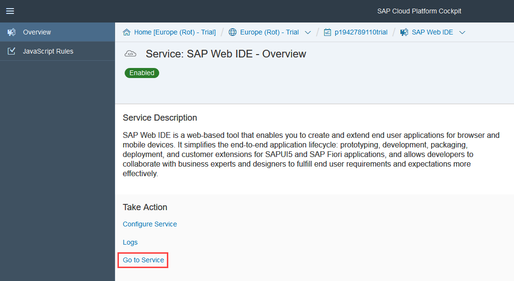
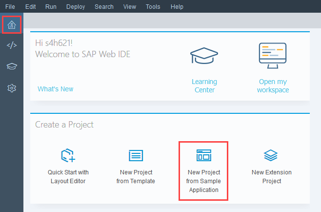
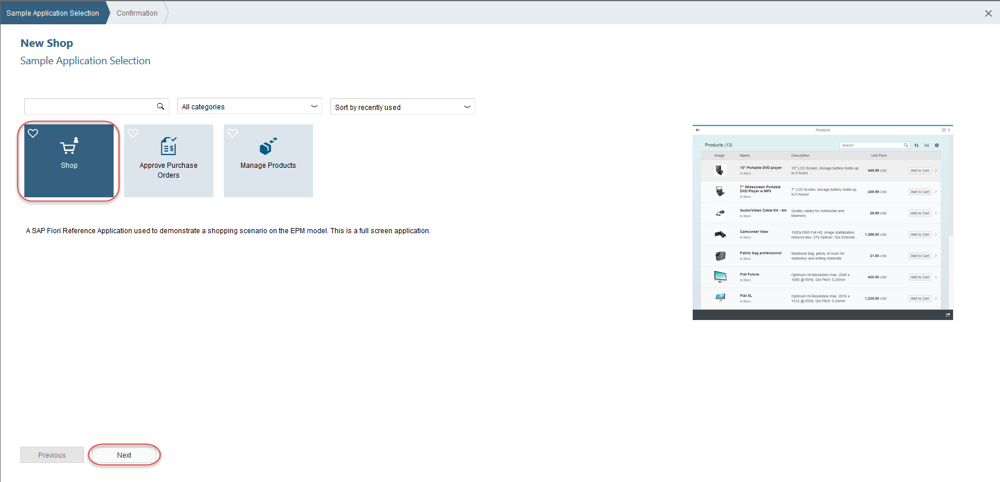
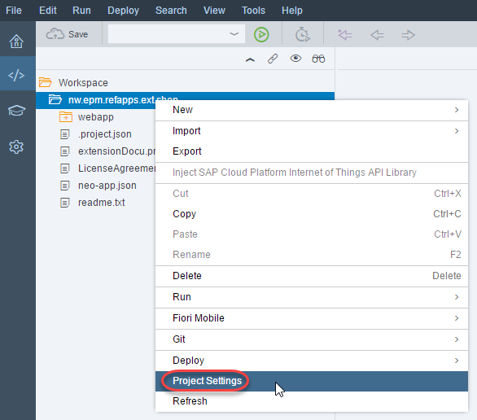
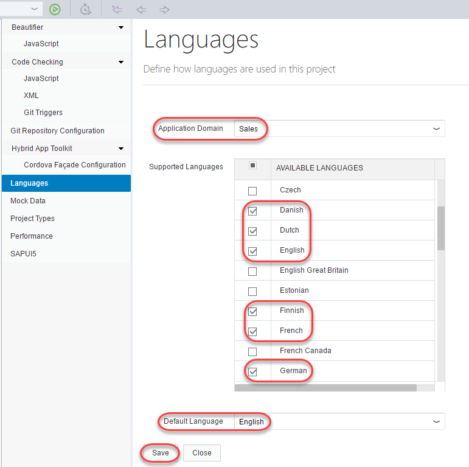
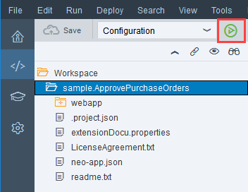
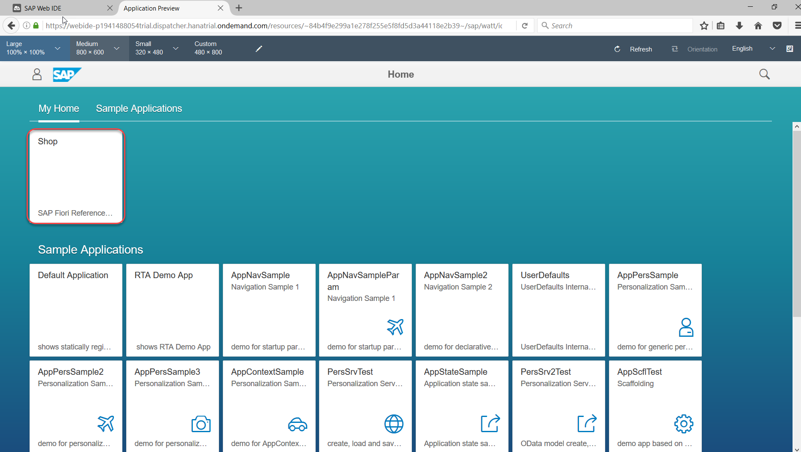

## Prerequisites  
 - **Proficiency:** Beginner
 - **Tutorials:** [Enable the SAP Translation Hub service](http://www.sap.com/developer/tutorials/sth-enable.html)

## Next Steps
- [Commit your project to Git and deploy to the cloud](http://www.sap.com/developer/tutorials/teched-2016-5.html) - This tutorial contains a Git repository called `te2016`. To make it easier to follow the steps in the translation tutorial, use the name of the project you created for the sample Fiori app in SAP Web IDE instead (`nwepmrefappsextshop`). Do not open the active version of the app, as described in the last step.
- [Translate your app with SAP Translation Hub](http://www.sap.com/developer/tutorials/sth-translate-fiori-app.html)

## Details
### You will learn  
You will use a sample Fiori app to create a new HTML5 app and prepare it for translation using SAP Translation Hub.

### Time to Complete
**10 Min**.

---
[ACCORDION-BEGIN [Step 1: ](Locate SAP Web IDE in the cockpit)]
In the service catalog, locate the **SAP Web IDE** tile by searching for `Web`, and then choose the tile.

[DONE]
[ACCORDION-END]

[ACCORDION-BEGIN [Step 2: ](Open SAP Web IDE)]

Choose **Open SAP Web IDE**.

[DONE]
[ACCORDION-END]

[ACCORDION-BEGIN [Step 3: ](Create a new project from a sample application)]

To get started with the app, choose **New Project from Sample Application**.

[DONE]
[ACCORDION-END]

[ACCORDION-BEGIN [Step 4: ](Choose shop app)]

To add a project with the required files to your account, choose **Shop** and then **Next**.

[DONE]
[ACCORDION-END]

[ACCORDION-BEGIN [Step 5: ](Accept standard license conditions)]

Accept the standard license conditions by choosing **I agree** and then **Finish**.

[DONE]
[ACCORDION-END]

[ACCORDION-BEGIN [Step 6: ](Define project settings)]

To be able to view the app in multiple languages, you need to adjust the language settings. To do that, right-click the project name and choose **Project Settings**.

[DONE]
[ACCORDION-END]

[ACCORDION-BEGIN [Step 7: ](Define language settings)]

On the **Languages** tab, make the following settings:

Field Name | Value
:-------------  | :-------------
Application Domain | **Basis**
Supported Languages | Add the languages of your choice; this tutorial uses the following: **Danish**, **Dutch**, **English**, **Finnish**, **French**, and **German**
Default Language | **English**

Once you've finished, choose **Save** and then **Close**.

[DONE]
[ACCORDION-END]

[ACCORDION-BEGIN [Step 8: ](Finalize project settings)]

To complete the configuration needed for SAP Translation Hub, add the location of the resources file to the project settings. Open the `.project.json` file and enter `i18n` as the `"resourceModelName"`:

Save the `.project.json` file.

[DONE]
[ACCORDION-END]

[ACCORDION-BEGIN [Step 9: ](Create run configuration)]

To test the application with mock data from a local system, you're going to need a special run configuration. To do this, right-click the application and choose **Run > Run Configurations**.

[DONE]
[ACCORDION-END]

[ACCORDION-BEGIN [Step 10: ](Choose Web application)]

Choose **+ > Web Application**.

[DONE]
[ACCORDION-END]

[ACCORDION-BEGIN [Step 11: ](Assign run application file)]

Now you need to do the following:

- Under **File Name**, enter the application file name `testFLPservice.html`.
- Under **Preview Mode**, choose **With Frame**.
- Under **Mock Data**, select **Run with mock data**.

Once you've done that, choose **OK**.

[DONE]
[ACCORDION-END]

[ACCORDION-BEGIN [Step 12: ](Open app in Fiori launchpad)]

Now you want to see what the application looks like by accessing it from a Fiori launchpad. To do this, choose the green button shown below.

[DONE]
[ACCORDION-END]

[ACCORDION-BEGIN [Step 13: ](Open the app)]

Choose the **Shop** tile.

To make things look more realistic, the app uses mock data:

[DONE]
[ACCORDION-END]

## Next Steps
- [Translate your app with SAP Translation Hub](http://www.sap.com/developer/tutorials/sth-translate-fiori-app.html)
