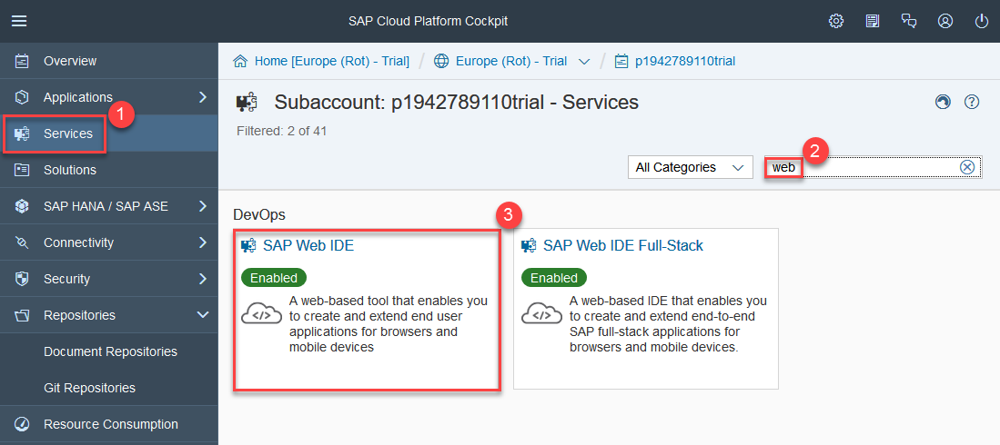
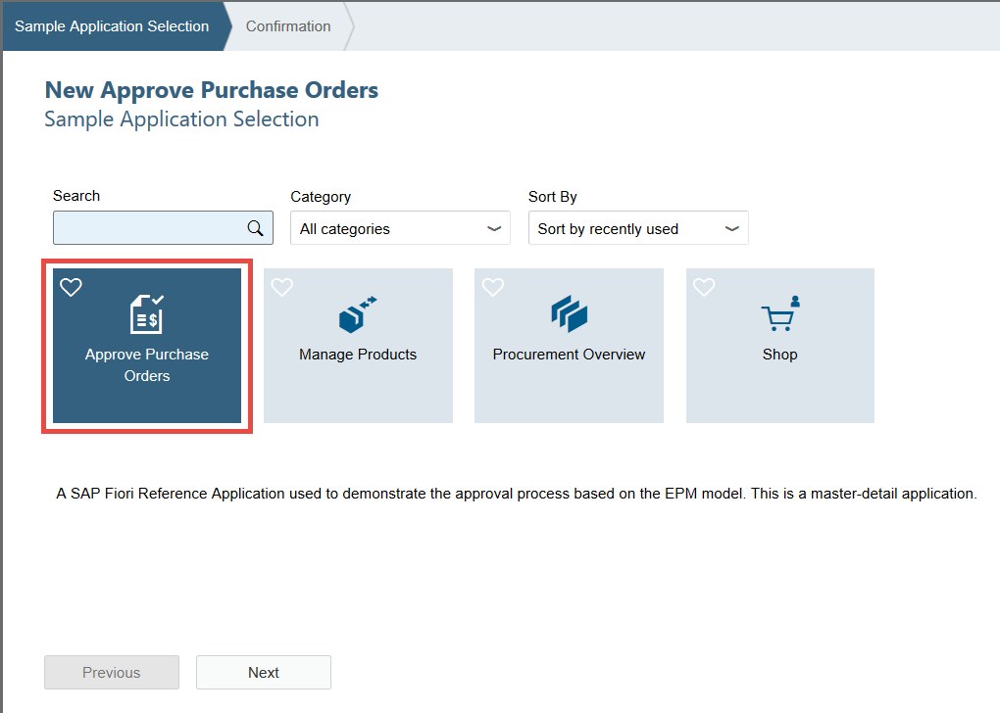
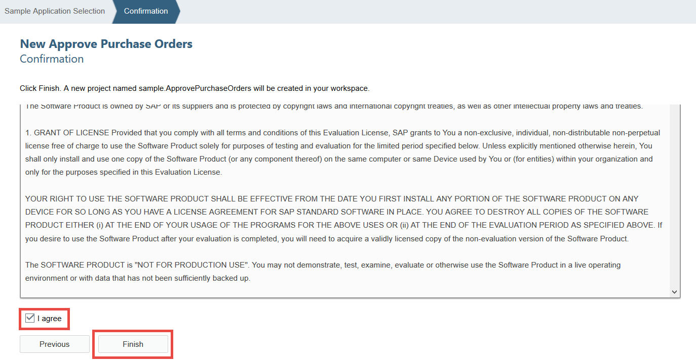
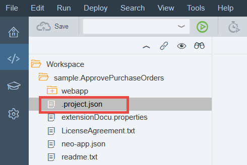
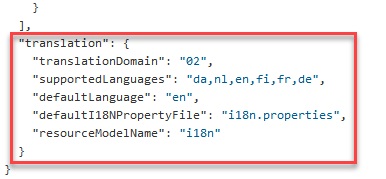
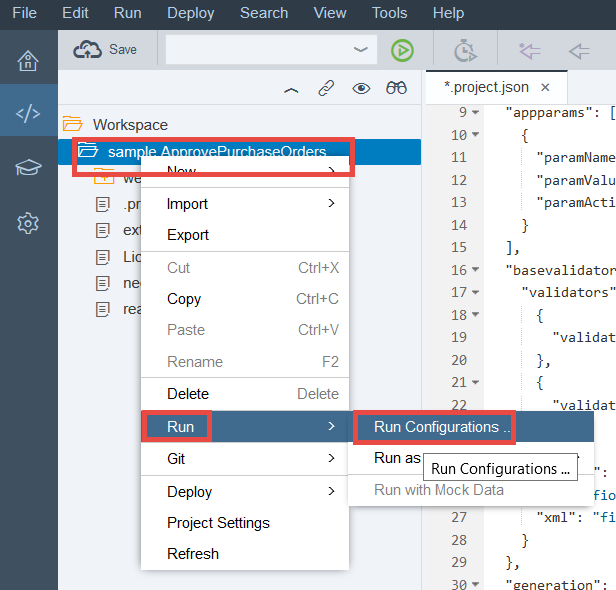
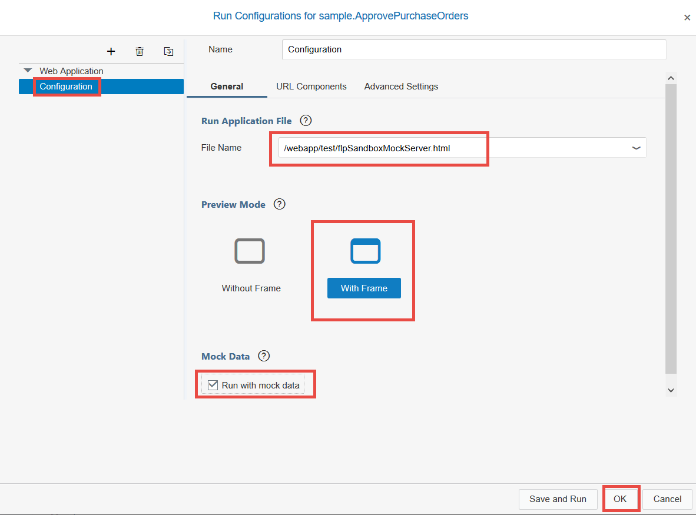
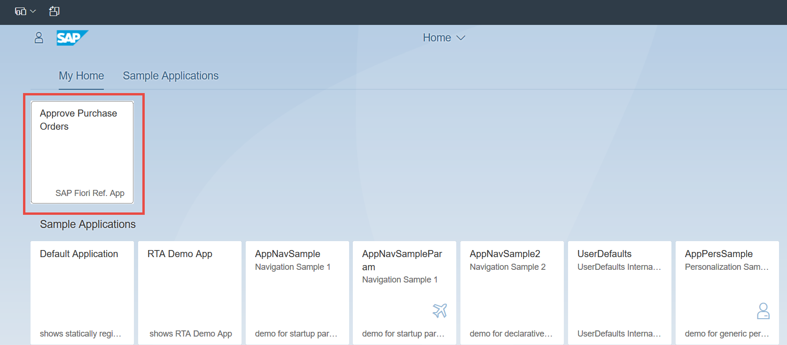
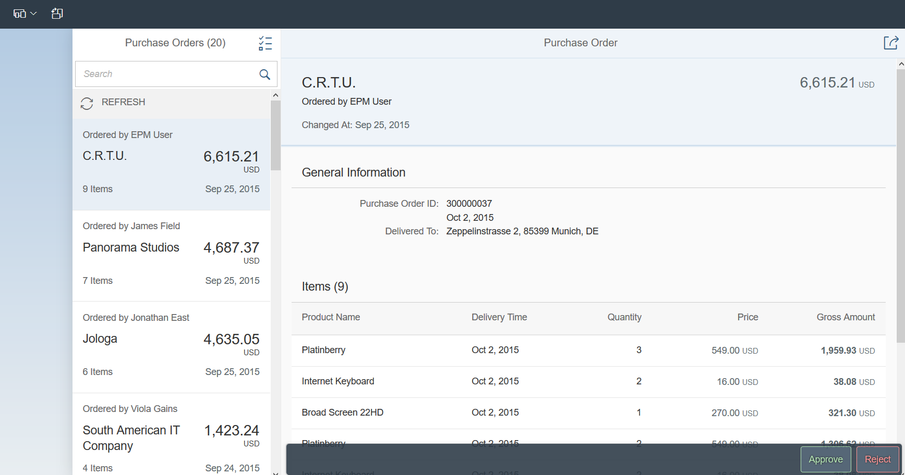

## Prerequisites  
 - **Proficiency:** Beginner
 - **Tutorials:** [Enable the SAP Translation Hub service](https://www.sap.com/developer/tutorials/sth-enable.html)

## Next Steps
- [Deploy a sample Fiori app to SAP Cloud Platform]
- [Translate a sample Fiori app](https://www.sap.com/developer/tutorials/sth-translate-fiori-app.html)

## Details
### You will learn  
You'll learn how to prepare a Fiori reference app so that you can translate it using SAP Translation Hub.

### Time to Complete
**10 Min**.

---
[ACCORDION-BEGIN [Step 1: ](Locate SAP Web IDE in the cockpit)]
In the service catalog, locate the **SAP Web IDE** tile by searching for `Web`, and then choose the tile.




[ACCORDION-END]

[ACCORDION-BEGIN [Step 2: ](Open SAP Web IDE)]

Choose **Go to Service**.


[ACCORDION-END]

[ACCORDION-BEGIN [Step 3: ](Create a new project from a sample application)]

To get started with the app, ensure that you're on the **Home** tab (house icon) and choose **New Project from Sample Application**.


[ACCORDION-END]

[ACCORDION-BEGIN [Step 4: ](Choose Approve Purchase Orders app)]

To add a project with the required files to your account, choose **Approve Purchase Orders** and then **Next**.




[ACCORDION-END]

[ACCORDION-BEGIN [Step 5: ](Accept standard license conditions)]

Accept the standard license conditions by choosing **I agree** and then **Finish**.




[ACCORDION-END]

[ACCORDION-BEGIN [Step 6: ](Open project file)]
To be able to view the app in multiple languages and enable SAP Translation Hub to locate the resources file, you need to enter some data in the `.project.json` file. Expand the root folder in the project and double-click the `.project.json` file.



[ACCORDION-END]

[ACCORDION-BEGIN [Step 7: ](Make project settings)]

In this step, you're going to specify the domain for the texts (sales), the languages in which you want the app to be available (Danish, Dutch, Finnish, French, and German), and the name of the resources file (`i18n.properties`).
In the `.project.json` file, enter a comma after the last square bracket (`]`) and choose **Enter** to insert a new line. At the start of the new line, paste the following code:

```
"translation": {
    "translationDomain": "02",
    "supportedLanguages": "da,nl,fi,fr,de",
    "defaultLanguage": "en",
    "defaultI18NPropertyFile": "i18n.properties",
    "resourceModelName": "i18n"
  }
```
The result should look like this:



Save your settings.


[ACCORDION-END]

[ACCORDION-BEGIN [Step 8: ](Create run configuration)]

To test the application with mock data from a local system, you're going to need a special run configuration. To do this, right-click the application and choose **Run | Run Configurations**.




[ACCORDION-END]

[ACCORDION-BEGIN [Step 9: ](Choose Web application)]

Choose the **+** sign then **Web Application**.


[ACCORDION-END]

[ACCORDION-BEGIN [Step 10: ](Assign run application file)]

Now you need to do the following:

- Under **File Name**, choose the application file name `/webapp/test/flpSandboxMockServer.html`.
- Under **Preview Mode**, select **With Frame**.
- Under **Mock Data**, select **Run with mock data**.

Once you've done that, choose **OK**.




[ACCORDION-END]

[ACCORDION-BEGIN [Step 11: ](Open app in Fiori launchpad)]

Now you want to see what the application looks like by accessing it from a Fiori launchpad. To do this, choose the green button shown below.


[ACCORDION-END]

[ACCORDION-BEGIN [Step 12: ](Open the app)]

Choose the **Approve Purchase Orders** tile.



To make things look more realistic, the app uses mock data.




[ACCORDION-END]


## Next Steps
- [Deploy a sample Fiori app to SAP Cloud Platform]
- [Translate a sample Fiori app](https://www.sap.com/developer/tutorials/sth-translate-fiori-app.html)
