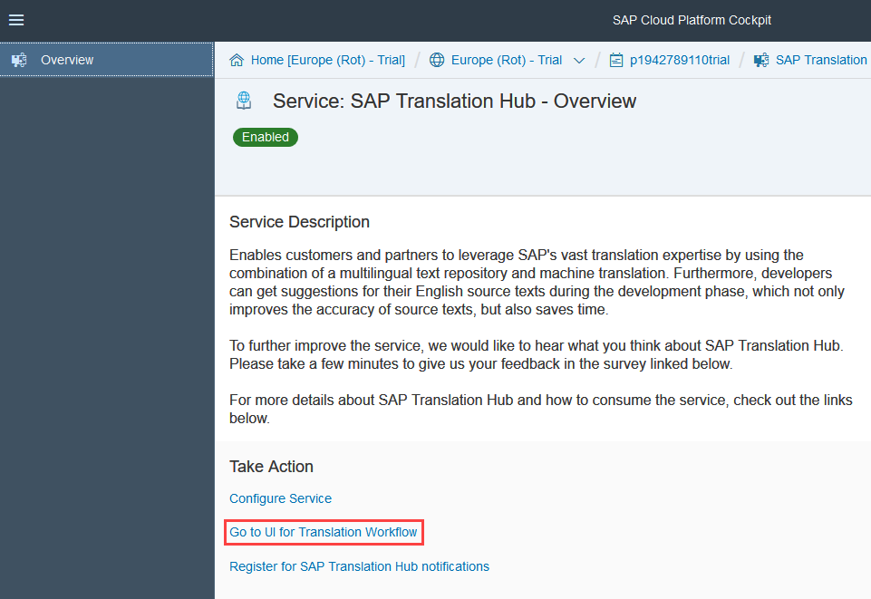
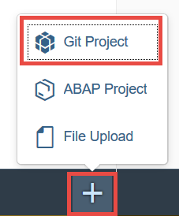
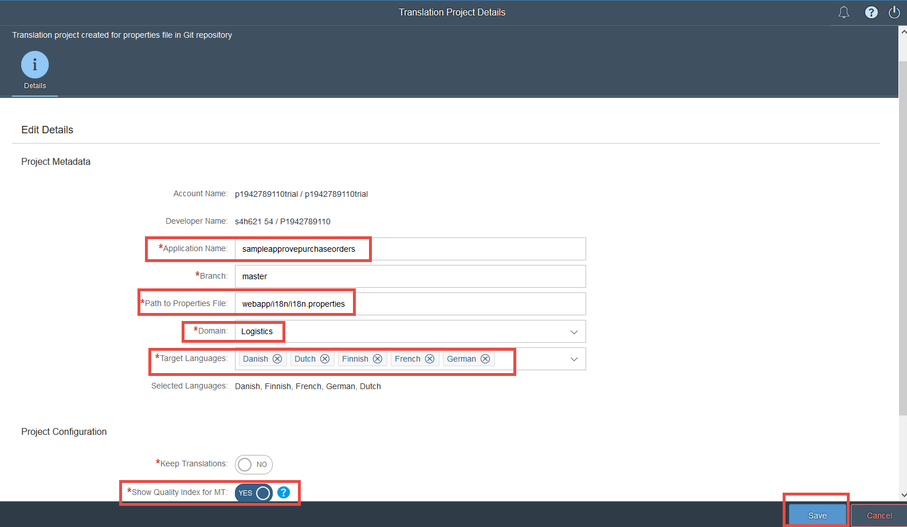
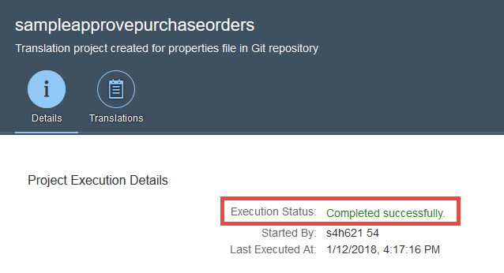
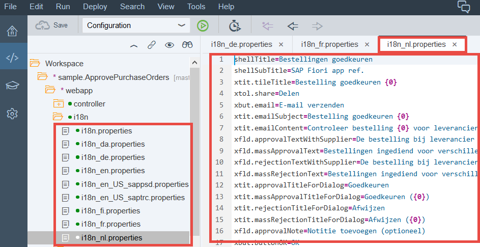
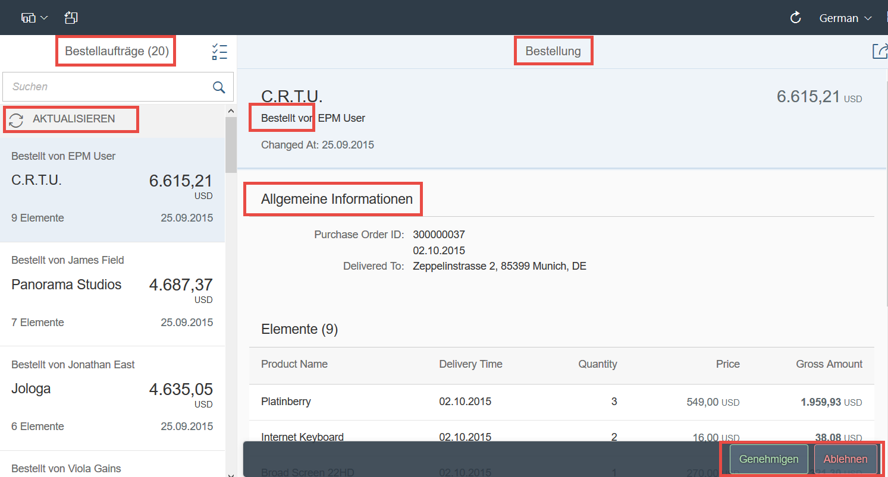

## Prerequisites  
 - **Proficiency:** Beginner
  - **Tutorials:** [Deploy a sample Fiori app to SAP Cloud Platform](https://www.sap.com/developer/tutorials/sth-deploy-fiori-app.html)

## Next Steps
- Select a tutorial from the [Tutorial Navigator](https://www.sap.com/developer/tutorial-navigator.html) or the [Tutorial Catalog](https://www.sap.com/developer/tutorial-navigator.tutorials.html)

## Details
### You will learn  
You'll learn how to translate a Fiori app using SAP Translation Hub.

### Time to Complete
**10 Min**.

---
[ACCORDION-BEGIN [Step 1: ](Open SAP Translation Hub)]

In the service catalog of the SAP Cloud Platform cockpit, locate the **SAP Translation Hub** service by searching for `Translation`. Click the tile and choose **Go to UI for Translation Workflow**.

[ACCORDION-END]

[ACCORDION-BEGIN [Step 2: ](Create new Git translation project)]

First, you'll need to create a translation project. Choose **+** and then **Git Project**.  

[ACCORDION-END]

[ACCORDION-BEGIN [Step 3: ](Enter translation project details)]

Now you need to enter the following details about your project:

Field Name | Value
:-------------  | :-------------
Application Name | **`sampleapprovepurchaseorders`**
Path to Properties File | **`webapp/i18n/i18n.properties`**
Domain | **Sales**
Target Languages   | Enter the target languages that you specified in your project in SAP Web IDE: **Danish**, **Dutch**, **Finnish**, **French**, and **German**

To see a quality index for translations provided by machine translation (not all languages are supported - see on-screen help for details), select **Show Quality Index for MT**.
Leave all other fields and selection options as they are and choose **Save**.

[ACCORDION-END]

[ACCORDION-BEGIN [Step 4: ](Translate texts in translation project)]

SAP Translation Hub shows an overview of your translation project. To start the translation process and push the translations to the Git repository, choose **Translate and Push** in the bottom right of the screen.

Enter your Git password and choose **Submit**.

If everything works as expected, you see the following status:

[ACCORDION-END]

[ACCORDION-BEGIN [Step 5: ](Check translations)]

The translation is now complete, but you might want to review the translations. To do that, choose **Translations**:

This is where you can switch between the target languages and, in the columns to the right, see the translation provider and a quality status. The higher the number on a scale from 0-100, the better the quality. Note: for translations provided by SAP Machine Translation (SAP MT), a quality index is not available for all languages.

[ACCORDION-END]

[ACCORDION-BEGIN [Step 6: ](Update translations (optional))]

If you want to change any of the translations, simply make your changes directly in the **Translated Text** column. After you make a change, the translation provider changes to `Manual`.
When you're done, choose **Save Project** and then push your changes to the Git repository by choosing **Push**:

Enter your Git password and choose **Submit**.

[ACCORDION-END]

[ACCORDION-BEGIN [Step 7: ](Pull translations from Git repository to SAP Web IDE)]

To see the translations in SAP Web IDE, you need to pull the translations from the Git repository. Open SAP Web IDE and select the `sampleapprovepurchaseorders` project:

In the **Git Pane**, choose **Pull**:

A success message appears in the top right of the SAP Web IDE window.

[ACCORDION-END]

[ACCORDION-BEGIN [Step 8: ](Check i18n properties files in SAP Web IDE)]

The **i18n** folder in your project now contains properties files for the target languages that you selected in your project. To see the translations, open any of the properties files by double-clicking the files.

[ACCORDION-END]

[ACCORDION-BEGIN [Step 9: ](Run sample app in additional languages)]

As a final step, you can run the app in different languages by choosing the green button shown below:

When the preview opens, change the language in the top right of the screen:

Now open the **Approve Purchase Orders** app:

> Note: Some texts in the app are pulled directly from the back end or are hard coded, and are therefore not part of the `i18n.properties` file that you translated in this tutorial.

[ACCORDION-END]

## Next Steps
- Select a tutorial from the [Tutorial Navigator](https://www.sap.com/developer/tutorial-navigator.html) or the [Tutorial Catalog](https://www.sap.com/developer/tutorial-navigator.tutorials.html)
