## Prerequisites  
 - **Proficiency:** Beginner
  - **Tutorials:** [Prepare a sample Fiori app for translation](http://www.sap.com/developer/tutorials/sth-prepare-fiori-app-translation.html)
 - **Tutorials:** [Commit your project to Git and deploy to the cloud](http://www.sap.com/developer/tutorials/teched-2016-5.html) - This tutorial contains a Git repository called `te2016`. To make it easier to follow the steps in the translation tutorial, use the name of the project you created for the sample Fiori app in SAP Web IDE instead (`nwepmrefappsextshop`). Do not open the active version of the app, as described in the last step.

## Next Steps
- Select a tutorial from the [Tutorial Navigator](http://www.sap.com/developer/tutorial-navigator.html) or the [Tutorial Catalog](http://www.sap.com/developer/tutorials.html)

## Details
### You will learn  
You will translate a sample Fiori app using SAP Translation Hub.

### Time to Complete
**10 Min**.

---
[ACCORDION-BEGIN [Step 1: ](Open SAP Translation Hub in the service catalog of the SAP Cloud Platform Cockpit)]

In the service catalog of the SAP Cloud Platform cockpit, locate the **SAP Translation Hub** service by searching for `Translation`. Click the tile and choose **Go to Service**.

[DONE]
[ACCORDION-END]

[ACCORDION-BEGIN [Step 2: ](Create new Git translation project)]

First, you'll need to create a translation project; choose **+** and then **Git Project**.  

[DONE]
[ACCORDION-END]

[ACCORDION-BEGIN [Step 3: ](Enter translation project details)]

Now you need to enter the following details about your project:

Field Name | Value
:-------------  | :-------------
Application Name | `nwepmrefappsextshop`
Path to Properties File | `webapp/i18n/i18n.properties`
Domain | **Basis**
Target Languages   | Enter the files you defined in your project in SAP Web IDE: **Danish**, **Dutch**, **English**, **Finnish**, **French**, and **German**

Leave all other fields as they are and choose **Save**.

[DONE]
[ACCORDION-END]

[ACCORDION-BEGIN [Step 4: ](Translate project texts in translation project)]

SAP Translation Hub shows an overview of your translation project. To start the translation process, choose **Get Translations** in the bottom right of the screen.

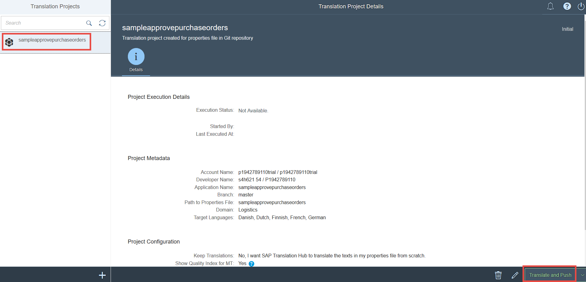

Enter your Git password and choose **Submit**.

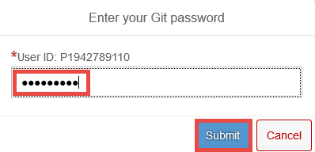

If everything works as expected, you see a success message:

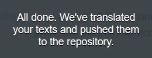

[DONE]
[ACCORDION-END]

[ACCORDION-BEGIN [Step 5: ](Check translations)]

The translation is now complete, but you might want to review the translations. To do that, choose **Translations**:

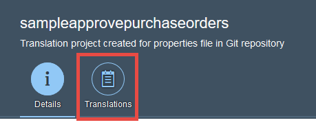

This is where you can switch between the target languages and, in the right columns, see the translation provider and a quality status. The higher the number on a scale from 0-100, the better the quality. Note that there is currently no quality index for translations provided by SAP Machine Translation (SAP MT).

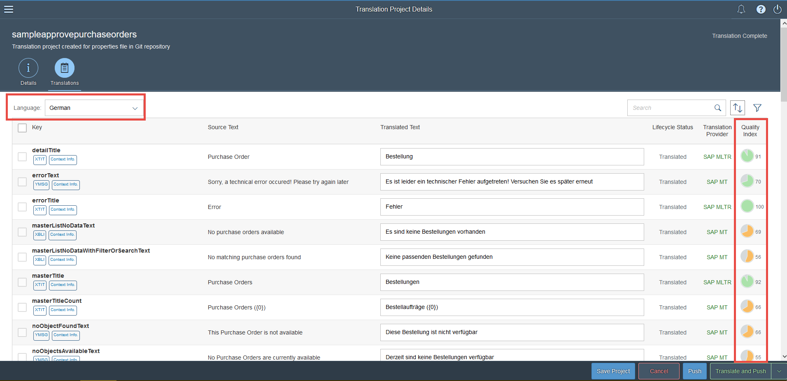

[DONE]
[ACCORDION-END]

[ACCORDION-BEGIN [Step 6: ](Update translations (optional))]

If you want to change any of the translations, simply make your changes directly in the **Translated Text** column. When you're done, choose **Save** and then push your changes to the repository using the context menu at the right of the **Get Translations** button:

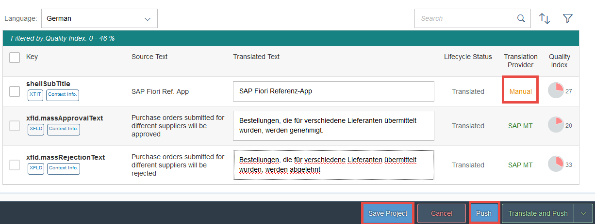

[DONE]
[ACCORDION-END]

[ACCORDION-BEGIN [Step 7: ](Pull translations from Git repository to SAP Web IDE)]

To see the translations in SAP Web IDE, you need to pull the translations from the Git repository. Open SAP Web IDE and select the `nw.epm.refapps.ext.shop` project:

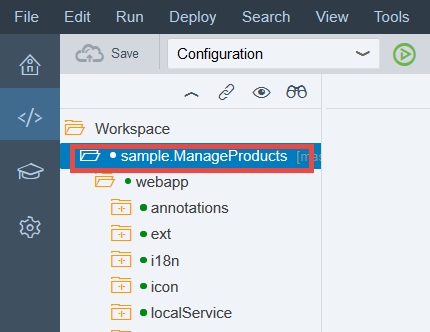

In the **Git Pane**, choose **Pull**:

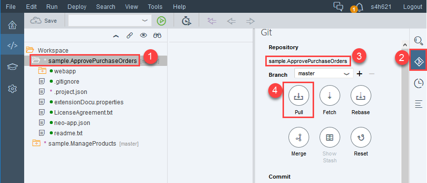

A success message appears in the top right of the SAP Web IDE window.

[DONE]
[ACCORDION-END]

[ACCORDION-BEGIN [Step 8: ](Check i18n properties files in SAP Web IDE)]

The **i18n** folder in your project now contains properties files for the target languages that you selected in your project. To see the translations, open any of the properties files by double-clicking the files.

[DONE]
[ACCORDION-END]

[ACCORDION-BEGIN [Step 9: ](Run sample app in additional languages)]

As a final step, you can run the app in different languages by choosing **Run**.

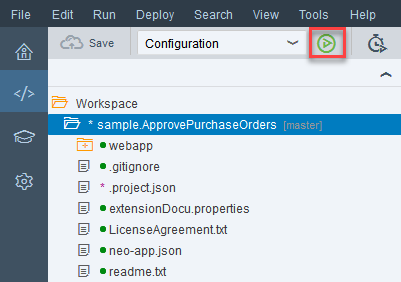

When the preview opens, change the language in the top right of the screen:

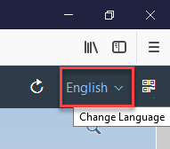

Now open the **Shop** app:

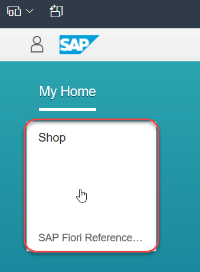

**Note: Some texts in the app come directly from the back end, and are therefore not part of the properties file that you translated.**

[DONE]
[ACCORDION-END]

## Next Steps
- Select a tutorial from the [Tutorial Navigator](http://www.sap.com/developer/tutorial-navigator.html) or the [Tutorial Catalog](http://www.sap.com/developer/tutorials.html)
