## Prerequisites  
 - **Proficiency:** Beginner
 - **Tutorials:**
   - [Translate your app into multiple languages](http://www.sap.com/developer/tutorials/teched-2016-8.html)
   - Your SAP HANA MDC database is created and running in SAP Cloud Platform account and you have Developer access to it

## Next Steps
  - [Time Series Forecasting with SAP HANA APL (Automated Predictive Library)](http://www.sap.com/developer/tutorials/teched-2016-11.html)

## Details
### You will learn

You will use the **SAP HANA Predictive Analytics Library (PAL)** to create and run an algorithm to analysis a set of data and separate them in groups (also known as **ABC analysis** or **Selective Inventory Control**).

For that, you will use a **SAP HANA multi-tenant database container (MDC)** instance available on the **SAP Cloud Platform** trial account where each tenant databases in the same system share the same system resources (memory and CPU cores) but each tenant database is fully isolated with its own database users, catalog, repository, persistence (data files and log files) and services.

For more details about the **ABC analysis**, you can check the [SAP HANA Predictive Analysis Library (PAL) Reference Guide ](https://help.sap.com/saphelp_hanaplatform/helpdata/en/d9/2aa7853c604750b7732ca2a1f93fce/content.htm).

### Time to Complete
**20 Min**.

---

[ACCORDION-BEGIN [Step 1: ](Check or create your SAP HANA MDC instance in HCP)]

Log into [SAP Cloud Platform](https://account.hanatrial.ondemand.com) by opening the following URL in a new tab: https://account.hanatrial.ondemand.com

Make sure you are using the **Europe (Trial)** landscape, and click on your account name to open the cockpit view.

In the left-hand navigation bar, select in **Persistence > Databases & Schemas** and check that you have database of the system type **HANA MDC (trial)** created.

**If you have one instance already configured, then please go to the next step of this tutorial.**


If you do not have HANA MDC instance, then follow these steps to create the instance and assign required roles to `SYSTEM` user.

Click on **New**.


Choose the **HANA MDC (trial)** as the Database System.

Pick a **Database ID** for your instance (it should be all lowercase, only letters and digits).

Choose a password for the **`SYSTEM`** user.

Please note it down, as you are the only one who is going to use it, and there is no way to reset it if lost.

Click on **Save**


Now your **SAP HANA MDC** instance is being built, and this will take about 6 minutes.

You should see a message **Database started successfully** on the **Events** screen once the instance is ready to be used.


Now, two more steps need to be done to give your **`SYSTEM`** user administration and developer roles.

**It is not a good practice to update the SYSTEM user like this but for the sake of time and reduce the number of steps, we will be updating the SYSTEM user.**

**So please, never give the same user administration and developer roles in real-life productive scenarios! `;-)`**

On the left side navigation bar, click on **Overview**.

Click on **Administration Tools: SAP HANA Cockpit**.

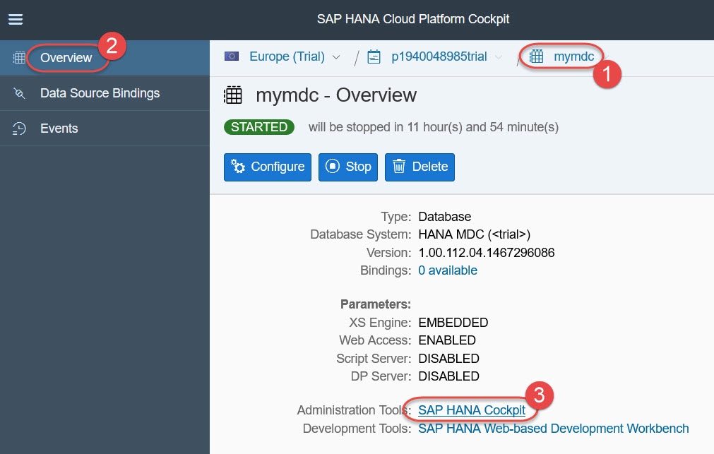

Logon as user **`SYSTEM`** with the password you provided during the instance creation.

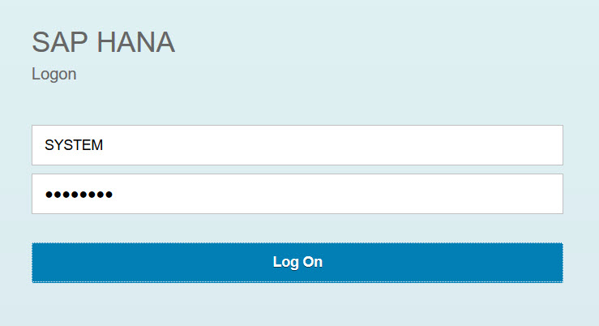

At the first time login as **`SYSTEM`**, an information screen pops up saying your user has no administration authorizations yet.

Just click **OK** on this and **Continue** on the next pop up.

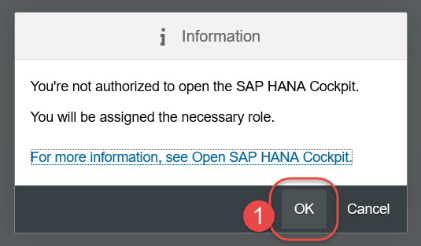

Once the **SAP HANA Cockpit** is open, click on **Manage Roles and Users** to open the **Security Workbench**.

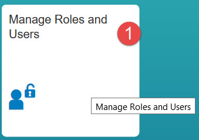

**SAP HANA Web-based Development Workbench: Security** opens in the new browser window.

Expand the **Users** node, click once on the **SYSTEM** user, and click **green plus** icon to add a new **Granted Roles** to the user.


Search for role **`sap.hana.xs.ide.roles::Developer`**, select it and click **OK** to add that role to **Granted Roles**.

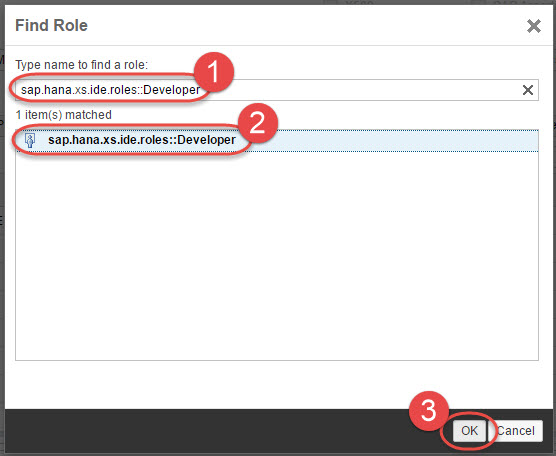

Press **`Ctrl+S`** or click **Save** icon.

Now your **`SYSTEM`** user has developer role assigned. **Again, never do the same - giving the same user both administration and developer roles in productive systems!**

Close the **Security Workbench** and the **SAP HANA Cockpit** and move to the next step.


[ACCORDION-END]

[ACCORDION-BEGIN [Step 2: ](Open SAP HANA Web-based Development Workbench)]

The database should be in the state **`STARTED`**. Click on **SAP HANA Web-based Development Workbench**.

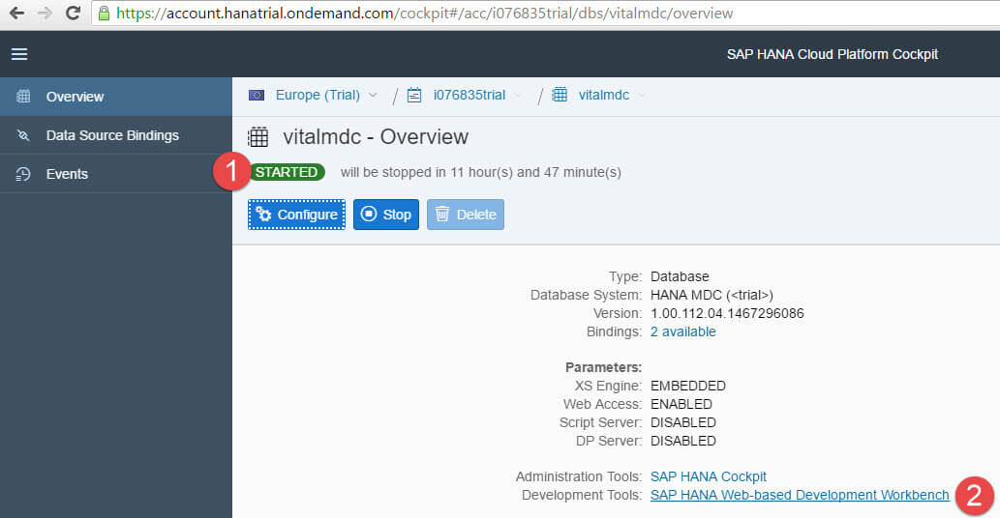


[ACCORDION-END]

[ACCORDION-BEGIN [Step 3: ](Open the Catalog tool)]

On the **SAP HANA Web-based Development Workbench**, click on **Catalog** which will allow you to create, edit, execute and manage SQL catalog artifacts in the SAP HANA database


Then, in the **Catalog Workbench** click on the **SQL** icon to open a new SQL Console.

Logon using your developer user. For brevity, you can use the user **`SYSTEM`**, but ideally a separate user should be used.

Type the following code and run it using the **Run** icon or pressing **F8** on the keyboard:

```sql
SELECT * FROM "SYS"."AFL_FUNCTIONS" WHERE AREA_NAME = 'AFLPAL'
ORDER BY FUNCTION_NAME;
```

If the **Predictive Analytics Library (PAL)** is installed in the SAP HANA instance, then the query will return the list of PAL predictive analytics algorithms available in the library.

You should be able to find **ABC** among PAL functions and this is the one you are going to use in this tutorial.


[ACCORDION-END]

[ACCORDION-BEGIN [Step 4: ](Introduction to PAL and ABC algorithm)]

The **Predictive Analysis Library (PAL)** defines functions that can be called from within **SQLScript** procedures to perform analytic algorithms.

PAL includes classic and universal predictive analysis algorithms in different data-mining categories, like Clustering, Classification, Regression, Association, Social Network Analysis etc.

ABC Analysis algorithm is used to classify objects (such as customers or products) based on a particular measure (such as revenue or profit).

It suggests that inventories of an organization are not of equal value, thus can be grouped into three categories (A, B, and C) by their estimated importance where "A" items are very important for an organization, "B" items are of medium importance and "C" items are of the least importance.

An example of ABC classification is as follows:

- "A" items – 20% of the items (customers or accounts) represents 70% of the revenue.
- "B" items – 30% of the items (customers or accounts) represents 20% of the revenue.
- "C" items – 50% of the items (customers or accounts) represents 10% of the revenue.

In this tutorial you will classify customers into **ABC** groups accordingly to the revenue they generate based on some dummy data.


[ACCORDION-END]

[ACCORDION-BEGIN [Step 5: ](Create a schema and load input data)]

Next, you need to create the table and load the data set that will be used during this tutorial.

You can find the SQL statements at the following link [`pal_abc_data.txt`](https://raw.githubusercontent.com/SAPDocuments/Tutorials/master/tutorials/teched-2016-10/pal_abc_data.txt).

Paste the code from the link above into a **SQL Editor** and hit **Run** to create a new schema **`TUTORIAL_PREDICTIVE`**, a table named **`ACCOUNT_REVENUE`** and insert the data.

**You may run into some SQL errors when running the script as the schema may already exists from a previous tutorial, so don't worry as long as the table is created.**

You should see the **`TUTORIAL_PREDICTIVE`** schema and the **`ACCOUNT_REVENUE`** table created in the **Catalog Explorer** on the left side (you may need to refresh the tree structure for that):


This is SAP HANA columnar table, so HANA will merge newly inserted records to get the table compressed and optimized for the best performance.

Verify all 100 records have been loaded.

```sql
--Merga delta part of columnar table ACCOUNT_REVENUE into its main part
SELECT COUNT(*) FROM "TUTORIAL_PREDICTIVE"."ACCOUNT_REVENUE";
```

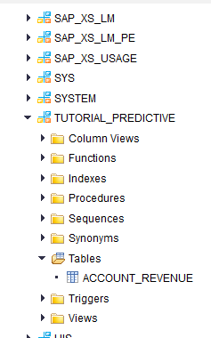

Next create a view that will be the input to the **ABC** algorithm.

```sql
DROP VIEW "TUTORIAL_PREDICTIVE"."V_ABC_INPUT" ;

CREATE VIEW "TUTORIAL_PREDICTIVE"."V_ABC_INPUT" as (SELECT ACCOUNTNR as SOMEOBJECT, TOTAL_AMOUNT as SOMEAMOUNT from "ACCOUNT_REVENUE");

SELECT COUNT(*) FROM "TUTORIAL_PREDICTIVE"."V_ABC_INPUT";
--Should return 100 records
```

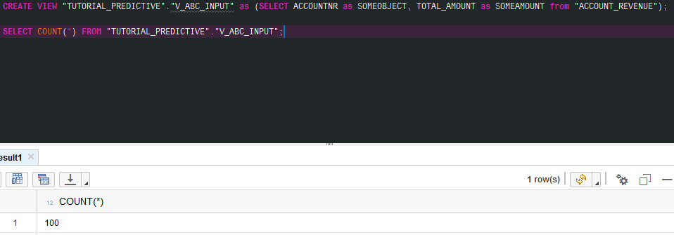


[ACCORDION-END]

[ACCORDION-BEGIN [Step 6: ](Create the wrap procedure for ABC PAL function)]

To use any **PAL** functions, you must do the following:

- Generate a procedure that wraps the generic **PAL** function with your specific data structures
- Call that wrap procedure, for example, from an **SQLScript** procedure

>You can find more details in **SAP HANA Predictive Analysis Library (PAL) Reference** document at https://help.sap.com/hana_platform.

Use the following code to generate the wrap procedure:

```sql
 --Prepare Table Types
 DROP TYPE "TUTORIAL_PREDICTIVE".PAL_ABC_DATA_VIEW_T;
 CREATE TYPE "TUTORIAL_PREDICTIVE".PAL_ABC_DATA_VIEW_T AS TABLE ("SOMEOBJECT" NVARCHAR(80), "SOMEAMOUNT" DOUBLE);  
 DROP TYPE "TUTORIAL_PREDICTIVE".PAL_CONTROL_T;
 CREATE TYPE "TUTORIAL_PREDICTIVE".PAL_CONTROL_T AS TABLE("Name" VARCHAR(100), "intArgs" INT, "doubleArgs" DOUBLE, "strArgs" VARCHAR(100));  
 DROP TYPE "TUTORIAL_PREDICTIVE".PAL_ABC_RESULT_T;
 CREATE TYPE "TUTORIAL_PREDICTIVE".PAL_ABC_RESULT_T AS TABLE("ABC" NVARCHAR(10), "SOMEOBJECT" NVARCHAR(80));

 --Create the proc using the wrapper
 --Define and populate parameters table
 DROP TABLE "TUTORIAL_PREDICTIVE"."PAL_ABC_PDATA_TBL";
 CREATE COLUMN TABLE "TUTORIAL_PREDICTIVE"."PAL_ABC_PDATA_TBL"
 (
   "POSITION" INT,
   "SCHEMA_NAME" NVARCHAR(256),
   "TYPE_NAME" NVARCHAR(256),
   "PARAMETER_TYPE" VARCHAR(7)
 );
 INSERT INTO "TUTORIAL_PREDICTIVE"."PAL_ABC_PDATA_TBL" VALUES (1,'TUTORIAL_PREDICTIVE','PAL_ABC_DATA_VIEW_T', 'in');  
 INSERT INTO "TUTORIAL_PREDICTIVE"."PAL_ABC_PDATA_TBL" VALUES (2,'TUTORIAL_PREDICTIVE','PAL_CONTROL_T', 'in');  
 INSERT INTO "TUTORIAL_PREDICTIVE"."PAL_ABC_PDATA_TBL" VALUES (3,'TUTORIAL_PREDICTIVE','PAL_ABC_RESULT_T','out');

 --Call the wrapper procedure to generate our ABC calculation procedure
 CALL SYS.AFLLANG_WRAPPER_PROCEDURE_DROP('TUTORIAL_PREDICTIVE', 'PAL_ABC_CALCULATE');
 CALL SYS.AFLLANG_WRAPPER_PROCEDURE_CREATE ('AFLPAL', 'ABC', 'TUTORIAL_PREDICTIVE', 'PAL_ABC_CALCULATE', "TUTORIAL_PREDICTIVE"."PAL_ABC_PDATA_TBL");
```

You should see following objects created in the `TUTORIAL_PREDICTIVE` schema:

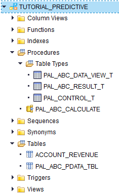


[ACCORDION-END]

[ACCORDION-BEGIN [Step 7: ](Run the wrapper procedure and check the results)]

Now, you can execute the procedure with the desired allocation of A, B, and C groups and the desired number of parallel calculation threads.

In this example you will have distribution of accounts accordingly to **70-20-10** distribution of their contribution to the total revenue and 5 threads.

```sql
--Prepare and execute the procedure with ABC Analysis
--Prepare parameters table
DROP TABLE "TUTORIAL_PREDICTIVE"."PAL_ABC_CONTROL_TBL";
CREATE COLUMN TABLE "TUTORIAL_PREDICTIVE"."PAL_ABC_CONTROL_TBL"
(
    "Name" NVARCHAR(100) NOT NULL,
    "intArgs" INTEGER,
    "doubleArgs" DECIMAL(15, 2),
    "strArgs" NVARCHAR(100),
    PRIMARY KEY ("Name")
);

TRUNCATE TABLE "TUTORIAL_PREDICTIVE"."PAL_ABC_CONTROL_TBL";
INSERT INTO "TUTORIAL_PREDICTIVE"."PAL_ABC_CONTROL_TBL"
SELECT 'THREAD_NUMBER',5,null,null from DUMMY UNION ALL
SELECT 'PERCENT_A',null,0.70,null from DUMMY UNION ALL
SELECT 'PERCENT_B',null,0.20,null from DUMMY UNION ALL
SELECT 'PERCENT_C',null,0.10,null from DUMMY;

--Execute the procedure
DROP TABLE "TUTORIAL_PREDICTIVE"."PAL_ABC_RESULT_TBL";
CREATE COLUMN TABLE "TUTORIAL_PREDICTIVE"."PAL_ABC_RESULT_TBL"
(
    "ABC" NVARCHAR(10) NOT NULL,
    "SOMEOBJECT" NVARCHAR(100) NOT NULL,
    PRIMARY KEY ("ABC", "SOMEOBJECT")
);
TRUNCATE TABLE "TUTORIAL_PREDICTIVE"."PAL_ABC_RESULT_TBL";

CALL "TUTORIAL_PREDICTIVE"."PAL_ABC_CALCULATE"
(
    "TUTORIAL_PREDICTIVE"."V_ABC_INPUT",
    "TUTORIAL_PREDICTIVE"."PAL_ABC_CONTROL_TBL",
    "TUTORIAL_PREDICTIVE"."PAL_ABC_RESULT_TBL"
) WITH OVERVIEW;
```

As a result, the table **`"TUTORIAL_PREDICTIVE"."PAL_ABC_RESULT_TBL"`** will be populated with the results of the **ABC Analysis** with account numbers assigned to particular A, B, or C group based on their revenue.


[ACCORDION-END]

[ACCORDION-BEGIN [Step 8: ](Check your results)]

Check the results. Firstly, check what group each account has been assigned to.

```sql
SELECT
  "ABC" AS ABC,
  T."SOMEOBJECT" AS COMPANY,
  "SOMEAMOUNT" AS GROSS_AMOUNT
FROM
  "TUTORIAL_PREDICTIVE"."V_ABC_INPUT" AS T
    INNER JOIN "TUTORIAL_PREDICTIVE"."PAL_ABC_RESULT_TBL" AS R
    ON T."SOMEOBJECT" = R."SOMEOBJECT"
ORDER BY 1, 3 desc;
```

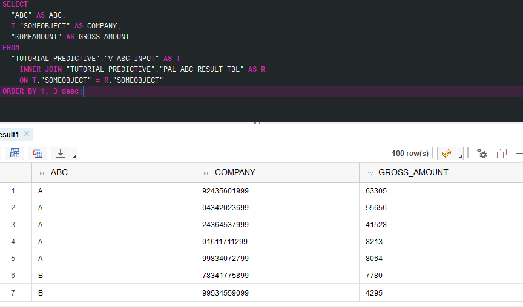

Secondly, using **SAP HANA SQL window functions**, you can compute the percentages of the total revenue falling into each group and compare to the desired **70-20-10** distribution.

```sql
SELECT
  "ABC" AS ABC,
  count(*) AS NR_OF_ACCOUNTS,
  sum("SOMEAMOUNT") AS GROSS_AMOUNT,
  round(sum("SOMEAMOUNT") / (sum(sum("SOMEAMOUNT") ) over ()),2) AS PT_SHARE
FROM
  "TUTORIAL_PREDICTIVE"."V_ABC_INPUT" AS T
    INNER JOIN "TUTORIAL_PREDICTIVE"."PAL_ABC_RESULT_TBL" AS R
    ON T."SOMEOBJECT" = R."SOMEOBJECT"
GROUP BY "ABC"
ORDER BY 1;  
```

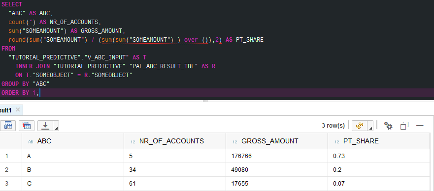

In real-world distribution, you would expect group **A** has a smaller count, but this is randomly generated data.

Congratulations!! You have run your first **PAL** algorithm!

**Final note**: the SAP HANA MDC instance is yours and you can use it as well outside of this tutorial.

Just remember that it is stopped automatically after 12 hours, and then deleted if not re-started during 7 days.

You will get email notifications before the instance is scheduled for deletion, so that you can go to your SAP Cloud Platform Trial account to start this instance and to prevent it from being removed.

And yes, use it to learn more about **SAP HANA** features!


[ACCORDION-END]

## Next Steps
 - [Time Series Forecasting with SAP HANA APL (Automated Predictive Library)](http://www.sap.com/developer/tutorials/teched-2016-11.html)
