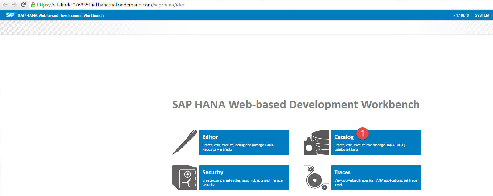
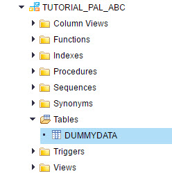
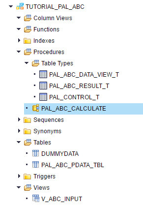
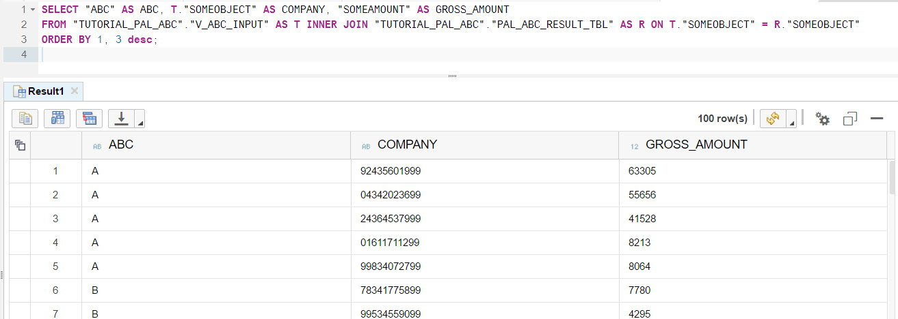

## Prerequisites  
 - **Proficiency:** Beginner
 - **Tutorials:**
   - [Internet of Things (IoT) made easy](http://go.sap.com/developer/tutorials/teched-2016-9.html)
   - Your SAP HANA MDC database is created and running in SAP HANA Cloud Platform account and you have Developer access to it

## Next Steps
 - Select a tutorial from the [Tutorial Navigator](http://go.sap.com/developer/tutorial-navigator.html) or the [Tutorial Catalog](http://go.sap.com/developer/tutorials.html)

## Details
### You will learn

You will use the SAP HANA Predictive Analytics Library to create and run an algorithm to do analysis of data in separate groups (also known as "ABC" analysis).

### Time to Complete
**10 Min**.

---

[ACCORDION-BEGIN [Step 1: ](Go to your SAP HANA MDC instance in HCP)]

In your SAP HCP Trial account go to `Databases & Schemas` and check you have database of the system type `HANA MDC (<trial>)` created.


[DONE]
[ACCORDION-END]

[ACCORDION-BEGIN [Step 2: ](Open SAP HANA Web-based Development Workbench)]

The database should be in the state `STARTED`. Click on `SAP HANA Web-based Development Workbench`.


[DONE]
[ACCORDION-END]

[ACCORDION-BEGIN [Step 3: ](Open the Catalog tool)]

On the SAP HANA Web-based Development Workbench screen click `Catalog` to open Catalog tool, which allows you to create, edit, execute and manage SQL catalog artifacts in the SAP HANA database



Then in the Catalog tool click on `SQL` icon to open a new SQL Console.  Logon using your developer user. For brevity, you can use the user `SYSTEM`, but ideally a separate user should be used.

Type the following code and run it using the **Run** icon or pressing `F8` on the keyboard:

```sql
SELECT * FROM "SYS"."AFL_FUNCTIONS" WHERE AREA_NAME = 'AFLPAL'
ORDER BY FUNCTION_NAME;
```

If Predictive Analytics Libary (PAL) is installed in the SAP HANA instance, then the query will return the list of PAL predictive analytics algorithms available in the library. You should be able to find `ABC` among PAL functions and this is the one you are going to use in this tutorial.


[DONE]
[ACCORDION-END]

[ACCORDION-BEGIN [Step 4: ](Introduction to PAL and ABC algorithm)]

The **Predictive Analysis Library (PAL)** defines functions that can be called from within SQLScript procedures to perform analytic algorithms. PAL includes classic and universal predictive analysis algorithms in different data-mining categories, like Clustering, Classification, Regression, Association, Social Network Analysis etc.

ABC Analysis algorithm is used to classify objects (such as customers or products) based on a particular measure (such as revenue or profit). It suggests that inventories of an organization are not of equal value, thus can be grouped into three categories (A, B, and C) by their estimated importance. “A” items are very important for an organization. “B” items are of medium importance. “C” items are of the least importance.

An example of ABC classification is as follows:

- “A” items – 20% of the items (customers) accounts for 70% of the revenue.
- “B” items – 30% of the items (customers) accounts for 20% of the revenue.
- “C” items – 50% of the items (customers) accounts for 10% of the revenue.

In this tutorial you will classify customers into ABC groups accordingly to the revenue they generate based on some dummy data.

[DONE]
[ACCORDION-END]

[ACCORDION-BEGIN [Step 5: ](Create a schema and load input data)]

First create a new schema `TUTORIAL_PAL_ABC` and a table with some dummy data. As in the previous step just paste this code into SQL Editor and hit `Run`.

```sql
--SET SCHEMA FOR THE TUTORIAL
CREATE SCHEMA "TUTORIAL_PAL_ABC";
SET SCHEMA "TUTORIAL_PAL_ABC";

CREATE COLUMN TABLE DUMMYDATA (
  accountnr varchar(11) default NULL,
  location varchar(100) default NULL,
  total_amount double default NULL
);
```

You should see the `TUTORIAL_PAL_ABC` schema and the `DUMMYDATA` table created in the Catalog Explorer on the left:



Next load 100 records with randomly generated data from the file [pal_abc_data.txt](pal_abc_data.txt) - **This is actually an SQL file**, where you find INSERT statements like below. Copy all of them into SQL Editor and execute.

```sql
INSERT INTO DUMMYDATA (accountnr,location,total_amount) VALUES ('51670856799','Sao Tome and Principe',640);
INSERT INTO DUMMYDATA (accountnr,location,total_amount) VALUES ('19947726599','Ukraine',270);
-- and so on...
```

Commit inserts and verify all records have been loaded.

```sql
COMMIT;
SELECT COUNT(*) FROM "TUTORIAL_PAL_ABC"."DUMMYDATA";
```


Now create a view that will be the input to the ABC algorithm.

```sql
CREATE VIEW "TUTORIAL_PAL_ABC"."V_ABC_INPUT" as (SELECT ACCOUNTNR as SOMEOBJECT, TOTAL_AMOUNT as SOMEAMOUNT from "DUMMYDATA");

SELECT COUNT(*) FROM "TUTORIAL_PAL_ABC"."V_ABC_INPUT";
--Should return the 100 records
```

[DONE]
[ACCORDION-END]

[ACCORDION-BEGIN [Step 6: ](Create the wrap procedure for ABC PAL function)]

To use PAL functions, you must do the following:

- Generate a procedure that wraps the PAL function with your specific data structures,
- Call the procedure, for example, from an SQLScript procedure.

>You can find more details in `SAP HANA Predictive Analysis Library (PAL) Reference` document at http://help.sap.com/hana_platform.

Use the following code to generate the wrap procedure:

```sql
 --Prepare Table Types
 DROP TYPE PAL_ABC_DATA_VIEW_T;
 CREATE TYPE PAL_ABC_DATA_VIEW_T AS TABLE ("SOMEOBJECT" NVARCHAR(80), "SOMEAMOUNT" DOUBLE);  
 DROP TYPE PAL_CONTROL_T;
 CREATE TYPE PAL_CONTROL_T AS TABLE("Name" VARCHAR(100), "intArgs" INT, "doubleArgs" DOUBLE, "strArgs" VARCHAR(100));  
 DROP TYPE PAL_ABC_RESULT_T;
 CREATE TYPE PAL_ABC_RESULT_T AS TABLE("ABC" NVARCHAR(10), "SOMEOBJECT" NVARCHAR(80));

 --Create the proc using the wrapper
 ---Define and populate parameters table
 DROP TABLE PAL_ABC_PDATA_TBL;
 CREATE COLUMN TABLE PAL_ABC_PDATA_TBL(
 "POSITION" INT,
 "SCHEMA_NAME" NVARCHAR(256),
 "TYPE_NAME" NVARCHAR(256),
 "PARAMETER_TYPE" VARCHAR(7)
 );
 INSERT INTO PAL_ABC_PDATA_TBL VALUES (1,'TUTORIAL_PAL_ABC','PAL_ABC_DATA_VIEW_T', 'in');  
 INSERT INTO PAL_ABC_PDATA_TBL VALUES (2,'TUTORIAL_PAL_ABC','PAL_CONTROL_T', 'in');  
 INSERT INTO PAL_ABC_PDATA_TBL VALUES (3,'TUTORIAL_PAL_ABC','PAL_ABC_RESULT_T','out');

 ---Call the wrapper procedure to generate our ABC calculation procedure
 CALL SYS.AFLLANG_WRAPPER_PROCEDURE_DROP('TUTORIAL_PAL_ABC', 'PAL_ABC_CALCULATE');
 CALL SYS.AFLLANG_WRAPPER_PROCEDURE_CREATE ('AFLPAL', 'ABC', 'TUTORIAL_PAL_ABC', 'PAL_ABC_CALCULATE', "TUTORIAL_PAL_ABC"."PAL_ABC_PDATA_TBL");
```

You should see following objects create in the `TUTORIAL_PAL_ABC` schema:



[DONE]
[ACCORDION-END]

[ACCORDION-BEGIN [Step 7: ](Run the wrapper procedure and check the results)]

Now execute the procedure with the desired allocation of A, B, and C groups and desired nr of parallel calculation threads. In this example you will have `70%-20%-10%` distribution and 5 threads.

```sql
--Prepare and execute the procedure with ABC Analysis
--Prepare parameters table
DROP TABLE "TUTORIAL_PAL_ABC"."PAL_CONTROL_TBL";
CREATE COLUMN TABLE "TUTORIAL_PAL_ABC"."PAL_CONTROL_TBL"
("Name" NVARCHAR(100) NOT NULL,
 "intArgs" INTEGER,
 "doubleArgs" DECIMAL(15, 2),
 "strArgs" NVARCHAR(100),
 PRIMARY KEY ("Name"));

TRUNCATE TABLE "TUTORIAL_PAL_ABC"."PAL_CONTROL_TBL";
INSERT INTO "TUTORIAL_PAL_ABC"."PAL_CONTROL_TBL"
SELECT 'THREAD_NUMBER',5,null,null from DUMMY UNION ALL
SELECT 'PERCENT_A',null,0.70,null from DUMMY UNION ALL
SELECT 'PERCENT_B',null,0.20,null from DUMMY UNION ALL
SELECT 'PERCENT_C',null,0.10,null from DUMMY;

---Execute the procedure
DROP TABLE "TUTORIAL_PAL_ABC"."PAL_ABC_RESULT_TBL";
CREATE COLUMN TABLE "TUTORIAL_PAL_ABC"."PAL_ABC_RESULT_TBL"
("ABC" NVARCHAR(10) NOT NULL,
 "SOMEOBJECT" NVARCHAR(100) NOT NULL,
 PRIMARY KEY ("ABC", "SOMEOBJECT"));
TRUNCATE TABLE "TUTORIAL_PAL_ABC"."PAL_ABC_RESULT_TBL";

CALL "TUTORIAL_PAL_ABC"."PAL_ABC_CALCULATE"("TUTORIAL_PAL_ABC"."V_ABC_INPUT","TUTORIAL_PAL_ABC"."PAL_CONTROL_TBL","TUTORIAL_PAL_ABC"."PAL_ABC_RESULT_TBL") WITH OVERVIEW;
```

As a result the table `"TUTORIAL_PAL_ABC"."PAL_ABC_RESULT_TBL"` should be populated with the results of the ABC Analysis with account numbers assigned to particular A, B, or C group based on their revenue.

[DONE]
[ACCORDION-END]

[ACCORDION-BEGIN [Step 8: ](Check your results)]

Check the results. Firstly, check what group each account has been assigned to.

```sql
SELECT "ABC" AS ABC, T."SOMEOBJECT" AS COMPANY, "SOMEAMOUNT" AS GROSS_AMOUNT
FROM "TUTORIAL_PAL_ABC"."V_ABC_INPUT" AS T INNER JOIN "TUTORIAL_PAL_ABC"."PAL_ABC_RESULT_TBL" AS R ON T."SOMEOBJECT" = R."SOMEOBJECT"
ORDER BY 1, 3 desc;
```



Secondly, using SAP HANA's SQL window functions you can calculate percentages of the total revenue falling into particular groups and compare to desired `70-20-10` distribution.

```sql
SELECT "ABC" AS ABC, count(*) AS NR_OF_ACCOUNTS, sum("SOMEAMOUNT") AS GROSS_AMOUNT, round(sum("SOMEAMOUNT") / (sum(sum("SOMEAMOUNT") ) over ()),2) AS PT_SHARE
FROM "TUTORIAL_PAL_ABC"."V_ABC_INPUT" AS T INNER JOIN "TUTORIAL_PAL_ABC"."PAL_ABC_RESULT_TBL" AS R ON T."SOMEOBJECT" = R."SOMEOBJECT"
GROUP BY "ABC"
ORDER BY 1;  
```


In real-world distribution you would expect group A has a smaller count, but this is randomly generated data.

You have run your first PAL algorithm.

[DONE]
[ACCORDION-END]


## Next Steps
 - Select a tutorial from the [Tutorial Navigator](http://go.sap.com/developer/tutorial-navigator.html) or the [Tutorial Catalog](http://go.sap.com/developer/tutorials.html)
