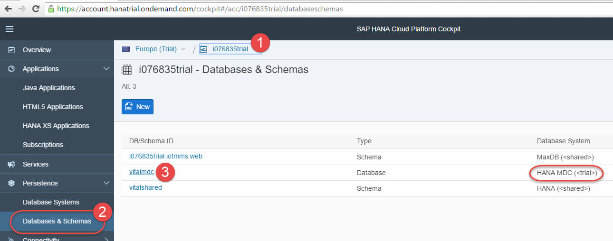
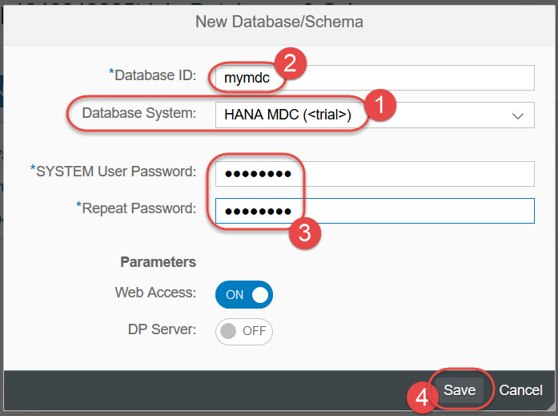
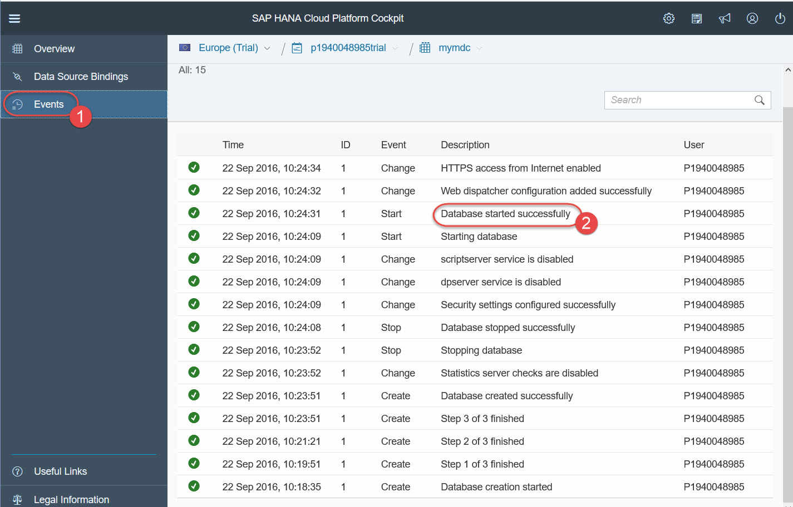
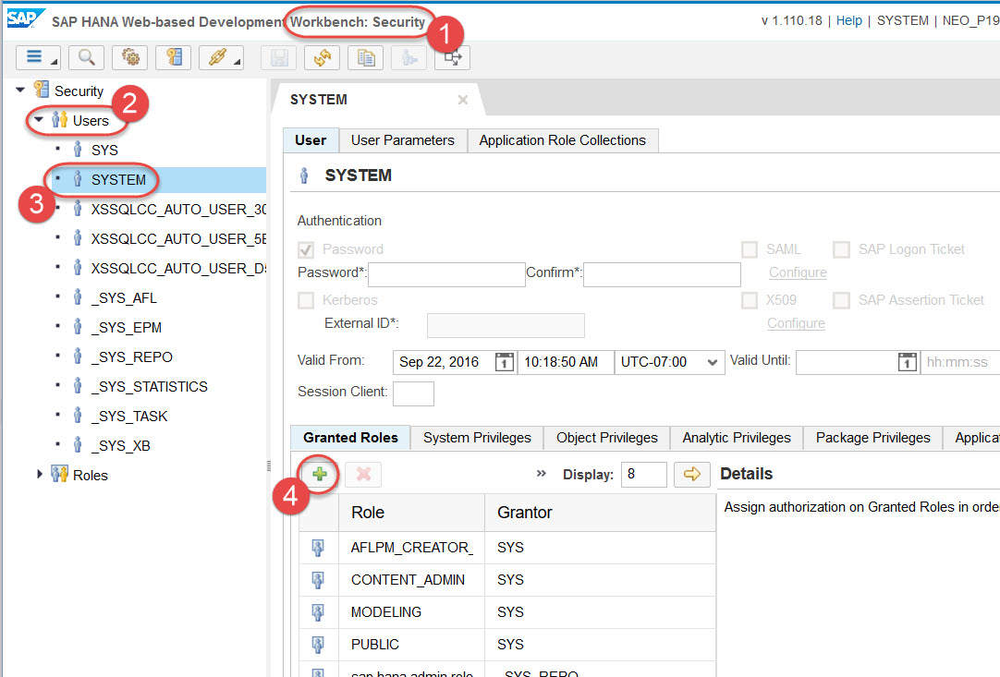
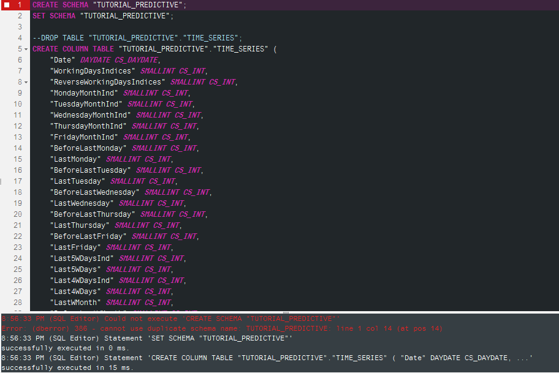
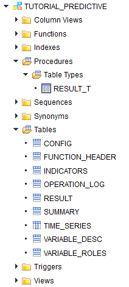
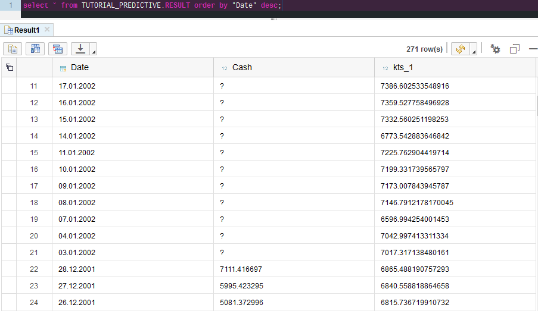

## Prerequisites
 - **Proficiency:** Beginner
 - **Tutorials:**
   - [ABC Analysis with SAP HANA PAL](https://www.sap.com/developer/tutorials/teched-2016-10.html)
   - Your SAP HANA MDC database is created and running in SAP Cloud Platform account and you have Developer access to it

## Next Steps
 - Select a tutorial from the [Tutorial Navigator](https://www.sap.com/developer/tutorial-navigator.html) or the [Tutorial Catalog](https://www.sap.com/developer/tutorial-navigator.tutorials.html)

## Details
### You will learn

You will use the **SAP HANA Automated Predictive Library (APL)** to create and run the **Automated Time Series** algorithm to analyze a signal and forecast the next "n" values.

For that, you will use a **SAP HANA multi-tenant database container (MDC)** instance available on the **SAP Cloud Platform** trial account where each tenant databases in the same system share the same system resources (memory and CPU cores) but each tenant database is fully isolated with its own database users, catalog, repository, persistence (data files and log files) and services.

For more details about the **Automated Time Series**  available in **APL**, you can check the [SAP HANA Automated Predictive Library Reference Guide](https://cp.hana.ondemand.com/dps/d/preview/5b8e06cae5be43f5af9dbe72d73bb7a9/2.5/en-US/frameset.htm?5db34eae84ed44e49ec1f0f78dfb52a1.html).

### Time to Complete
**20 Min**.

[ACCORDION-BEGIN [Info: ](SAP HANA Automated Predictive Library)]

The ***SAP HANA Automated Predictive Library*** (APL) is an ***Application Function Library*** (AFL) which lets you use the data mining capabilities of the ***SAP Predictive Analytics*** automated analytics engine on your SAP HANA stored data.

With the APL, you can create the following types of models to answer your business questions:

- Classification/Regression models
- Clustering models
- Time series analysis models
- Recommendation models
- Social network analysis models

For more details about the SAP HANA APL function, check the online [documentation](https://help.sap.com/viewer/cb31bd99d09747089754a0ba75067ed2/3.1/en-US/9bf31268c57e4c079f0cbabd36f39640.html).

[ACCORDION-END]

[ACCORDION-BEGIN [Info: ](Calling SAP HANA APL functions)]

In order to use any **SAP HANA APL*** functions, ultimately you need to create an AFL wrapper and then invoke this AFL wrapper which is how the APL function is called.

Creating and invoking the AFL wrapper is performed by executing SAP HANA SQL Script statements through a ***SAP HANA `SQLScript`*** (an extension of SQL).

Other database objects also need to be created, such as table types or signature table.

There are two techniques for calling APL functions:

- **The direct technique**:

This technique consists of explicitly generating an AFL wrapper for the APL function to be executed.
The generation of this AFL wrapper requires the explicit creation of table types, signature table, input and output tables, etc.
This is all supposed to be done by the APL consumer, through SQL DDL & DML statements.
Once the AFL wrapper is generated, it can be invoked through a call statement. This "direct technique" is always available.

However, the ***SAP HANA APL*** installation package includes a script where you can import pre-defined table types (used in the code below) which helps reduce the code size.

Here is a quick code example with the direct technique:

```
-- --------------------------------------------------------------------------
-- Create the table type for the dataset
-- --------------------------------------------------------------------------
drop type TRAINING_DATASET_T;
create type TRAINING_DATASET_T as table ( .. );

-- --------------------------------------------------------------------------
-- Create the AFL wrapper corresponding to the target APL function
-- --------------------------------------------------------------------------
DROP TABLE CREATE_MODEL_SIGNATURE;
create column table CREATE_MODEL_SIGNATURE  like PROCEDURE_SIGNATURE_T;

-- the signature is defined in the APL API documentation
INSERT INTO CREATE_MODEL_SIGNATURE VALUES (1, 'MYSCHEMA','FUNCTION_HEADER_T'  , 'IN');
INSERT INTO CREATE_MODEL_SIGNATURE VALUES (2, 'MYSCHEMA','OPERATION_CONFIG_T' , 'IN');
INSERT INTO CREATE_MODEL_SIGNATURE VALUES (3, 'MYSCHEMA','TRAINING_DATASET_T' , 'IN');
INSERT INTO CREATE_MODEL_SIGNATURE VALUES (4, 'MYSCHEMA','MODEL_BIN_OID_T'    , 'OUT');
INSERT INTO CREATE_MODEL_SIGNATURE VALUES (5, 'MYSCHEMA','VARIABLE_DESC_OID_T', 'OUT');

call SYS.AFLLANG_WRAPPER_PROCEDURE_DROP('MYSCHEMA','APLWRAPPER_CREATE_MODEL');
call SYS.AFLLANG_WRAPPER_PROCEDURE_CREATE('APL_AREA','CREATE_MODEL','MYSCHEMA', 'APLWRAPPER_CREATE_MODEL', CREATE_MODEL_SIGNATURE);

-- --------------------------------------------------------------------------
-- Create the input/output tables used as arguments for the APL function
-- --------------------------------------------------------------------------
DROP TABLE FUNCTION_HEADER;
CREATE COLUMN TABLE FUNCTION_HEADER LIKE FUNCTION_HEADER_T;
INSERT INTO FUNCTION_HEADER VALUES ('key', 'value');

DROP TABLE OPERATION_CONFIG;
CREATE COLUMN TABLE OPERATION_CONFIG LIKE OPERATION_CONFIG_T;
INSERT INTO OPERATION_CONFIG VALUES ('key', 'value');

DROP TABLE TRAINED_MODEL;
CREATE COLUMN TABLE TRAINED_MODEL LIKE MODEL_BIN_OID_T;

DROP TABLE VARIABLE_DESC;
CREATE COLUMN TABLE VARIABLE_DESC LIKE VARIABLE_DESC_OID_T;

-- --------------------------------------------------------------------------
-- Execute the APL function using its AFL wrapper and the actual input/output tables
-- --------------------------------------------------------------------------
call APLWRAPPER_CREATE_MODEL(FUNCTION_HEADER, OPERATION_CONFIG, MYSCHEMA.TRAINING_DATASET, TRAINED_MODEL, VARIABLE_DESC) with overview;
```

- **The procedure technique**:

This technique is not only much simpler than the direct technique, but it's also more efficient and scalable.
Instead of having to deal with the life cycle of the AFL wrappers and all its companion database objects on a per-call basis, the APL user can directly call APL specific stored procedures which take care of all the AFL details.

These APL stored procedures are part of the `HCO_PA_APL` delivery unit which is automatically deployed when installing **SAP HANA APL**.

Here is a quick code example with the procedure technique:

```
SET SESSION 'APL_CACHE_SCHEMA' = 'APL_CACHE';

-- --------------------------------------------------------------------------
-- Create the input/output tables used as arguments for the APL function
-- --------------------------------------------------------------------------
DROP TABLE FUNCTION_HEADER;
CREATE COLUMN TABLE FUNCTION_HEADER LIKE "SAP_PA_APL"."sap.pa.apl.base::BASE.T.FUNCTION_HEADER";
INSERT INTO FUNCTION_HEADER VALUES ('key', 'value');

DROP TABLE OPERATION_CONFIG;
CREATE COLUMN TABLE OPERATION_CONFIG LIKE "SAP_PA_APL"."sap.pa.apl.base::BASE.T.OPERATION_CONFIG_DETAILED";
INSERT INTO OPERATION_CONFIG VALUES ('key', 'value');

DROP TABLE TRAINED_MODEL;
CREATE COLUMN TABLE TRAINED_MODEL LIKE "SAP_PA_APL"."sap.pa.apl.base::BASE.T.MODEL_BIN_OID";

DROP TABLE VARIABLE_DESC;
CREATE COLUMN TABLE VARIABLE_DESC LIKE  "SAP_PA_APL"."sap.pa.apl.base::BASE.T.VARIABLE_DESC_OID";

-- --------------------------------------------------------------------------
-- Execute the APL function using its AFL wrapper and the actual input/output tables
-- --------------------------------------------------------------------------
call "SAP_PA_APL"."sap.pa.apl.base::CREATE_MODEL"(FUNCTION_HEADER, OPERATION_CONFIG, 'MYSCHEMA','TRAINING_DATASET', TRAINED_MODEL, VARIABLE_DESC) with overview;
```

We will use the procedure technique in this tutorial.

[ACCORDION-END]

[ACCORDION-BEGIN [Info: ](Introduction to APL and Auto Time Series algorithm)]

In order to use any ***SAP HANA APL*** functions, ultimately you need to create an AFL wrapper and then invoke this AFL wrapper which is how the APL function is called.

Creating and invoking the AFL wrapper is performed by executing SAP HANA SQL Script statements through a ***SAP HANA `SQLScript`*** (an extension of SQL).

Other database objects also need to be created, such as table types or signature table.

For more details about the SAP HANA APL function, check the online [documentation](https://help.sap.com/viewer/cb31bd99d09747089754a0ba75067ed2/3.1/en-US/9bf31268c57e4c079f0cbabd36f39640.html).

The **Auto Time Series** algorithm analyzes a dataset containing the successive values of a target indicator (the signal) over time to predict the next values.

This algorithm:

 - Analyzes a time series and generates forecasts based on identified patterns
 - Returns forecast and real values for past data of the time series
 - Provides confidence intervals computed for each forecast
 - Provides the trend, cycles, and fluctuations of the time series
 - Provides indicators on the reliability of the results

The predictive model combines the trend, cycles, and fluctuations found in the time series to generate forecasts. The prediction also depends on information provided through extra-predictive variables if any.

The granularity of the prediction is the same as the granularity used in the dataset. For example, if the dataset contains daily observations of a time series, the service computes the values of the series in the next days. See the Time Series Scenarios on the SAP Help Portal for a description of the time series components.

> **Note:**
> If you use extra-predictive variables, which are variables other than date and target indicator, their values must be known for each date of the forecasts.
> The service may return forecasts without error bars beyond the maximum confident horizon.

&nbsp;

To summarize, in order to execute the **Auto Time Series** algorithm, you will need a dataset with:

 - a date variable
 - a variable to predict (usually a continuous number variable), the target variable or signal
 - optionally a set of "extra" predictors which can be used to better predict the forecast variable

https://help.sap.com/businessobject/product_guides/pa24/en/pa24_hana_apl_user_en/frameset.htm

[ACCORDION-END]

[ACCORDION-BEGIN [Step 1: ](Create your SAP HANA MDC instance)]

Log into [SAP Cloud Platform](https://account.hanatrial.ondemand.com) by opening the following URL in a new tab: https://account.hanatrial.ondemand.com

Make sure you are using the **Europe (Trial)** landscape, and click on your account name to open the cockpit view.

In the left-hand navigation bar, select in **Persistence > Databases & Schemas** and check that you have database of the system type **HANA MDC (trial)** created.

**If you have one instance already configured, then please go to the next step of this tutorial.**



If you do not have HANA MDC instance, then follow these steps to create the instance and assign required roles to **`SYSTEM`** user.

Click on **New**.


Choose the **HANA MDC (trial)** as the Database System.

Pick a **Database ID** for your instance (it should be all lowercase, only letters and digits).

Choose a password for the **`SYSTEM`** user.

Please note it down, as you are the only one who is going to use it, and there is no way to reset it if lost.

Click on **Save**



Now your **SAP HANA MDC** instance is being built, and this will take about 6 minutes.

You should see a message **Database started successfully** on the **Events** screen once the instance is ready to be used.



Now, two more steps need to be done to give your **`SYSTEM`** user administration and developer roles.

**It is not a good practice to update the SYSTEM user like this but for the sake of time and reduce the number of steps, we will be updating the SYSTEM user.**

**So please, never give the same user administration and developer roles in real-life productive scenarios! `;-)`**

On the left side navigation bar, click on **Overview**.

Click on **Administration Tools: SAP HANA Cockpit**.


Logon as user **`SYSTEM`** with the password you provided during the instance creation.


At the first time login as **`SYSTEM`**, an information screen pops up saying your user has no administration authorizations yet.

Just click **OK** on this and **Continue** on the next pop up.


Once the **SAP HANA Cockpit** is open, click on **Manage Roles and Users** to open the **Security Workbench**.


**SAP HANA Web-based Development Workbench: Security** opens in the new browser window.

Expand the **Users** node, click once on the **SYSTEM** user, and click **green plus** icon to add a new **Granted Roles** to the user.



Search for role **`sap.hana.xs.ide.roles::Developer`**, select it and click **OK** to add that role to **Granted Roles**.


Press **`Ctrl+S`** or click **Save** icon.

Now your **`SYSTEM`** user has developer role assigned. **Again, never do the same - giving the same user both administration and developer roles in productive systems!**

Close the **Security Workbench** and the **SAP HANA Cockpit** and move to the next step.

Click on **SAP HANA Web-based Development Workbench**.


[ACCORDION-END]

[ACCORDION-BEGIN [Step 2: ](Open the Catalog tool)]

On the **SAP HANA Web-based Development Workbench**, click on **Catalog** which will allow you to create, edit, execute and manage SQL catalog artifacts in the SAP HANA database


Then, in the **Catalog Workbench** click on the **SQL** icon to open a new SQL Console.

Logon using your developer user. For brevity, you can use the user `SYSTEM`, but ideally a separate user should be used.

Type the following code and run it using the **Run** icon or pressing `F8` on the keyboard:

```SQL
SELECT * FROM "SYS"."AFL_FUNCTIONS" WHERE AREA_NAME = 'APL_AREA'
ORDER BY FUNCTION_NAME;
```

If the **Automated Predictive Library (APL)** is installed on the SAP HANA instance, then the query will return the list of APL functions available in the library.


You should be able to find **FORECAST** among **APL** functions and this is the one you are going to use in this tutorial.

Now, in order to be able to execute the **APL** functions, you will need to add your user the **`AFL__SYS_AFL_APL_AREA_EXECUTE`** role.

As you are connected as the `SYSTEM` you can't that role to yourself, so we will be creating and using a dedicated user to run the APL functions.

Type the following code and run it using the **Run** icon or pressing `F8` on the keyboard:

```SQL
DROP USER APL_USER CASCADE;
CREATE USER APL_USER PASSWORD Welcome18Welcome18 NO FORCE_FIRST_PASSWORD_CHANGE;
ALTER USER  APL_USER DISABLE PASSWORD LIFETIME;

call _SYS_REPO.GRANT_ACTIVATED_ROLE ('sap.hana.ide.roles::Developer','APL_USER');
call _SYS_REPO.GRANT_ACTIVATED_ROLE ('sap.pa.apl.base.roles::APL_EXECUTE','APL_USER');

GRANT AFL__SYS_AFL_APL_AREA_EXECUTE TO APL_USER;
GRANT AFLPM_CREATOR_ERASER_EXECUTE TO APL_USER;

GRANT "CREATE SCHEMA" TO APL_USER;
```

You can now logout from the Catalog console, and log back in using the new `APL_USER` user where the password is `Welcome18Welcome18`.

[ACCORDION-END]

[ACCORDION-BEGIN [Step 3: ](Create a schema and load input data)]

Next, you need to create the table and load the data set that will be used during this tutorial.

The dataset will be using during this tutorial is extracted from the sample dataset available with SAP BusinessObjects Predictive Analytics.

The file presents daily measures of cash flows from January 2, 1998 to September, 30 1998. Each observation is characterized by 25 data items. The data or variables are described in the following table.

| Variable | Description | Example of values
| --------------|--------------|--------------
| Date | Day, month and year of the readings | A date in the format `yyyy-mm-dd` such as 1998-01-02
| <nobr>`Cash`</nobr> | Cash flow | A numerical value with n decimals
| <nobr>`BeforeLastMonday`</nobr> <br><nobr>`LastMonday`</nobr> <br><nobr>`BeforeLastTuesday`</nobr> <br><nobr>`LastTuesday`</nobr> <br><nobr>`BeforeLastWednesday`</nobr> <br><nobr>`LastWednesday`</nobr> <br><nobr>`BeforeLastThursday`</nobr> <br><nobr>`LastThursday`</nobr> <br><nobr>`BeforeLastFriday`</nobr> <br><nobr>`LastFriday`</nobr> | Boolean variables that indicate if the information is true or false | 1 if the information is true.
| <nobr>`Last5WDays`</nobr> <br><nobr>`Last4WDays`</nobr> | Boolean variables that indicate if the date is in the 5 or 4 last working days of the month | 1 if the information is true.
| <nobr>`LastWMonth`</nobr> <br><nobr>`BeforeLastWMonth`</nobr> | Boolean variables that indicate if the information is true or false | 1 if the information is true.
| <nobr>`WorkingDaysIndices`</nobr> <br><nobr>`ReverseWorkingDaysIndices`</nobr> | Indices or reverse indices of the working days | An integer value
| <nobr>`MondayMonthInd`</nobr> <br><nobr>`TuesdayMonthInd`</nobr> <br><nobr>`WednesdayMonthInd`</nobr> <br><nobr>`ThursdayMonthInd`</nobr> <br><nobr>`FridayMonthInd`</nobr> | Indices of the week days in the month | An integer value
| <nobr>`Last5WDaysInd`</nobr> <br><nobr>`Last4WDaysInd`</nobr> | Indices of the 5 or 4 last working days of the month | An integer value

You can find the SQL statements at the following link [`apl_timeseries_data.txt`](https://raw.githubusercontent.com/SAPDocuments/Tutorials/master/tutorials/teched-2016-11/apl_timeseries_data.txt).

Paste the code from the link above into a **SQL Editor** and hit **Run** to create a new schema **`TUTORIAL_PREDICTIVE`**, a table named **`TIME_SERIES`** and insert the data.

**You may run into some SQL errors when running the script as the schema may already exists from a previous tutorial, so don't worry as long as the table is created.**

You should see the **`TUTORIAL_PREDICTIVE`** schema and the **`TIME_SERIES`** table created in the **Catalog Explorer** on the left side (you may need to refresh the tree structure for that):



As this is a columnar table, so HANA will merge newly inserted records to get the table compressed and optimized for the best performance.

Verify all 272 records have been loaded by running the following SQL script:

```SQL
SELECT COUNT(*) FROM "TUTORIAL_PREDICTIVE"."TIME_SERIES";
```


Next, you can create a view that will be the input to the **Automated Time Series** algorithm as time series analysis usually requires sorted data.

```SQL
DROP VIEW "TUTORIAL_PREDICTIVE"."TIME_SERIES_SORTED";

CREATE VIEW "TUTORIAL_PREDICTIVE"."TIME_SERIES_SORTED" AS SELECT * FROM "TUTORIAL_PREDICTIVE"."TIME_SERIES" ORDER BY "Date" ASC;

SELECT COUNT(*) FROM "TUTORIAL_PREDICTIVE"."TIME_SERIES_SORTED";
--Should return 272 records
```


[ACCORDION-END]

[ACCORDION-BEGIN [Step 4: ](SAP HANA APL with the direct technique)]

To use any **APL** functions with the direct technique, you must do the following:

- Generate the input table "types" required by the generic **APL** function with your specific data structures
- Call that **AFL** procedure, for example, from an **SQLScript** procedure

>You can find more details in **SAP HANA Automated Predictive Library (APL) Reference** document at https://help.sap.com/pa.

> **Note:**
> Due to a recent change on the HANA MDC setup on trial, we had to review the code provided below and use the "hard-coded way" to use the APL. Once the setup is fixed, we will revert to the nicer and shorter version of the script.

Use the following code to generate the types and the model configuration:

```SQL
/* Set the function header to  prepare logging configuration */
DROP TYPE "TUTORIAL_PREDICTIVE"."T_FUNCTION_HEADER";
CREATE TYPE "TUTORIAL_PREDICTIVE"."T_FUNCTION_HEADER" AS TABLE (
  "KEY" NVARCHAR(50),
  "VALUE"NVARCHAR(50)
);
DROP TABLE "TUTORIAL_PREDICTIVE"."APL_FUNCTION_HEADER";
CREATE TABLE "TUTORIAL_PREDICTIVE"."APL_FUNCTION_HEADER" LIKE "TUTORIAL_PREDICTIVE"."T_FUNCTION_HEADER";
INSERT INTO "TUTORIAL_PREDICTIVE"."APL_FUNCTION_HEADER" VALUES ( 'Oid','TIME_SERIES');
INSERT INTO "TUTORIAL_PREDICTIVE"."APL_FUNCTION_HEADER" VALUES ( 'LogLevel','8');

/* Set the Time Series algorithm configuration*/
DROP TYPE "TUTORIAL_PREDICTIVE"."T_OPERATION_CONFIG";
CREATE TYPE "TUTORIAL_PREDICTIVE"."T_OPERATION_CONFIG" AS TABLE (
  "KEY" NVARCHAR(1000),
  "VALUE" NVARCHAR(300),
  "CONTEXT" NVARCHAR(100)
);
DROP TABLE "TUTORIAL_PREDICTIVE"."APL_OPERATION_CONFIG";
CREATE TABLE "TUTORIAL_PREDICTIVE"."APL_OPERATION_CONFIG" LIKE "TUTORIAL_PREDICTIVE"."T_OPERATION_CONFIG";
INSERT INTO "TUTORIAL_PREDICTIVE"."APL_OPERATION_CONFIG" VALUES ('APL/Horizon', '21', '');
INSERT INTO "TUTORIAL_PREDICTIVE"."APL_OPERATION_CONFIG" VALUES ('APL/TimePointColumnName', 'Date', '');
INSERT INTO "TUTORIAL_PREDICTIVE"."APL_OPERATION_CONFIG" VALUES ('APL/LastTrainingTimePoint', '2001-12-29 00:00:00', '');

/* We don't need to set the variable, so it will be guessed from the data*/
DROP TYPE "TUTORIAL_PREDICTIVE"."T_VARIABLE_DESC";
CREATE TYPE "TUTORIAL_PREDICTIVE"."T_VARIABLE_DESC" AS TABLE (
  "RANK"  Integer,
  "NAME" NVARCHAR(127),
  "STORAGE" NVARCHAR(10),
  "VALUETYPE" NVARCHAR(10),
  "KEYLEVEL" Integer,
  "ORDERLEVEL" Integer,
  "MISSINGSTRING" NVARCHAR(50),
  "GROUPNAME" NVARCHAR(50),
  "DESCRIPTION" NVARCHAR(100),
  "OID" NVARCHAR(50)
);
DROP TABLE "TUTORIAL_PREDICTIVE"."APL_VARIABLE_DESC";
CREATE TABLE "TUTORIAL_PREDICTIVE"."APL_VARIABLE_DESC" LIKE "TUTORIAL_PREDICTIVE"."T_VARIABLE_DESC";

/* We only need to describe the date column and the signa we are trying to predict*/
DROP TYPE "TUTORIAL_PREDICTIVE"."T_VARIABLE_ROLES";
CREATE TYPE "TUTORIAL_PREDICTIVE"."T_VARIABLE_ROLES" AS TABLE (
	"NAME" NVARCHAR(127),
	"ROLE" NVARCHAR(10),
	"COMPOSITION_TYPE" NVARCHAR(10),
	"COMPONENT_NAME" NVARCHAR(127),
	"OID" NVARCHAR(50)
);
DROP TABLE "TUTORIAL_PREDICTIVE"."APL_VARIABLE_ROLES";
CREATE TABLE "TUTORIAL_PREDICTIVE"."APL_VARIABLE_ROLES" LIKE "TUTORIAL_PREDICTIVE"."T_VARIABLE_ROLES";
INSERT INTO "TUTORIAL_PREDICTIVE"."APL_VARIABLE_ROLES" VALUES ('Date', 'input',null,null,null);
INSERT INTO "TUTORIAL_PREDICTIVE"."APL_VARIABLE_ROLES" VALUES ('Cash', 'target',null,null,null);

/* Now, we prepare the input table type*/
DROP TYPE "TUTORIAL_PREDICTIVE"."T_APL_INPUT" ;
CREATE TYPE "TUTORIAL_PREDICTIVE"."T_APL_INPUT" as table  (
    "Date" DAYDATE,
    "WorkingDaysIndices" Integer,
    "ReverseWorkingDaysIndices" Integer ,
    "MondayMonthInd" Integer ,
    "TuesdayMonthInd" Integer ,
    "WednesdayMonthInd" Integer ,
    "ThursdayMonthInd" Integer ,
    "FridayMonthInd" Integer ,
    "BeforeLastMonday" Integer ,
    "LastMonday" Integer ,
    "BeforeLastTuesday" Integer ,
    "LastTuesday" Integer ,
    "BeforeLastWednesday" Integer ,
    "LastWednesday" Integer ,
    "BeforeLastThursday" Integer ,
    "LastThursday" Integer ,
    "BeforeLastFriday" Integer ,
    "LastFriday" Integer ,
    "Last5WDaysInd" Integer ,
    "Last5WDays" Integer ,
    "Last4WDaysInd" Integer ,
    "Last4WDays" Integer ,
    "LastWMonth" Integer ,
    "BeforeLastWMonth" Integer ,
    "Cash" DOUBLE
);

/* Now, we prepare the output table*/
DROP TYPE "TUTORIAL_PREDICTIVE"."T_APL_MODEL_RESULT" ;
CREATE TYPE "TUTORIAL_PREDICTIVE"."T_APL_MODEL_RESULT" as table (
 "Date" DAYDATE,
 "Cash" DOUBLE,
 "kts_1" DOUBLE
);
DROP TABLE "TUTORIAL_PREDICTIVE"."APL_MODEL_RESULT";
CREATE TABLE "TUTORIAL_PREDICTIVE"."APL_MODEL_RESULT" LIKE "TUTORIAL_PREDICTIVE"."T_APL_MODEL_RESULT";

/* Now, we prepare the opertion log table*/
DROP TYPE "TUTORIAL_PREDICTIVE"."T_OPERATION_LOG";
CREATE TYPE "TUTORIAL_PREDICTIVE"."T_OPERATION_LOG" AS TABLE (
	"OID" NVARCHAR(50),
	"TIMESTAMP" TIMESTAMP,
	"LEVEL" Integer,
	"ORIGIN" NVARCHAR(50),
	"MESSAGE" NCLOB
);
DROP TABLE "TUTORIAL_PREDICTIVE"."APL_OPERATION_LOG";
CREATE TABLE "TUTORIAL_PREDICTIVE"."APL_OPERATION_LOG" LIKE "TUTORIAL_PREDICTIVE"."T_OPERATION_LOG";

/* Now, we prepare the summary table*/
DROP TYPE "TUTORIAL_PREDICTIVE"."T_SUMMARY";
CREATE TYPE "TUTORIAL_PREDICTIVE"."T_SUMMARY" AS TABLE (
	"OID" NVARCHAR(50),
	"KEY" NVARCHAR(100),
	"VALUE" NVARCHAR(200)
);
DROP TABLE "TUTORIAL_PREDICTIVE"."APL_SUMMARY";
CREATE TABLE "TUTORIAL_PREDICTIVE"."APL_SUMMARY" LIKE "TUTORIAL_PREDICTIVE"."T_SUMMARY";

/* Now, we prepare the indicator table*/
DROP TYPE "TUTORIAL_PREDICTIVE"."T_INDICATORS";
CREATE TYPE "TUTORIAL_PREDICTIVE"."T_INDICATORS" AS TABLE (
	"OID" NVARCHAR(50),
	"VARIABLE" NVARCHAR(127),
	"TARGET" NVARCHAR(127),
	"KEY" NVARCHAR(127),
	"VALUE" NCLOB,
	"DETAIL" NCLOB
);
DROP TABLE "TUTORIAL_PREDICTIVE"."APL_INDICATORS";
CREATE TABLE "TUTORIAL_PREDICTIVE"."APL_INDICATORS" LIKE "TUTORIAL_PREDICTIVE"."T_INDICATORS";
```

You should see following objects created in the `TUTORIAL_PREDICTIVE` schema:



Now, you can execute the *APL** wrapper procedure.

```SQL
/* Now, we create the AFL signature table to create the wrapper procedure*/
DROP TABLE "TUTORIAL_PREDICTIVE"."FORECAST_SIGNATURE";
CREATE COLUMN TABLE "TUTORIAL_PREDICTIVE"."FORECAST_SIGNATURE"
 (
   "POSITION" INT,
   "SCHEMA_NAME" NVARCHAR(256),
   "TYPE_NAME" NVARCHAR(256),
   "PARAMETER_TYPE" VARCHAR(7)
 );
insert into "TUTORIAL_PREDICTIVE"."FORECAST_SIGNATURE" VALUES (1, 'TUTORIAL_PREDICTIVE','T_FUNCTION_HEADER', 'IN');
insert into "TUTORIAL_PREDICTIVE"."FORECAST_SIGNATURE" VALUES (2, 'TUTORIAL_PREDICTIVE','T_OPERATION_CONFIG', 'IN');
insert into "TUTORIAL_PREDICTIVE"."FORECAST_SIGNATURE" VALUES (3, 'TUTORIAL_PREDICTIVE','T_VARIABLE_DESC', 'IN');
insert into "TUTORIAL_PREDICTIVE"."FORECAST_SIGNATURE" VALUES (4, 'TUTORIAL_PREDICTIVE','T_VARIABLE_ROLES', 'IN');
insert into "TUTORIAL_PREDICTIVE"."FORECAST_SIGNATURE" VALUES (5, 'TUTORIAL_PREDICTIVE','T_APL_INPUT', 'IN');
insert into "TUTORIAL_PREDICTIVE"."FORECAST_SIGNATURE" VALUES (6, 'TUTORIAL_PREDICTIVE','T_APL_MODEL_RESULT', 'OUT');
insert into "TUTORIAL_PREDICTIVE"."FORECAST_SIGNATURE" VALUES (7, 'TUTORIAL_PREDICTIVE','T_OPERATION_LOG', 'OUT');
insert into "TUTORIAL_PREDICTIVE"."FORECAST_SIGNATURE" VALUES (8, 'TUTORIAL_PREDICTIVE','T_SUMMARY', 'OUT');
insert into "TUTORIAL_PREDICTIVE"."FORECAST_SIGNATURE" VALUES (9, 'TUTORIAL_PREDICTIVE','T_INDICATORS', 'OUT');

/* Now, we drop and re-create the AFL Wrapper procedure*/
call SYS.AFLLANG_WRAPPER_PROCEDURE_DROP('TUTORIAL_PREDICTIVE','APLWRAPPER_FORECAST');
call SYS.AFLLANG_WRAPPER_PROCEDURE_CREATE('APL_AREA','FORECAST','TUTORIAL_PREDICTIVE', 'APLWRAPPER_FORECAST', "TUTORIAL_PREDICTIVE"."FORECAST_SIGNATURE");

/* And finally, we call the AFL Wrapper that will run the APL Forecast algorithm*/
call "TUTORIAL_PREDICTIVE"."APLWRAPPER_FORECAST"(
        "TUTORIAL_PREDICTIVE"."APL_FUNCTION_HEADER",
        "TUTORIAL_PREDICTIVE"."APL_OPERATION_CONFIG",
        "TUTORIAL_PREDICTIVE"."APL_VARIABLE_DESC",
        "TUTORIAL_PREDICTIVE"."APL_VARIABLE_ROLES",
        "TUTORIAL_PREDICTIVE"."TIME_SERIES_SORTED",
        "TUTORIAL_PREDICTIVE"."APL_MODEL_RESULT",
        "TUTORIAL_PREDICTIVE"."APL_OPERATION_LOG",
        "TUTORIAL_PREDICTIVE"."APL_SUMMARY",
        "TUTORIAL_PREDICTIVE"."APL_INDICATORS"
) with overview;
```

As a result, the table `"TUTORIAL_PREDICTIVE"."RESULT"` will be populated with the results of the **Automated Time Series** model where **`kts_1`** represents the prediction.

[ACCORDION-END]

[ACCORDION-BEGIN [Step 5: ](SAP HANA APL with the procedure technique)]

To use any **APL** functions with the procedure technique, you can use the following code:

```SQL
SET SCHEMA "TUTORIAL_PREDICTIVE";

SET SESSION 'APL_CACHE_SCHEMA' = 'TUTORIAL_PREDICTIVE';
-- --------------------------------------------------------------------------
-- Cleanup SAPL objects
-- --------------------------------------------------------------------------
call "SAP_PA_APL"."sap.pa.apl.base::CLEANUP"(1,?);
-- --------------------------------------------------------------------------
-- Drop generic tables
-- --------------------------------------------------------------------------
DROP TABLE "TUTORIAL_PREDICTIVE"."APL_FUNCTION_HEADER";
DROP TABLE "TUTORIAL_PREDICTIVE"."APL_OPERATION_CONFIG";
DROP TABLE "TUTORIAL_PREDICTIVE"."APL_VARIABLE_DESC";
DROP TABLE "TUTORIAL_PREDICTIVE"."APL_VARIABLE_ROLES";
DROP TABLE "TUTORIAL_PREDICTIVE"."APL_OPERATION_LOG";
DROP TABLE "TUTORIAL_PREDICTIVE"."APL_SUMMARY";
DROP TABLE "TUTORIAL_PREDICTIVE"."APL_INDICATORS";
DROP TABLE "TUTORIAL_PREDICTIVE"."APL_OPERATION_RESULT";
-- --------------------------------------------------------------------------
-- Drop model specific tables
-- --------------------------------------------------------------------------
DROP TABLE "TUTORIAL_PREDICTIVE"."APL_MODEL_RESULT";
-- --------------------------------------------------------------------------
-- Create generic tables
-- --------------------------------------------------------------------------
CREATE COLUMN TABLE "TUTORIAL_PREDICTIVE"."APL_FUNCTION_HEADER"   LIKE "SAP_PA_APL"."sap.pa.apl.base::BASE.T.FUNCTION_HEADER";
CREATE COLUMN TABLE "TUTORIAL_PREDICTIVE"."APL_OPERATION_CONFIG"  LIKE "SAP_PA_APL"."sap.pa.apl.base::BASE.T.OPERATION_CONFIG_DETAILED";
CREATE COLUMN TABLE "TUTORIAL_PREDICTIVE"."APL_VARIABLE_DESC"     LIKE "SAP_PA_APL"."sap.pa.apl.base::BASE.T.VARIABLE_DESC_OID";
CREATE COLUMN TABLE "TUTORIAL_PREDICTIVE"."APL_VARIABLE_ROLES"    LIKE "SAP_PA_APL"."sap.pa.apl.base::BASE.T.VARIABLE_ROLES_WITH_COMPOSITES_OID";
CREATE COLUMN TABLE "TUTORIAL_PREDICTIVE"."APL_OPERATION_LOG"     LIKE "SAP_PA_APL"."sap.pa.apl.base::BASE.T.OPERATION_LOG";
CREATE COLUMN TABLE "TUTORIAL_PREDICTIVE"."APL_SUMMARY"           LIKE "SAP_PA_APL"."sap.pa.apl.base::BASE.T.SUMMARY";
CREATE COLUMN TABLE "TUTORIAL_PREDICTIVE"."APL_INDICATORS"        LIKE "SAP_PA_APL"."sap.pa.apl.base::BASE.T.INDICATORS";
CREATE COLUMN TABLE "TUTORIAL_PREDICTIVE"."APL_OPERATION_RESULT"  LIKE "SAP_PA_APL"."sap.pa.apl.base::BASE.T.RESULT";
-- --------------------------------------------------------------------------
-- Create model tables
-- --------------------------------------------------------------------------
CREATE COLUMN TABLE "TUTORIAL_PREDICTIVE"."APL_MODEL_RESULT" (
 "Date" DAYDATE,
 "Cash" DOUBLE,
 "kts_1" DOUBLE
);

-- --------------------------------------------------------------------------
-- Insert config
-- --------------------------------------------------------------------------
INSERT INTO "TUTORIAL_PREDICTIVE"."APL_VARIABLE_ROLES" VALUES ('Date', 'input' ,NULL,NULL,'#42');
INSERT INTO "TUTORIAL_PREDICTIVE"."APL_VARIABLE_ROLES" VALUES ('Cash', 'target',NULL,NULL,'#42');

INSERT INTO "TUTORIAL_PREDICTIVE"."APL_FUNCTION_HEADER" VALUES ('Oid', '#42');
INSERT INTO "TUTORIAL_PREDICTIVE"."APL_FUNCTION_HEADER" VALUES ('LogLevel', '8');

INSERT INTO "TUTORIAL_PREDICTIVE"."APL_OPERATION_CONFIG" VALUES ('APL/Horizon', '21', '');
INSERT INTO "TUTORIAL_PREDICTIVE"."APL_OPERATION_CONFIG" VALUES ('APL/TimePointColumnName', 'Date', '');
INSERT INTO "TUTORIAL_PREDICTIVE"."APL_OPERATION_CONFIG" VALUES ('APL/LastTrainingTimePoint', '2001-12-29 00:00:00', '');
-- --------------------------------------------------------------------------
-- Execute the APL function to train the model
-- --------------------------------------------------------------------------
CALL "SAP_PA_APL"."sap.pa.apl.base::FORECAST" (
    "TUTORIAL_PREDICTIVE"."APL_FUNCTION_HEADER"
  , "TUTORIAL_PREDICTIVE"."APL_OPERATION_CONFIG"
  , "TUTORIAL_PREDICTIVE"."APL_VARIABLE_DESC"
  , "TUTORIAL_PREDICTIVE"."APL_VARIABLE_ROLES"
  , 'TUTORIAL_PREDICTIVE', 'TIME_SERIES_SORTED'
  , 'TUTORIAL_PREDICTIVE', 'APL_MODEL_RESULT'
  , "TUTORIAL_PREDICTIVE"."APL_OPERATION_LOG"
  , "TUTORIAL_PREDICTIVE"."APL_SUMMARY"
  , "TUTORIAL_PREDICTIVE"."APL_INDICATORS"
) with overview;
-- --------------------------------------------------------------------------
-- Cleanup SAPL objects
-- --------------------------------------------------------------------------
CALL "SAP_PA_APL"."sap.pa.apl.base::CLEANUP"(1,?);
```

[ACCORDION-END]

[ACCORDION-BEGIN [Step 6: ](Check your results)]
  - The indicators:

  When training, testing or querying a model, it's possible to retrieve variable indicators (i.e. variable statistics).

  For each variable, a collection of indicators may be retrieved. These indicators are described using the following attributes: { variable name, indicator name, indicator value, indicator detail (when applicable) }.

  Indicators are returned from an APL function through an output database table. The output table contains estimator indicators for regression models, to help plotting the regression curve.

```SQL
select * from "TUTORIAL_PREDICTIVE"."APL_INDICATORS";
```

  - The summary:

  When training or applying a model, debriefing information related to the operation is produced.

  This is known as the summary. This information is a set of indicators, provided as string pairs { KEY, VALUE }.

```SQL
select * from "TUTORIAL_PREDICTIVE"."APL_SUMMARY";
```

  - The operation log:

  When performing an APL operation, especially training or applying a model, the Automated Analytics engine produces status/warning/error messages.

  These messages are returned from an APL function through an output database table.

```SQL
select * from "TUTORIAL_PREDICTIVE"."APL_OPERATION_LOG";
```

  - The result:

  The result table will contain 3 columns: the date, the cash value with the training data if any and the predictive (`kts_1`).

```SQL
select * from "TUTORIAL_PREDICTIVE"."APL_MODEL_RESULT" order by "Date" desc;
```



Congratulations!! You have run your first **APL** algorithm!

**Final note**: the SAP HANA MDC instance is yours and you can use it as well outside of this tutorial.

Just remember that it is stopped automatically after 12 hours, and then deleted if not re-started during 7 days.

You will get email notifications before the instance is scheduled for deletion, so that you can go to your SAP Cloud Platform Trial account to start this instance and to prevent it from being removed.

And yes, use it to learn more about **SAP HANA** features!

[ACCORDION-END]

## Next Steps
  - Select a tutorial from the [Tutorial Navigator](https://www.sap.com/developer/tutorial-navigator.html) or the [Tutorial Catalog](https://www.sap.com/developer/tutorial-navigator.tutorials.html)
