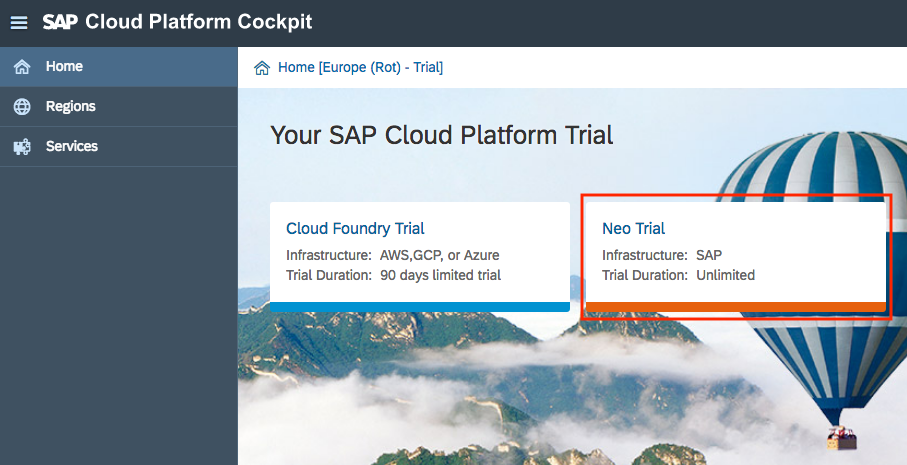
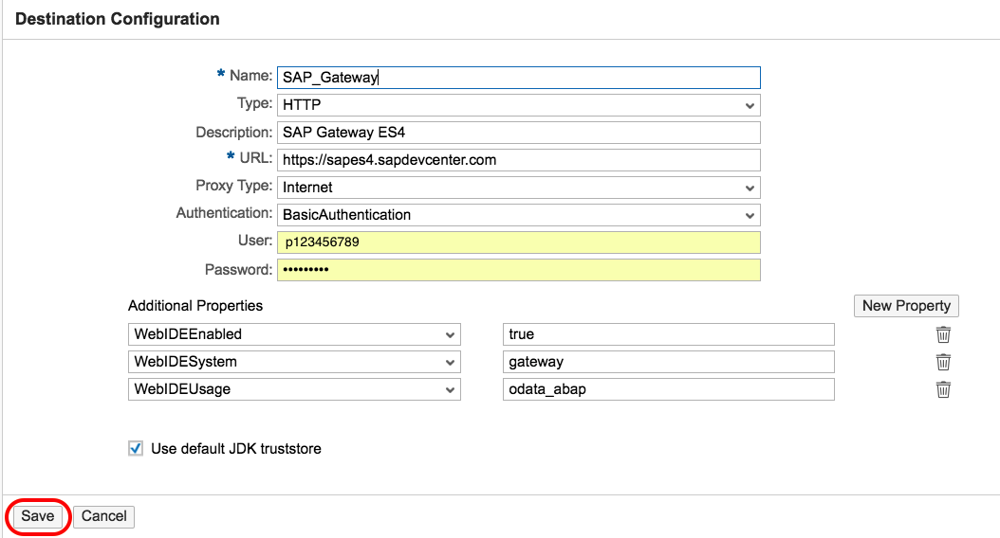

## Prerequisites  
 - **Proficiency:** Beginner

## Details
### You will learn  
You will create a destination (a server end-point where SAP Cloud Platform can send or receive data) that points to an SAP Gateway OData service.

### Time to Complete
**5 Min**.

---

[ACCORDION-BEGIN [Step 1: ](Log into your SAP Cloud Platform account)]
Log into [SAP Cloud Platform](https://account.hanatrial.ondemand.com) by opening the following URL in a new tab: <https://account.hanatrial.ondemand.com>

Click on the ***Neo Trial*** tile to open the cockpit for the Neo environment.

[DONE]
[ACCORDION-END]

[ACCORDION-BEGIN [Step 2: ](Go to Destinations)]

In the left-hand navigation bar, select **Connectivity > Destinations** then click on **New Destination**.

[DONE]
[ACCORDION-END]

[ACCORDION-BEGIN [Step 3: ](Enter Destination details)]

Enter the field values as listed below:

Field Name     | Value
:------------- | :-------------
Name           | `SAP_Gateway`
Type           | `HTTP`
Description    | `SAP Gateway ES5`
URL            | `https://sapes5.sapdevcenter.com`
Proxy Type     | `Internet`
Authentication | `BasicAuthentication`
User           | `<Your ES5 Gateway user> (e.g. p123456789)`
Password       | `<Your ES5 Gateway password>`

Leave the **Use default JDK truststore** checked.

And add the following **Additional Properties** fields by clicking on the **New Property** button once for each property.

Field Name       | Value
:--------------- | :-------------
`WebIDEEnabled`  | `true`
`WebIDESystem`   | `gateway`
`WebIDEUsage`    | `odata_abap`

Then click **Save**.

[DONE]
[ACCORDION-END]

[ACCORDION-BEGIN [Step 4: ](Save your destination)]

Click **Save**.

[DONE]
[ACCORDION-END]

[ACCORDION-BEGIN [Step 5: ](Check the Additional Property settings)]

Select the value of the **`WebIDEUsage`** parameter in your destination from the list below and click **Validate**:

[VALIDATE_5]
[ACCORDION-END]
