## Prerequisites  
 - **Proficiency:** Beginner
 - **Tutorials:** [Commit your project to Git and deploy to the cloud](http://go.sap.com/developer/tutorials/teched-2016-6.html)


## Next Steps
 - [Add a map display to your app](http://go.sap.com/developer/tutorials/teched-2016-7.html)

## Details
### You will learn  
With your app committed to your Git repository, you can now safely make some changes to the app. Any mistakes you make can be removed by discarding your changes using the Git pane.

In this tutorial, you will add some additional data fields to the detail view (the right side of you app), change the icons used on the tabs, and finally add an XML `fragment` file to contain the display of information on one of the tabs in the app.

### Time to Complete
**15 Min**.

---
[ACCORDION-BEGIN [Step 1: ](The fields you will add)]

The first change you will make is to add four additional fields at the top of the Detail view. 


[DONE]
[ACCORDION-END]

[ACCORDION-BEGIN [Step 2: ](Open the Detail view)]

Open SAP Web IDE, and click on the folder icons to open the **`te2016` > `webapp` > `view`** folder. Double-click on `Detail.view.xml` to open it in the editor.

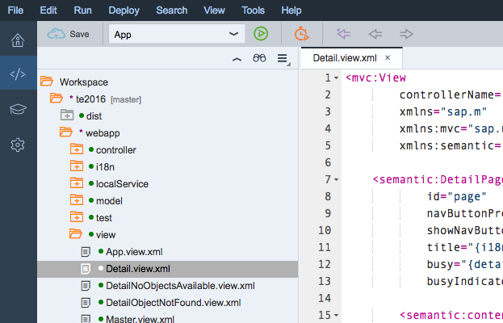

[DONE]
[ACCORDION-END]

[ACCORDION-BEGIN [Step 3: ](Interting fields into the `ObjectHeader`)]

Insert the four lines below into the `ObjectHeader` element. The XML snippet below adds four fields from the OData service (City, Country, URL and Partner role), as well as a reference to a title that you will insert in the next step.


Note that the code generate by the template has a closing angle bracket on line 19. That angle bracket belongs with the line above. Insert the code below as shown and you can clean up the angle bracket as well. Save your changes.

Code to insert:
    
```xml
<ObjectAttribute title="{i18n>headerCity}" text="{Address/City}"/>
<ObjectAttribute title="{i18n>headerCountry}" text="{Address/CountryText}"/>
<ObjectAttribute title="{i18n>headerURL}" text="{WebAddress}"/>
<ObjectAttribute title="{i18n>headerBusinessPartnerRole}" text="{BusinessPartnerRoleText}"/>
```
    
    
Your XML file should look like this:


[DONE]
[ACCORDION-END]

[ACCORDION-BEGIN [Step 4: ](Open the i18n file)]
    
The `title` attributes in the snippet you inserted tell the app to look for the label of the data field in a centralized file. To all those labels, **`te2016` > `webapp` > `i18n`** folder and double-click the `i18n.properties` file.

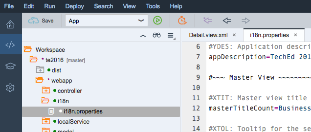

[DONE]
[ACCORDION-END]

[ACCORDION-BEGIN [Step 5: ](Inserting strings)]

Insert the text below into the `i18n.properties` file just below the **Detail View** separator line and save your edits. 

```
headerCity=City
headerCountry=Country
headerURL=URL
headerBusinessPartnerRole=Relationship
itf1Title=Contacts
itf2Title=Map
mapFragmentTitle=Map
```

> The actual location in the file doesn't matter, but it is nice to keep things organized so you can find them easily in the future.

> You will notice three additional labels that you've added. You will use them later in the tutorial.

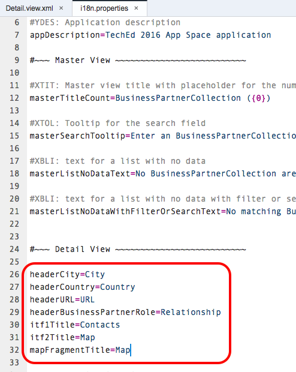

[DONE]
[ACCORDION-END]

[ACCORDION-BEGIN [Step 6: ](Run the app with new fields in the header)]

With both files saved, click the **Run** button again to launch your app. You should now see the four additional fields at the top of the detail view.

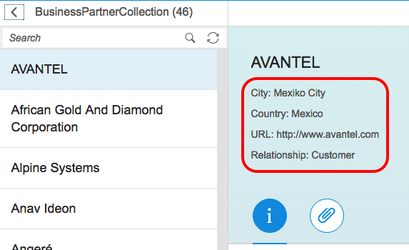

[DONE]
[ACCORDION-END]

[ACCORDION-BEGIN [Step 7: ](Add a new file)]

Before you make some additional changes to the `Detail.view.xml` file shortly, you will create the XML `fragment` file that you will link to the detail view. A Fragment is a light-weight UI components that do not have a dedicated "controller". Fragments are typically used in pop up screens (Dialog, Message boxes etc), and you will use one to control the data shown on the second tab of your app.

Add a new file to your project by right-clicking on your **`view`** folder and select **New > File**.

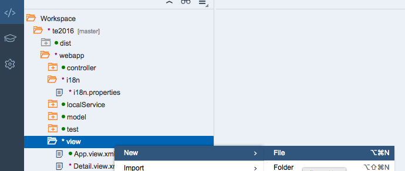     

[DONE]
[ACCORDION-END]

[ACCORDION-BEGIN [Step 8: ](Name the new file)]

Name the file `Map.fragment.xml` and click **OK**.

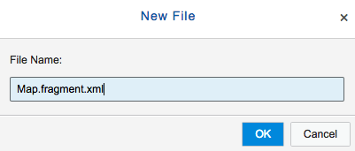 

[DONE]
[ACCORDION-END]

[ACCORDION-BEGIN [Step 9: ](Add the content to the `Fragment` file)]

Paste the XML below into the new `Map.fragment.xml` file and save your edits.

```xml
    <core:FragmentDefinition xmlns:core="sap.ui.core" xmlns:f="sap.ui.layout.form" xmlns:l="sap.ui.layout" xmlns="sap.m">
	    <l:Grid defaultSpan="L12 M12 S12" id="contactFragment" width="auto">
		    <l:content>
			    <f:SimpleForm columnsL="6" columnsM="1" editable="false" 
				layout="ResponsiveGridLayout" maxContainerCols="6" minWidth="1024" title="{i18n>mapFragmentTitle}">
				    <f:content>
					    <Label text="Address "/>
					    <Text text="{Address/Building}"/>
					    <Text text="{Address/Street}"/>
					    <Text text="{Address/City}"/>
					    <Text text="{Address/PostalCode}"/>
					    <Text text="{Address/CountryText}"/>
				    </f:content>
			    </f:SimpleForm>
		    </l:content>
	    </l:Grid>
    </core:FragmentDefinition>
```

Your file should look like this:
    
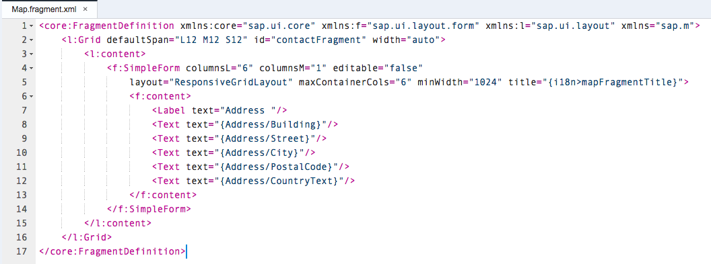

[DONE]
[ACCORDION-END]

[ACCORDION-BEGIN [Step 10: ](Add a new namespace)]

Return to `Detail.view.xml`. You will make a few simple edits to the file, before you do some bigger restructuring.

At the top of the file, in the `mvc:View` element, insert an additional XML `namespace` attribute (this namespace will be used when the `Fragment` is loaded): 
    
```xml
xmlns:core="sap.ui.core"
```

The top of your file should look like this:
    


[DONE]
[ACCORDION-END]

[ACCORDION-BEGIN [Step 11: ](Update titles in the `IconTabFilter`s)]

Scroll down to the **`IconTabFilter`** elements. Update both `IconTabFilter` sections as shown the image below. You will need to:

 - change both `icon` attributes as shown in the image
 - and insert the two `text` attributes provided below. These link the label for the tabs to lines you previously inserted into `i18n.properties`.

For the first `IconTabFilter` element:
    
```xml
text="{i18n>itf1Title}"
```
    
For the second `IconTabFilter` element:
    
```xml
text="{i18n>itf2Title}"
```

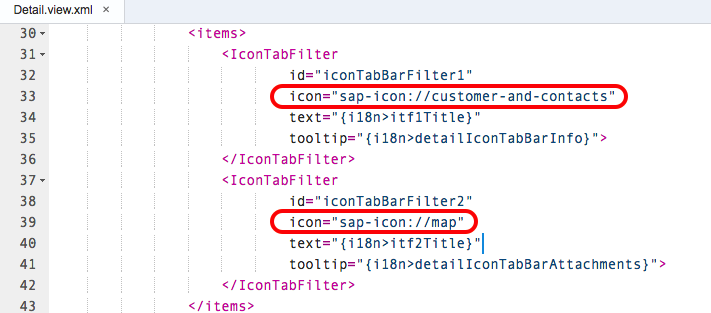

[DONE]
[ACCORDION-END]

[ACCORDION-BEGIN [Step 12: ](Insert a `content` element for the first tab)]

The next step is to set the content to be displayed in the first tab. Place your cursor at the end of line 35 (the `tooltip` line of the first `IconTabFilter`) and type in `<content>` (don't copy and paste this one time). 

You will notice that as soon as you type the closing angle bracket, Web IDE automatically inserts the `</content>` closing tag for you. Add some line feeds between the `<content>` tags so your file looks like this:

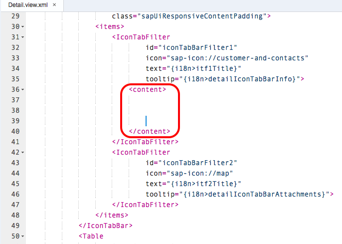

[DONE]
[ACCORDION-END]

[ACCORDION-BEGIN [Step 13: ](Deleting the `Table` element)]

This step will start the restructuring of the detail view where you will move the entire **`<Table>`** element from its current location and place it within the `<content>` element you just inserted. 

Locate the entire **`<Table>`** element as shown below, copy the text, then delete it.

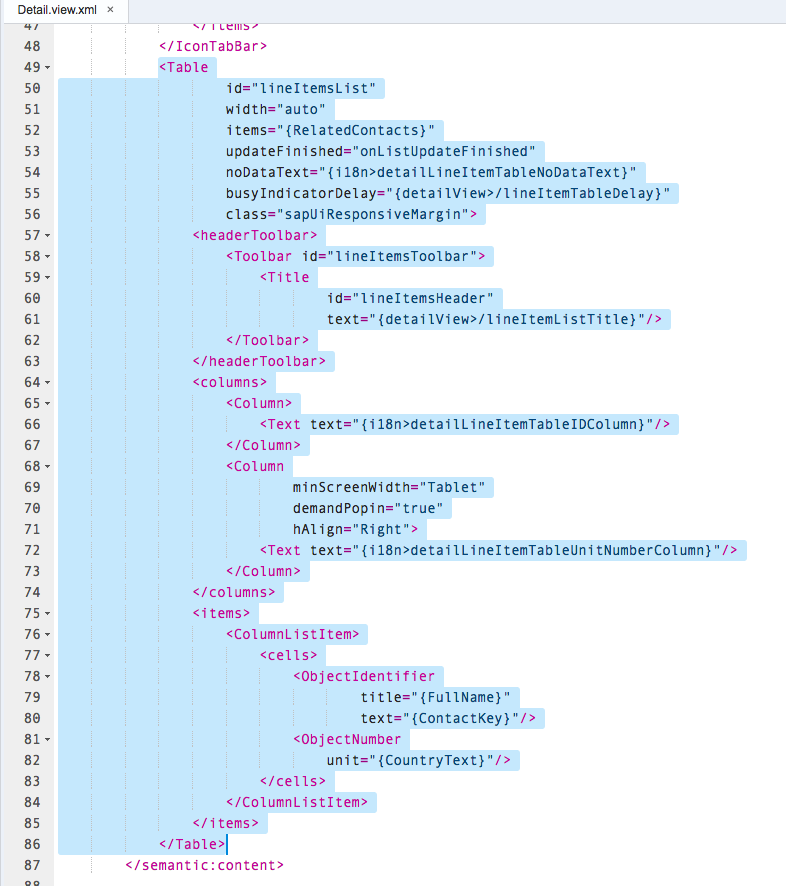

[DONE]
[ACCORDION-END]

[ACCORDION-BEGIN [Step 14: ](Re-inserting the `Table` element)]

Paste the text you just deleted within the **`<content>`** element you added above and save your changes.

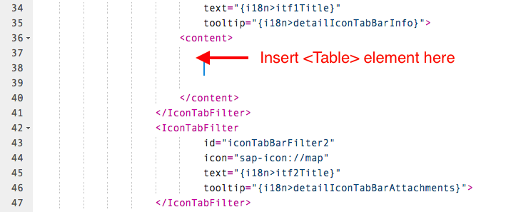

[DONE]
[ACCORDION-END]

[ACCORDION-BEGIN [Step 15: ](Changing a displayed field)]

The field displayed below the contact's full name is the `ContactKey` which is not useful to a user. Change that field to show the gender of the contact by replacing `{ContactKey}` with `{GenderText}`, save your change and run your app. 

The detail view will now look like this:

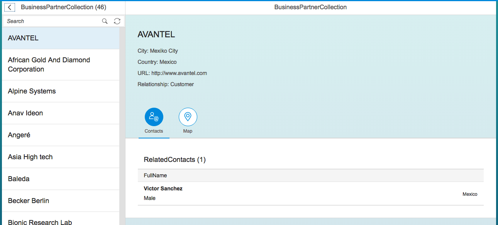

[DONE]
[ACCORDION-END]

[ACCORDION-BEGIN [Step 16: ](Insert a `content` element for the second tab)]

The last part of the restructuring is to add in a `<content>` element for the second tab (the second `<IconTabFilter>` in the file) to load the `Fragment` file you created.

Insert the XML snippet below before the closing tag of the second `<IconTabFilter>` as shown in the image below.

```xml
<content>
    <core:Fragment fragmentName="com.test.teched.view.Map" type="XML" />
</content>
```

  

[DONE]
[ACCORDION-END]

[ACCORDION-BEGIN [Step 17: ](Second `IconTabFilter` appearance)]

The section of the `Detail.view.xml` file for your second `<IconTabFilter>` should look like this:
    
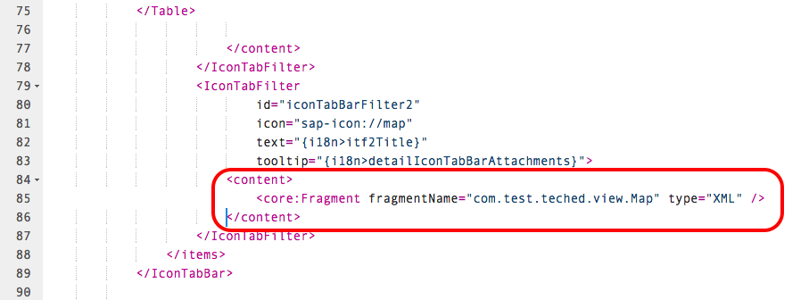    

[DONE]
[ACCORDION-END]

[ACCORDION-BEGIN [Step 18: ](Change object type in the view)]

One last little edit to the detail view is to change the `ObjectNumber` element to an `ObjectIdentifier` element as shown below. 

XML to insert:
    
```xml
 <ObjectIdentifier
	title="{City}"
	text="{CountryText}"/>
```		 

Element to change:
    
 

Result:
    
 

[DONE]
[ACCORDION-END]

[ACCORDION-BEGIN [Step 19: ](Modify the App Descriptor]


The last change before running your app is to modify the `manifest.json` file. Open **`te2016` > `webapp` > `manifest.json`**.

[ACCORDION-BEGIN [Step 20: ](Run your app)]

Insert the two lines below as shown in the image.

```
"description": "{{appDescription}}",
"ach": "ach",
```		

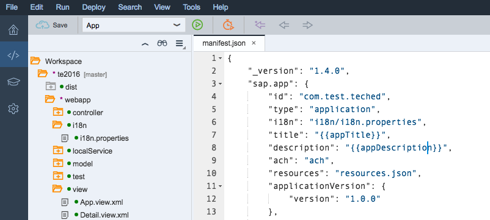

[DONE]
[ACCORDION-END]

[ACCORDION-BEGIN [Step 21: ](Run your app)]

Save your edits and run your app. The two tabs in the detail view should look like the images below.

Contact tab:
    
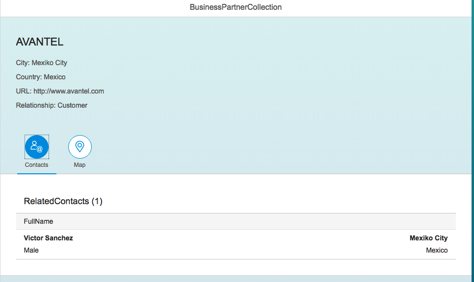    
    
Map tab:
    
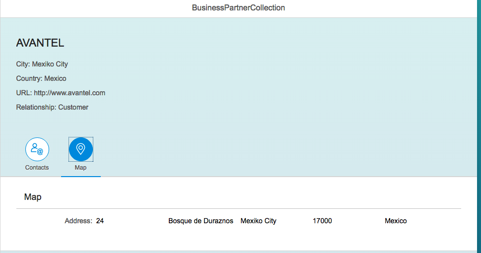    

[DONE]
[ACCORDION-END]

## Next Steps
 - [Add a map display to your app](http://go.sap.com/developer/tutorials/teched-2016-7.html)
