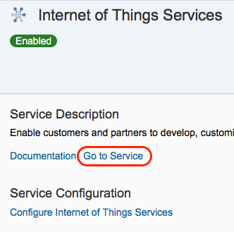
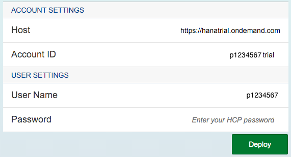
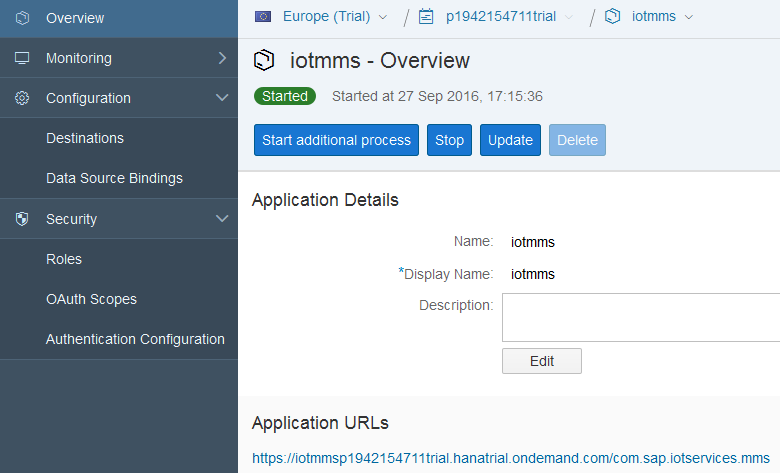
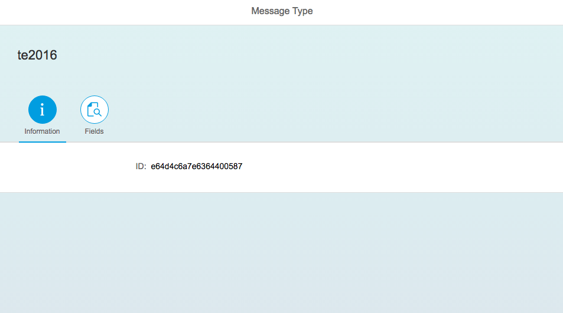
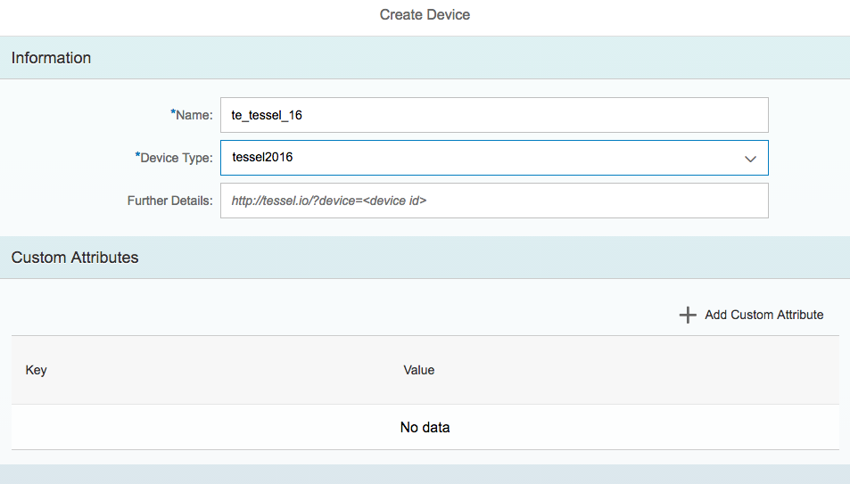
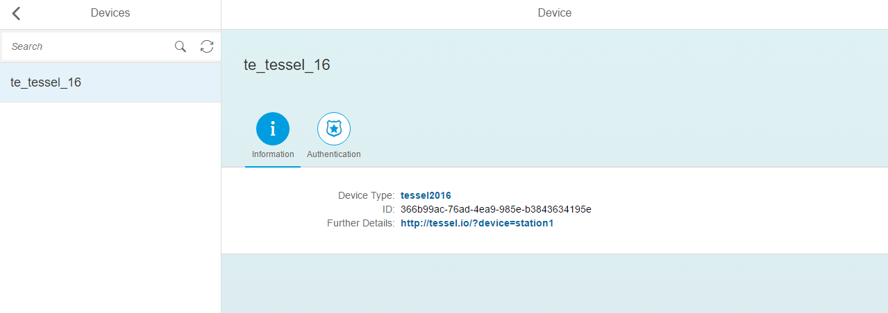
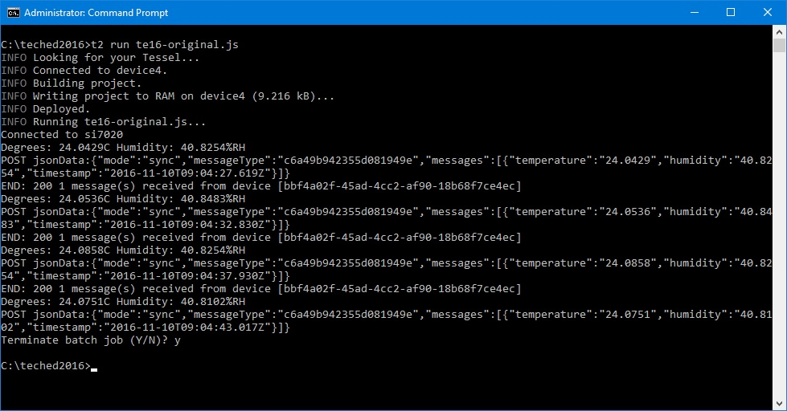

## Prerequisites  
 - **Proficiency:** Beginner
 - **Tutorials:** [ABC Analysis with SAP HANA PAL](https://www.sap.com/developer/tutorials/teched-2016-10.html)

## Next Steps
  - Select a tutorial from the [Tutorial Navigator](https://www.sap.com/developer/tutorial-navigator.html) or the [Tutorial Catalog](https://www.sap.com/developer/tutorial-navigator.tutorials.html)

## Details
### You will learn  
- How to add a device type, message type and device to the IoT Services of SAP Cloud Platform (HCP)
- How to modify JavaScript code on your device to send data to the SAP Cloud Platform (HCP)

This tutorial will take you through the steps at a rapid pace, if you'd like more details please contact one of our support staff.

If you have an interest in the world of IoT this first tutorial will help you get started by giving you the basics necessary for connecting any device or sensor that you decide to use.

In this tutorial, we have decided to use a Tessel 2 device.

However, you could just as easily use a Raspberry Pi, Arduino, or any number of other `micro-controller` devices available on the market today.

### Time to Complete
**20 Min**.

---

[ACCORDION-BEGIN [Step 1: ](Connection to the SAP Cloud Platform)]

Log into [SAP Cloud Platform](https://account.hanatrial.ondemand.com) by opening the following URL in a new tab: https://account.hanatrial.ondemand.com

Make sure you are using the **Europe (Trial)** landscape, and click on your account name to open the cockpit view.


[ACCORDION-END]

[ACCORDION-BEGIN [Step 2: ](Enable IoT Services)]

In the left-hand navigation bar, select **Services**, then click on the **Internet of Things Services** tile from the main panel.


If the **Internet of Things (IoT)** is not enabled, then click on **Enable**.

Once the service is enabled click the **Go to Service** link and a new browser window will open.




[ACCORDION-END]

[ACCORDION-BEGIN [Step 3: ](Deploy the IoT Services)]

With **Internet of Things** enabled, you can begin the steps necessary to connect your device and enable message communication.

The first step will be to configure and deploy the **Message Management Service (MMS)**.

Click on the **Deploy Message Management Service** tile. It will deploy `iotmms` Java application for you in the background.

The form should already be filled with your information like your account ID (p-number or s-number if you are SAP's customer or partner, or i-/d-number if you are SAP employee) with the world "trial" (no space between the p-number and trial), your user name etc.

Enter your **SAP Cloud Platform** password, then click on **Deploy**.




[ACCORDION-END]

[ACCORDION-BEGIN [Step 4: ](Configure the IoT MMS)]

Once the `iotmms` Java application is successfully deployed (created), you will need to add data binding and the required authorization for users who should use it.

The data binding allow the data you are sending from the device to the system to be stored for later access and the authorization will grant the access to Message Management System to your user.

Return to the **SAP Cloud Platform Cockpit**, and in the left navigation bar select **Applications > Java Applications**.

You will see the `iotmms` application you just deployed.

Click on the `iotmms` link to display the **IoT MMS - Overview** page.


On the left navigation bar, select **Configuration > Data Source Bindings**.

Check that the **<DEFAULT>** data binding is in place which should look like something similar to pictures below.


or


**In case your `iotmms` application is missing the data binding**, you will need to apply additional steps in order to manually create a new database, and then add the data source binding.

Otherwise proceed to the next step of assigning a role with required authorizations to your user.


[ACCORDION-END]

[ACCORDION-BEGIN [Step 5: ](Assign authorizations to run IoT MMS)]

On the left navigation bar, select **Roles**.

Select the **IoT-MMS-User** (click the empty cell next to the Name to select the row if it is not highlighted in blue).


Then under **Individual Users**, click **Assign** and enter your SAP Cloud Platform user ID (e.g. your p-number ***without*** the word "trial" on the end).


Once your user is assigned to the role, stop then start `iotmms` application.

Click on **Overview** in the left navigation bar.

Click **Stop**, then when the process completes, you can click on **Start**.



From here you will need to go back to the **IoT Service Cockpit** from where you deployed the **Message Management Service** .


[ACCORDION-END]

[ACCORDION-BEGIN [Step 6: ](Create a new Message Type)]

Now that your version is up to date you will need to go to **Message Types** and create a new message type.


The "Message Type" defines the structure of data received from devices and generates a table to hold this data.

Pay close attention to your field names, both in spelling, case sensitive and type as you will not be able to alter these after creation.

 Field    | Value
 :------- | :-----------------
 Name     | `te2016`

And the following fields:

 Position    | Name          | Type
 :---------- | :------------ | :------
 1           | `timestamp`   | date
 2           | `temperature` | double
 3           | `humidity`    | double


Please note down the created Message Type's **ID** displayed here, as you will be using it later.




[ACCORDION-END]

[ACCORDION-BEGIN [Step 7: ](Create new Device Type)]

Once the **Message Type** is created, you will need to create a new **Device Type** and assign the **Message Type** to it.


Field            | Value
:--------------- | :----------------
Name             | `tessel2016`
Message Type     | `te2016`
Direction        | `From Device`


[ACCORDION-END]

[ACCORDION-BEGIN [Step 8: ](Add a device)]

Now that you have your **Message Type** and **Device Type** created, you will need to add your **Device**.


Field            | Value        
:--------------- | :----------------
Name             | `te_tessel_16`
Device Type      | `tessel2016`



Be sure to save this **Device** token that is generated as you will need it later.

If you lose it you will need to generate a new one.


Please note down the created **Device** id displayed here as you will be using it later.




[ACCORDION-END]

[ACCORDION-BEGIN [Step 9: ](Select your IoT Device)]

If you are with us at TechEd in the `AppSpace`, your device is the physical **Tessel** device next to you.


[ACCORDION-END]

[ACCORDION-BEGIN [Step 10: ](Copy and Modify the JavaScript file)]

With these steps completed you are now ready to modify the JavaScript code we have prepared for the device and deploy and execute it.

If you are with us at TechEd in the `AppSpace`, the file is already available in the following directory: `C:\teched2016\te16-original.js`. Please make a copy of the file for your own use `C:\teched2016\te16.js` and the convenience of the next attendee.

If you are doing this on your own machine, you can download the file [`te16_js.txt`](https://raw.githubusercontent.com/SAPDocuments/Tutorials/master/tutorials/teched-2016-9/te16_js.txt), and rename it to `te16.js` on your machine.


[ACCORDION-END]

[ACCORDION-BEGIN [Step 11: ](Modify the code)]

Modifying the code provided in the file now called `te16.js`, you will need to add in your **Message Type** id, **Device** id, etc.

The lines in particular you will need to modify are the following:

```javascript
var accountOwner = '<your account user>';
var messageTypeID = '<message type>';
var deviceId = '<device id>';
var authToken = '<auth token of the device>';
```

You will modify:
 - The `accountOwner` line to add your own SAP Cloud Platform Account User ID which starts with either an `S`, `P`, `I`, `D` or `C`.
 - The `messageTypeID` is the ID of the message type you created, and not the name of the message type.
 - The `deviceId` is the ID of the device you created, not to be confused with the `token`
 - The `authToken` line contains the token of the device (not the device type!). You received it in the pop-up window after creating your device. But if missed it, then regenerate this token from Device screen once again.


[ACCORDION-END]

[ACCORDION-BEGIN [Step 12: ](Run your JavaScript program)]

Once you have saved your file, you will deploy and execute it from the command line. `t2` is the command line interface for `Tessel2` devices, which has been pre-installed on the computer already.

Open a "command" window, and run the following commands:

```shell
cd c:\teched2016
t2 run te16.js
```


[ACCORDION-END]

[ACCORDION-BEGIN [Step 13: ](Verify data acquisition)]

Provided your JavaScript file was modified properly with the correct items your output should be something like the following.




[ACCORDION-END]

[ACCORDION-BEGIN [Step 14: ](See your data in SAP Cloud Platform)]

If you now go back to the **IoT Services Cockpit** in SAP Cloud Platform you can see those newly created entries.

Click on **Send and view messages, or perform other actions**.


Click on **Display stored messages**.


The table with your data will match the **Message Type** id generated earlier.

   


[ACCORDION-END]

## Next Steps
  - Select a tutorial from the [Tutorial Navigator](https://www.sap.com/developer/tutorial-navigator.html) or the [Tutorial Catalog](https://www.sap.com/developer/tutorial-navigator.tutorials.html)
