## Prerequisites  
 - **Proficiency:** Beginner

## Details
### You will learn  
Change your data source from a mock server created by BUILD to a live OData service. It is important to know how to configure the connection to the backend of an application, which you will learn here.

### Time to Complete
**15 Min**

---

[ACCORDION-BEGIN [Step 1: ](Reopen SAP Web IDE)]

When you create a new destination in SAP Cloud Platform, SAP Web IDE must be updated to get the latest information. **Refresh or close and re-open** your SAP Web IDE.

[DONE]
[ACCORDION-END]

[ACCORDION-BEGIN [Step 2: ](Add the OData service)]

You need to add the OData service to your application. **Right click** on the project name. Select **New > OData Service**.

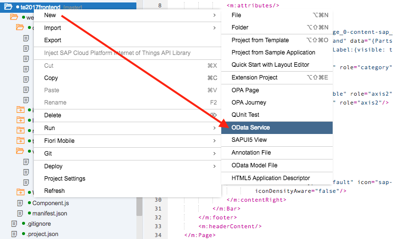

[DONE]
[ACCORDION-END]

[ACCORDION-BEGIN [Step 3: ](Select the service)]

The OData service wizard will pop up. On the **Data Connection** page, select **Service URL** from the _Sources_ options.

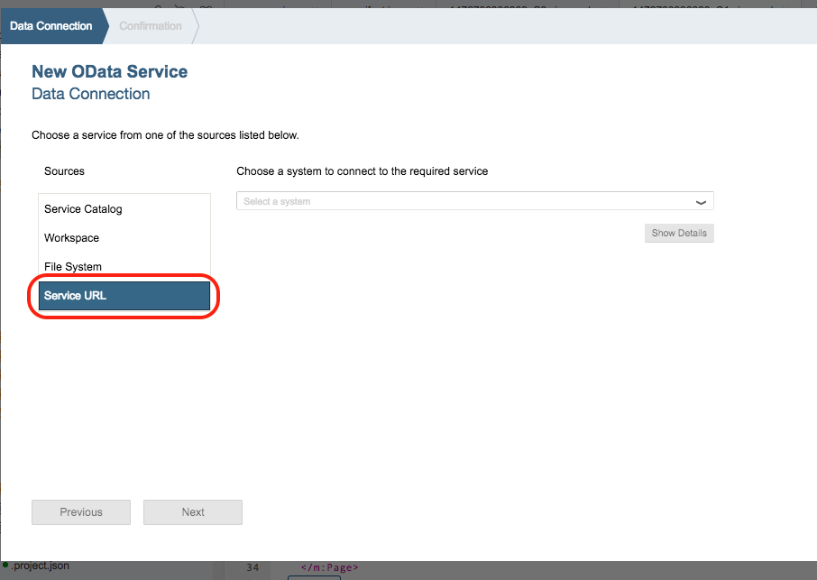

In the drop down, select **`Toys OData service for TechEd Frontend app`**.

Enter **/** for the relative URL and click **Test**. If you configured your destination and OData connection properly, you will see a **list of entities in the OData service**, which include Sets and Parts.

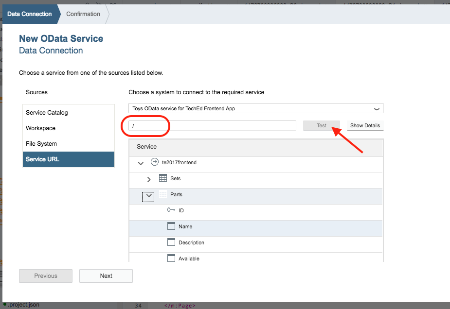

Click **Next** if your data is correct.

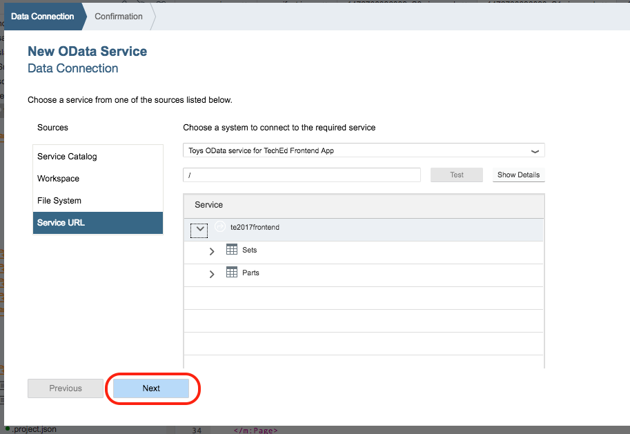

Leave Overwrite existing OData service connections unchecked. Click **Finish**.

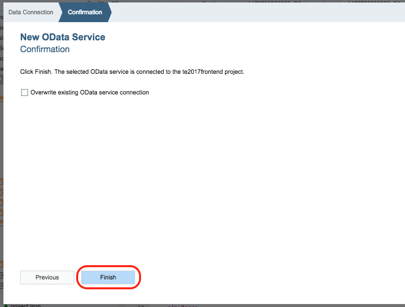

[DONE]
[ACCORDION-END]

[ACCORDION-BEGIN [Step 4: ](Validate the data source)]

Open the **metadata** file for the new OData service by opening the `webapp`, then the `localService`, and finally the `te2017frontend` folders.

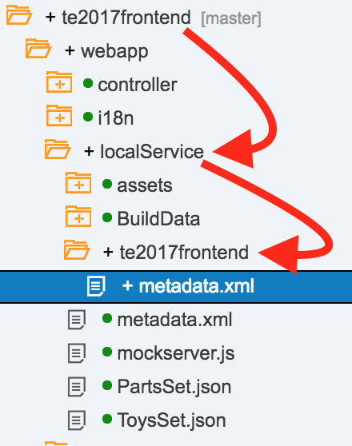

**Double click** on the `metadata.xml` file to open it. **Copy the `NavigationProperty`** element in the XML under the entity `SetsType`.

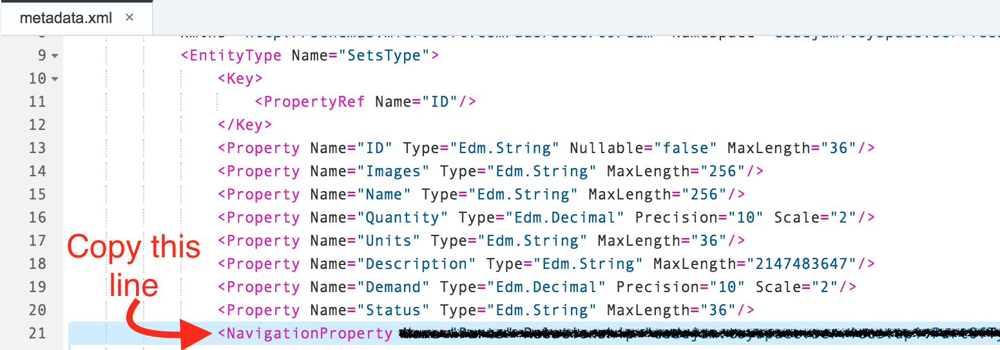

[VALIDATE_4]
[ACCORDION-END]

[ACCORDION-BEGIN [Step 5: ](Change the Component file)]

Locate the **`Component.js`** file under the *`webapp`* folder. **Double click** to open the file.

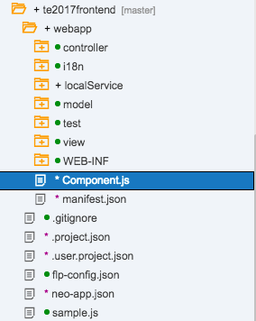

Two updates need to be made to this file to switch from the Mock Data to the Live Data service. Locate the server initialization line and the navigation properties variable. You want to remove the `server.init()` line as this initializes the mock server. Additionally, you need to update the navigation properties to match the new entity name of **Sets** instead of `ToysSet`.

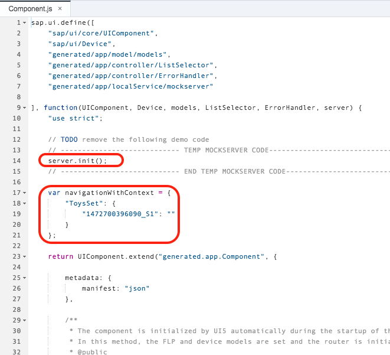

**Comment out `server.init()`** on line 14 by adding 2 forward slashes (`//`) to the beginning of the line.

Change the word `ToysSet` to **`Sets`** in line 18.

**SAVE** your changes.

[DONE]
[ACCORDION-END]

[ACCORDION-BEGIN [Step 6: ](Change the manifest file)]

Open the **`manifest.json`** file also located in the `webapp` folder.

SAP Web IDE defaults to the _Description Editor_. You will need to be in the **Code Editor**. To change to the Code Editor, locate the toolbar on the bottom of the screen. **Click Code Editor** in the toolbar.

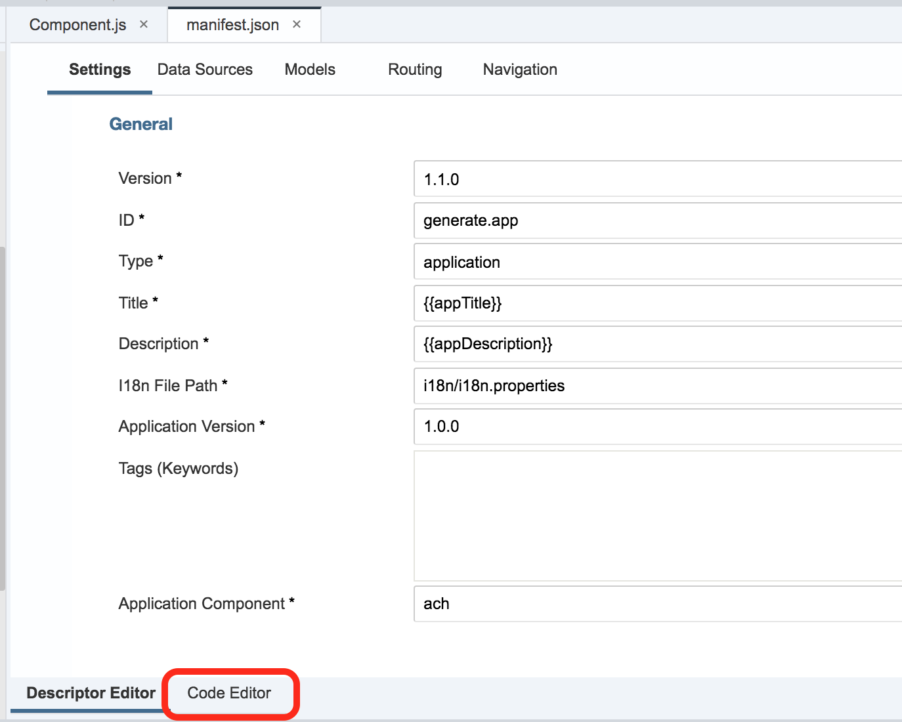

You will know you are in the Code Editor because the file is all code. If you see tabs and input fields, you are still in the Description Editor. Make sure your screen matches the screenshot below.

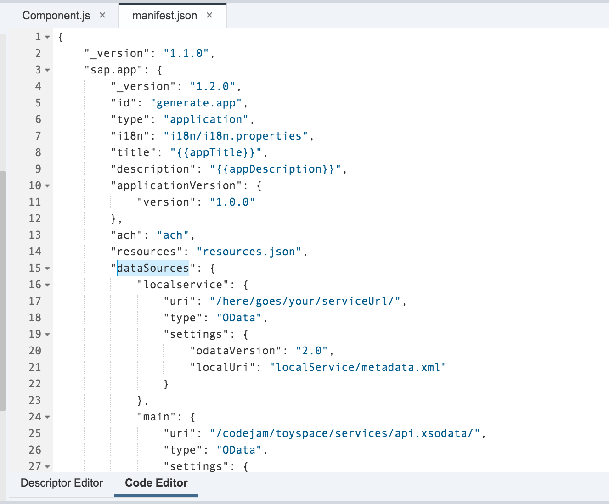

Locate the `dataSources` array in the manifest file. You have added a new data source called `te2017frontend` when you added the OData service in the earlier steps. You want to make this your **main** data service.

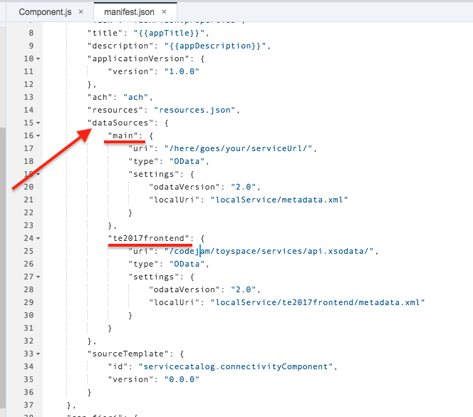

**Rename** *`main`* to `localservice`.

**Rename** *`te2017frontend`* to `main`.

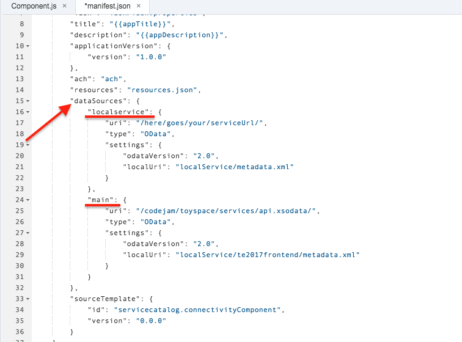

**SAVE** your changes.

[DONE]
[ACCORDION-END]

[ACCORDION-BEGIN [Step 7: ](Update the Master view)]

Open the **Master view**, or the view ending with `_S0`.

The **items binding** in the List control needs to be updated to match the new entity name.

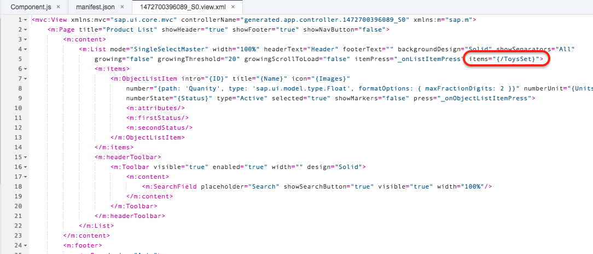

**Change** *`/ToysSet`* to `/Sets`.

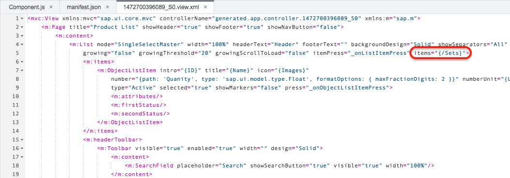

**SAVE** your changes.

[DONE]
[ACCORDION-END]

[ACCORDION-BEGIN [Step 8: ](Update the Detail controller)]

Open the **Detail controller**, or the controller ending in `_S1`.

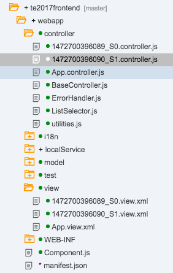

The **expand parameter** needs to be updated to match the new entity description. There are 2 instances of `PartOf` in the controller file. Both need to be updated.

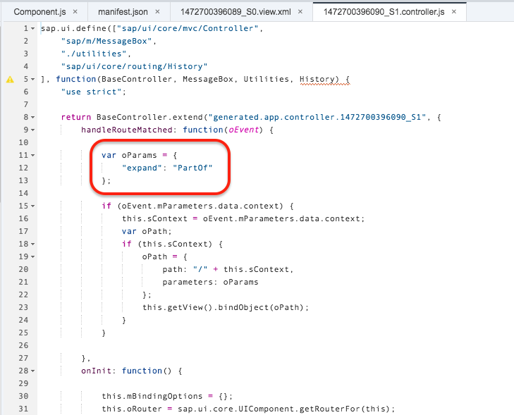

In the `handleRouteMatched` function, find the `oParams` variable. **Change the value** of `expand` from *`PartOf`* to **`Parts`**.

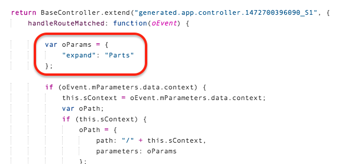

Towards the bottom of the `onInit` function, right before the `onAfterRendering` function, there is a reference to the _expanded entity name_ that needs to be updated. In the `oBindingParameters` variable, **Change the value** of `path` from *`PartOf`* to **`Parts`**.

**SAVE** your changes.

[DONE]
[ACCORDION-END]

[ACCORDION-BEGIN [Step 9: ](Validate your initialization function)]
**Copy the code** from your `onInit` function in the Detail (`S1`) controller. Paste it in the box below.

[VALIDATE_9]
[ACCORDION-END]
