## Prerequisites  
 - **Proficiency:** Beginner
 - **Tutorials:** [Getting started with SAP HANA Vora Tools](http://go.sap.com/developer/tutorials/vora-tools-getting-started.html)

## Next Steps
 - [SAP HANA Vora Modeler: Unions in SQL View](http://go.sap.com/developer/tutorials/vora-modeler-view-union.html)

## Details
### You will learn  
You will learn how to use Modeler artifacts to create SQL views with joins. It will be the first step to build a view to find the average revenue per region per year.

### Time to Complete
**5 Min**.

---

1. Now open the Modeler, where you will create an SQL view.

    Choose `+` in the navigation pane, name a name `STAR_CUSTOMERS`. The view type will remain `SQL`. Click `Ok`.

    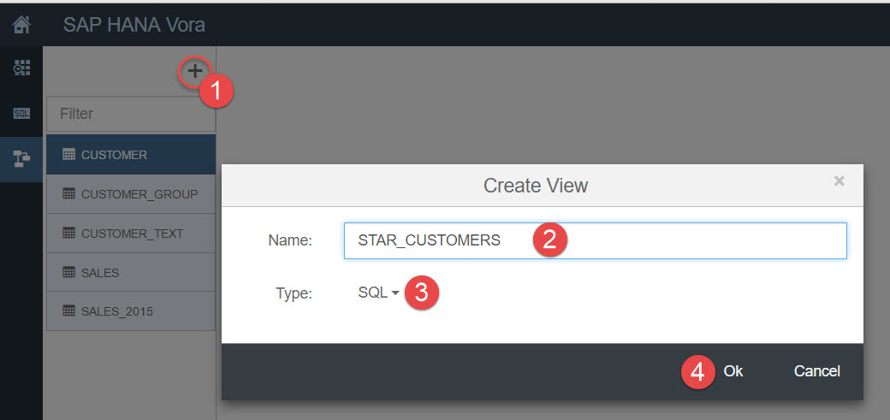

2. Click on `SubSelect` and place it on the canvas. Right click on it, choose **Add Alias** and call it `CUSTOMER_INFO`.

    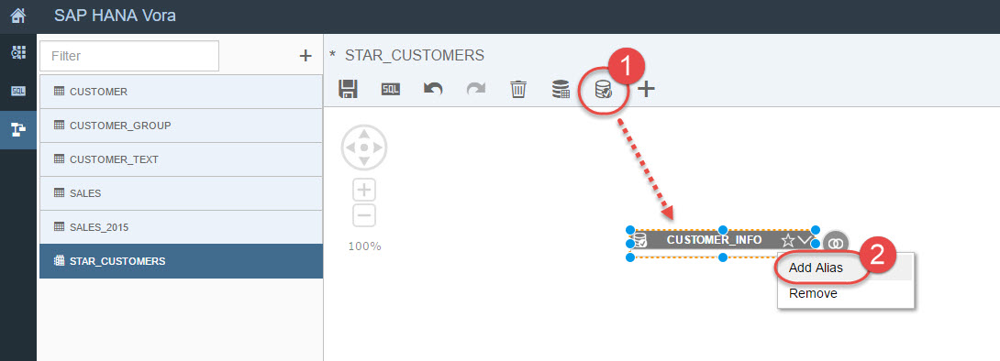

3. Double-click the `CUSTOMER_INFO` box to get into its edit screen. You should see the object reference changed to `STAR_CUSTOMERS / CUSTOMER_INFO` in the header.

    Now you want to select different attributes for the customers and for that you need to join `CUSTOMER` and `CUSTOMER_GROUP`. Therefore add `CUSTOMER` as data sources.

    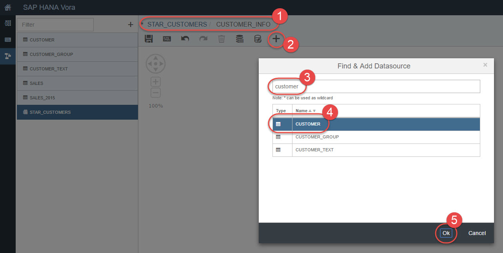

    Follow the same steps to add `CUSTOMER_GROUP` as a data source.

4. To create a join between these two tables, highlight the `CUSTOMER` table and click on the join symbol.

    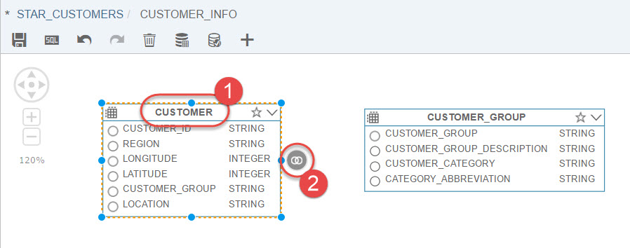

    Drag and drop it to `CUSTOMER_GROUP` table.

    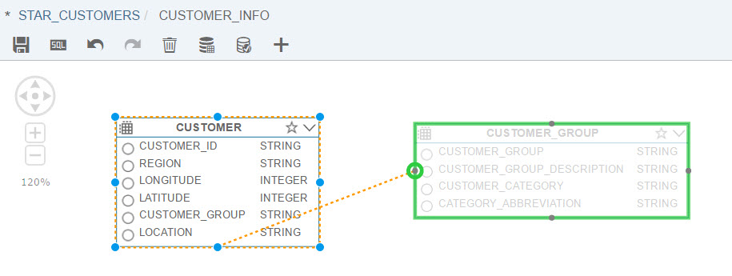

    The join window will pop up. Click on **Propose condition** and you see the common column between two tables are added as join condition. Please note that you accepted the default type of join which is `INNER` join. But you can change it by clicking on the arrow next to the `Type` depending on requirements.

    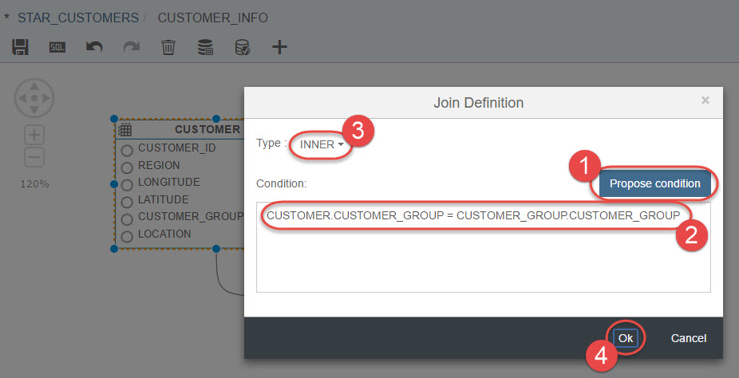

    Notice the join symbol and a condition in the subselect view.

    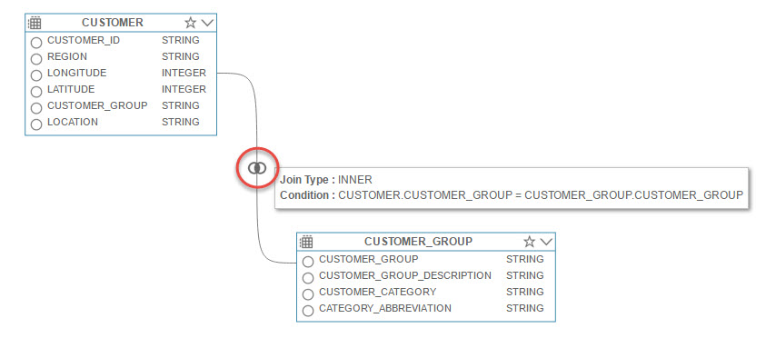

5. Choose `CUSTOMER_ID`, `CUSTOMER_GROUP`, `LOCATION` and `CATEGORY_ABBREVIATION` columns by clicking on the small circle next to each column name. The circle will become black once a column is selected. As well column names are added to `Columns` part of the view in the right pane.

    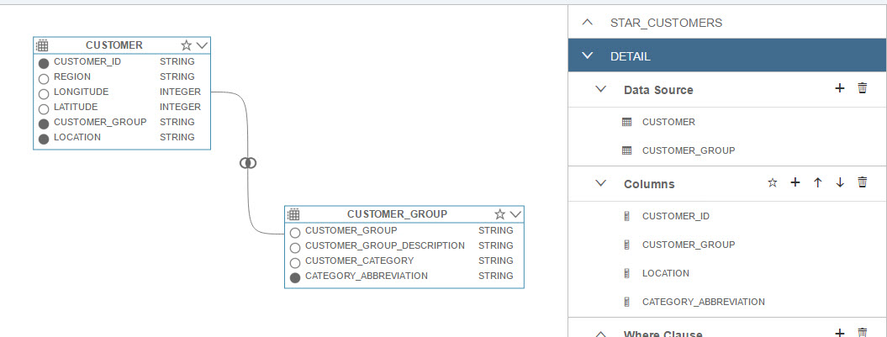

6. Go back to your main view by clicking on the `STAR_CUSTOMERS` hyperlink in the header. Click on the Star pictogram on top of your subselect rectangle to add all selected columns to the output of the view. Save your work.

    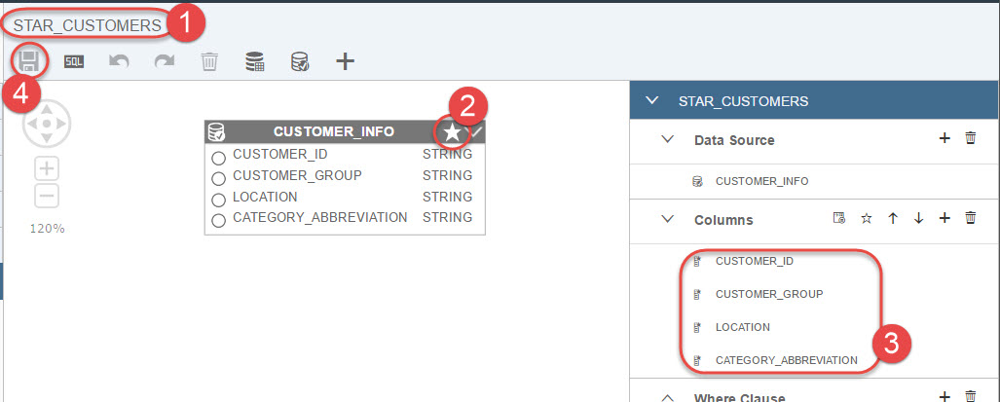

7. Click on **SQL** icon in the Modeler editor to open the generated SQL and copy the statement. Click **Close**

    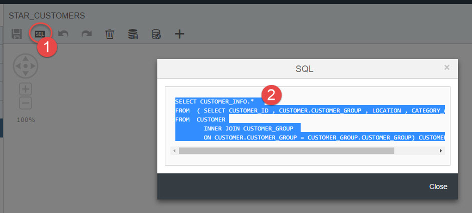

    Go back to the SQL Editor view and paste the generated SQL. Add second statement to select directly from the view. Click on **Execute All** button to run both statements.

    ```sql
    SELECT CUSTOMER_INFO.*  
    FROM  ( SELECT CUSTOMER_ID , CUSTOMER.CUSTOMER_GROUP , LOCATION , CATEGORY_ABBREVIATION  
    FROM  CUSTOMER
	    INNER JOIN CUSTOMER_GROUP
	    ON CUSTOMER.CUSTOMER_GROUP = CUSTOMER_GROUP.CUSTOMER_GROUP) CUSTOMER_INFO;

    SELECT * FROM STAR_CUSTOMERS
    ```

    The result of the last statement, ie. select from the view `STAR_CUSTOMERS`, is displayed in the `Results` pane.

    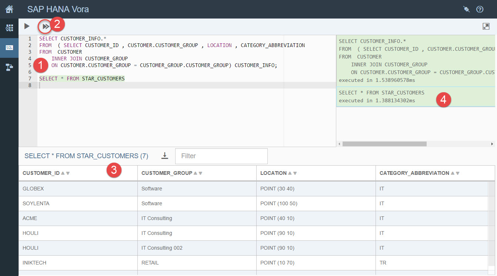

    Now to see the results of the previous statement, click on the green field with the statement in the right pane. You will see as well corresponding statement highlighted in green in the editor window.

    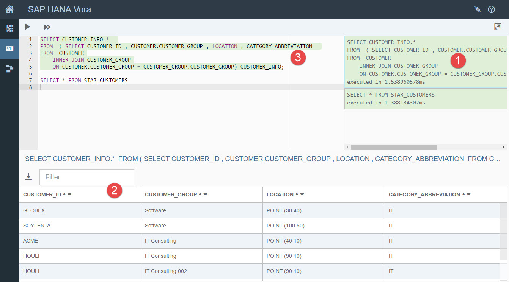

    Compare results of both statements.

## Next Steps
 - [SAP HANA Vora Modeler: Unions in SQL View](http://go.sap.com/developer/tutorials/vora-modeler-view-union.html)
