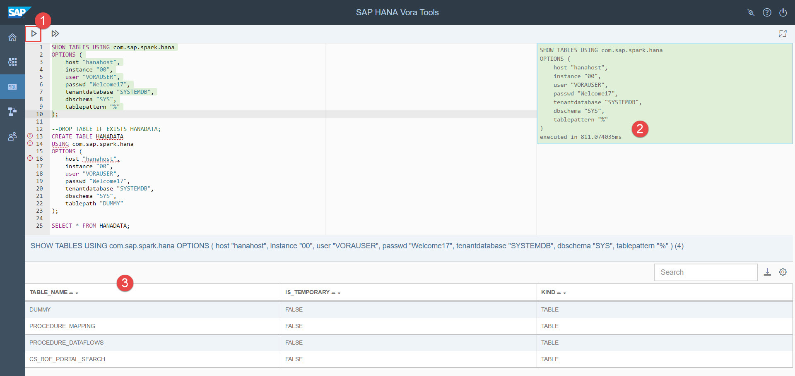

## Prerequisites  
 - **Proficiency:** Beginner
 - **Tutorials:** [Working with the SAP Vora Tools](https://www.sap.com/developer/tutorials/vora-ova-toolsintro.html)


## Next Steps
 - [Using Spark Shell to run SAP Vora examples](https://www.sap.com/developer/tutorials/vora-ova-spark-shell.html)

## Details
### You will learn  
You will learn how to connect to SAP HANA database as a data source and create a SAP Vora table with SAP HANA data. The SAP HANA data source supports read and write access from SAP Vora to SAP HANA.

### Time to Complete
**15 Min**

---

[ACCORDION-BEGIN [Step 1: ](Listing tables from SAP HANA)]
To list tables from SAP HANA in SAP Vora 1.4 run the following query.

```sql
SHOW TABLES USING com.sap.spark.hana
OPTIONS (
    host "hanahost",
    instance "00",
    user "VORAUSER",
    passwd "somepassword",
    tenantdatabase "SYSTEMDB",
    dbschema "SYS",
    tablepattern "%"
);
```




[ACCORDION-END]

[ACCORDION-BEGIN [Step 2: ](Create Vora table from HANA data source)]
To reflect an SAP HANA table in the Spark session catalog, you can use a `CREATE TABLE` statement that references an existing SAP HANA table. The table metadata is copied from the SAP HANA catalog into the Spark session catalog. The table in SAP HANA has to exist prior to importing it into SAP HANA Vora.

You can also create new tables in SAP HANA using the `CREATE TABLE` command. A prerequisite is that the table does not yet exist in SAP HANA.

You need to provide a table name, the fully qualified name of the SAP HANA data source package `com.sap.spark.hana`, and a set of options required by the data source.

```sql
--DROP TABLE IF EXISTS HANADATA;
CREATE TABLE HANADATA
USING com.sap.spark.hana
OPTIONS (
    host "hanahost",
    instance "00",
    user "VORAUSER",
    passwd "Welcome17",
    tenantdatabase "SYSTEMDB",
    dbschema "SYS",
    tablepath "DUMMY"
);
```


Now you can query the table.

```sql
SELECT * FROM HANADATA;
```


[ACCORDION-END]

## Next Steps
- [Using Spark Shell to run SAP Vora examples](https://www.sap.com/developer/tutorials/vora-ova-spark-shell.html)
