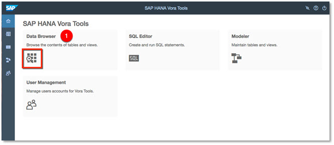
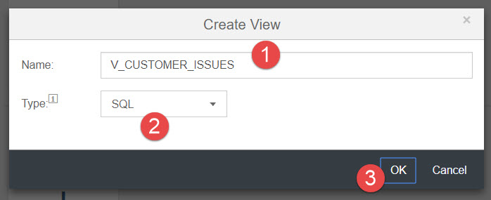
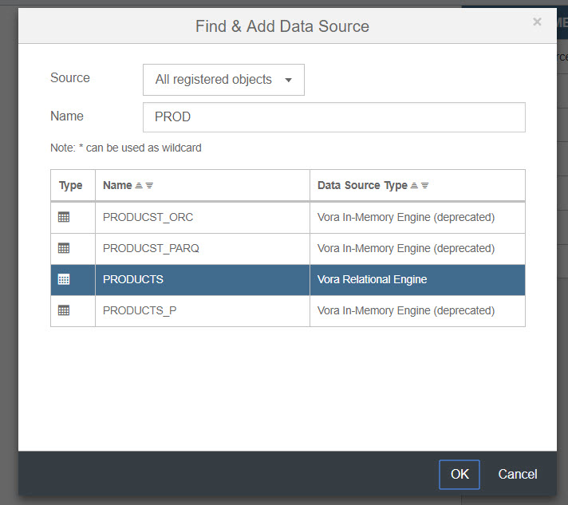
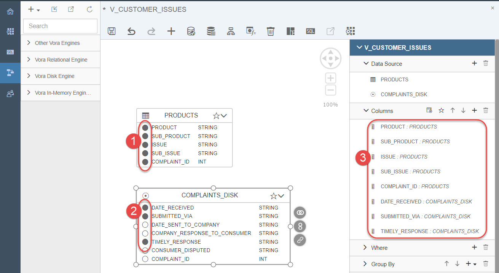
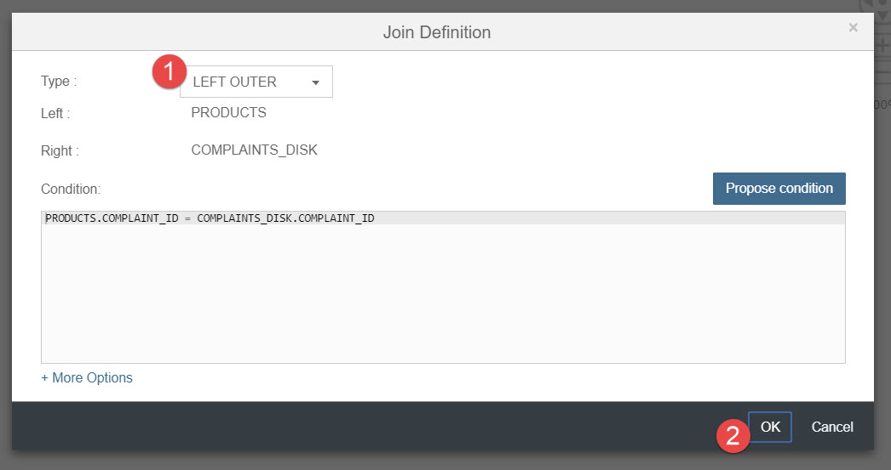

## Prerequisites  
 - [Working with Graph Engine using Apache Zeppelin](http://www.sap.com/developer/tutorials/vora-ova-zeppelin4.html)

## Next Steps
 - [Working with SAP HANA data source](https://www.sap.com/developer/tutorials/vora-ova-hana-datasource.html)

## Details
### You will learn  
You will learn how to use Data Browser and Modeler from Vora Tools.

### Time to Complete
**15 Min**

---

[ACCORDION-BEGIN [Step 1: ](SAP Vora Tools)]
The SAP Vora 1.4 Tools provide a data browser for viewing and exporting data in tables and views, an SQL editor for creating and running SQL scripts, and a modeler for creating data models.

SAP Vora makes available OLAP-style capabilities for data on Hadoop, in particular, a hierarchy implementation that allows you to define hierarchical data structures and perform complex computations on different levels of data.

[ACCORDION-END]

[ACCORDION-BEGIN [Step 2: ](Accessing the Tools)]
You can access the SAP Vora tools via web browser on the port 9225 of the Vora host: `http://<IP_ADDRESS>:9225`. In your SAP Vora, developer edition, you can use user `admin`. The default password is `admin` too.

You will be presented with the initial landing page once logged in successfully.

[ACCORDION-END]

[ACCORDION-BEGIN [Step 3: ](Data Browser)]
Continue by selecting the **Data Browser**. This node will give a list of all object created in the platform (from previously done tutorials). You can also preview data.

Expand the tree views of Vora In-Memory Engine and Vora Disk Engine.

Continue by opening a table `PRODUCTS` to browse its content.

[ACCORDION-END]

[ACCORDION-BEGIN [Step 4: ](Modeler)]
Select the **Modeler** button. Create a new SQL View called `V_CUSTOMER_ISSUES` by selecting **Create New** tile in **Views**.

Select View Type `SQL` and name it `V_CUSTOMER_ISSUES`.

Once the view is created, the next step is to add Data Sources (two tables from previous steps). Click on the **Add Data Source** button. You can start typing the table name or supply a `*` to list all known Data Sources as shown below.

Repeat to add second table.

Continue by selecting desired columns as output by clicking on the highlighted radio buttons next to each required column. Note that the selected output columns will appear in the right hand pane **Columns**.

Join the two tables on the common column `COMPLAINT_ID`. First use your mouse pointer to select the `COMPLAINT_ID` column in the `PRODUCTS` table. Hold the mouse button down while dragging it to the `COMPLAINTS_DISK` table and drop it on the `COMPLAINT_ID` column.

The **Join Definition** window appears. Change the type to `Left Outer` and select **OK** when done.

Save the view. Now preview what you have done so far by clicking on the **Preview** button as demonstrated below. Note the join linking the two tables.

[ACCORDION-END]

## Next Steps
- [Working with SAP HANA data source](https://www.sap.com/developer/tutorials/vora-ova-hana-datasource.html)
