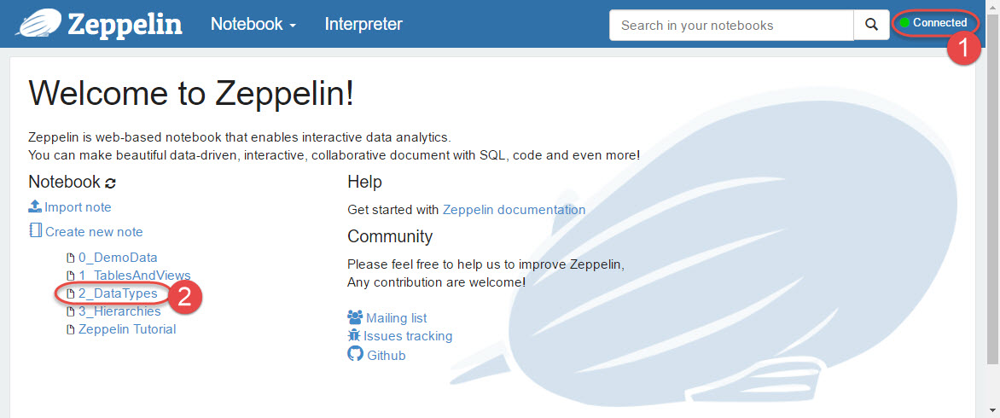
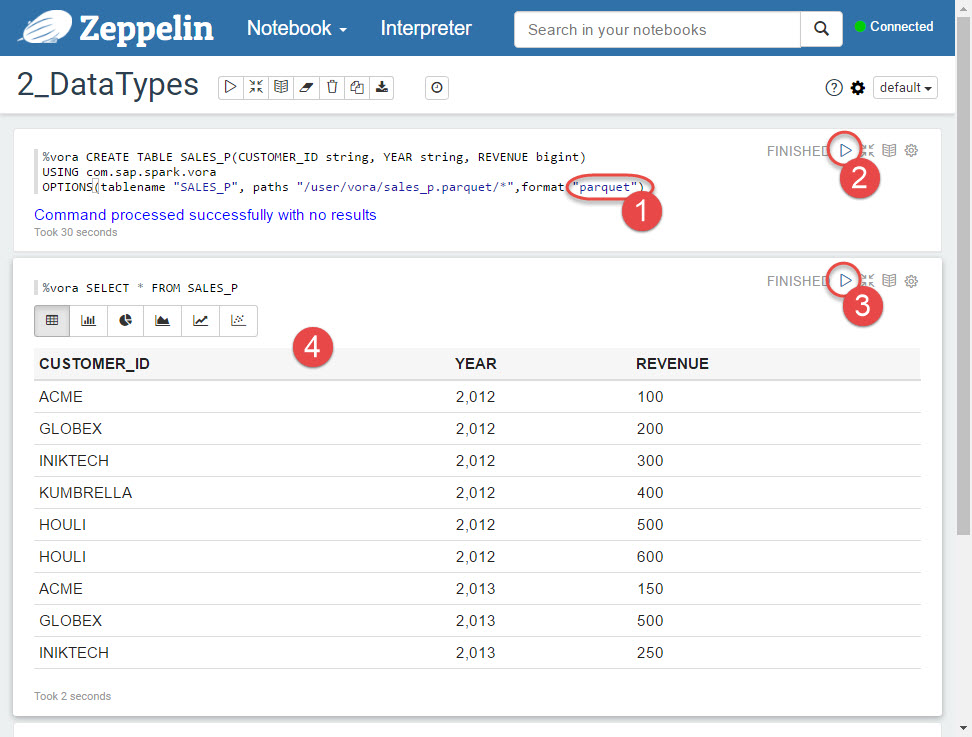
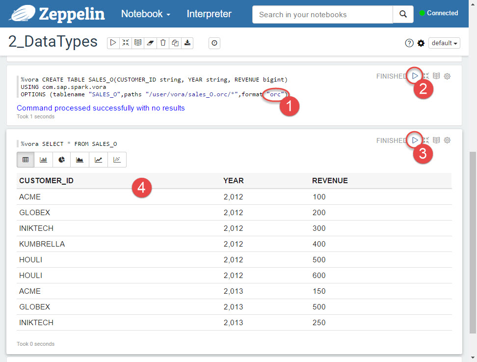

## Prerequisites  
 - **Proficiency:** Beginner
 - **Tutorials:** [SAP HANA Vora Modeler: Aggregation in SQL View](http://go.sap.com/developer/tutorials/vora-modeler-view-aggregate.html)

## Next Steps
 - [Using hierarchies in SAP HANA Vora](http://go.sap.com/developer/tutorials/vora-zeppelin-hierarchies.html)

## Details
### You will learn  
You will learn how to load sample data from Parquet and ORC file formats.

### Time to Complete
**5 Min**.

---

1. SAP HANA Vora support loading data not only from CSV format, but as well Hadoop-specific Parquet and ORC file formats.

    For this tutorial SAP HANA Vora, developer edition, has already sample files preloaded into HDFS. You can see them by executing following statements in the host's operating system as user `vora`.

    ```shell
    hdfs dfs -ls *.orc
    hdfs dfs -ls *.parquet
    ```

    

2. Similarly to loading sample CSV files you will use Zeppelin with predefined notebook here as well. To open Zeppelin web UI click on **Connect** in your SAP HANA Vora instance in CAL, and then pick **Open** a link for `Application: Zeppelin`.

    Once Zeppelin opens up in a new browser window, check it is **Connected** and if yes, then click on `2_DataTypes` notebook.

    

3. First you will create a table `SALES_P` using Apache Parquet file format.

    Click on **Run this paragraph** play button first on `CREATE TABLE` statement and then on `SELECT` one. Please note `format "parquet"` option in the first statement.

    

    You can run these statements from SAP HANA Vora Tools' SQL Editor as well.

    ```sql
    CREATE TABLE SALES_P(CUSTOMER_ID string, YEAR string, REVENUE bigint)
    USING com.sap.spark.vora
    OPTIONS(tablename "SALES_P", paths "/user/vora/sales_p.parquet/*",format "parquet");

    SELECT * FROM SALES_P

    ```

4. Next you will create table `SALES_O` using Apache ORC (Optimized Record Columnar File) file format.

    Click on **Run this paragraph** play button first on `CREATE TABLE` statement and then on `SELECT` one. Please note `format "orc"` option in the first statement.

    

    You can run these statements from SAP HANA Vora Tools' SQL Editor as well.

    ```sql
    CREATE TABLE SALES_O(CUSTOMER_ID string, YEAR string, REVENUE bigint)
    USING com.sap.spark.vora
    OPTIONS (tablename "SALES_O",paths "/user/vora/sales_O.orc/*",format "orc");

    SELECT * FROM SALES_O

    ```    

## Next Steps
 - [Using hierarchies in SAP HANA Vora](http://go.sap.com/developer/tutorials/vora-zeppelin-hierarchies.html)
