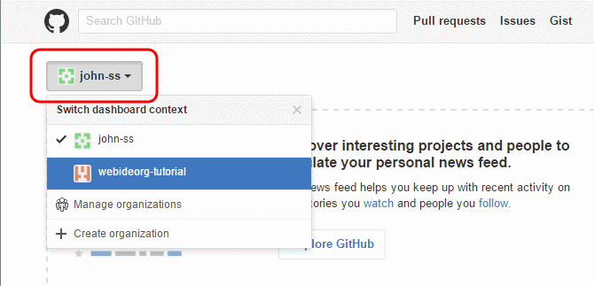
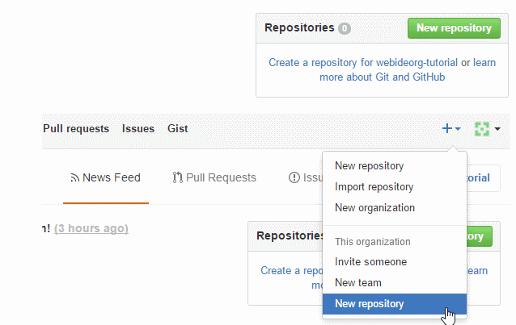
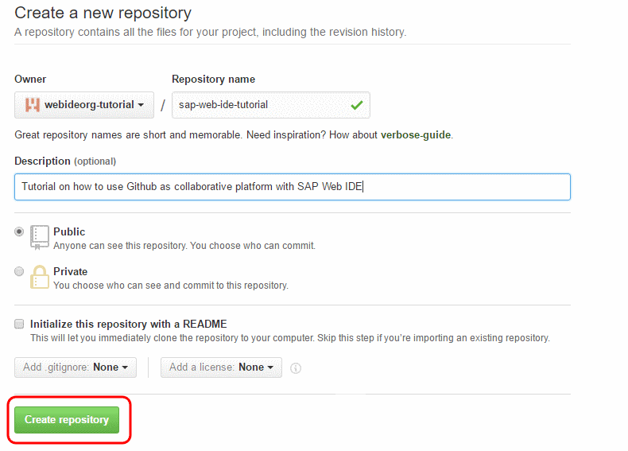
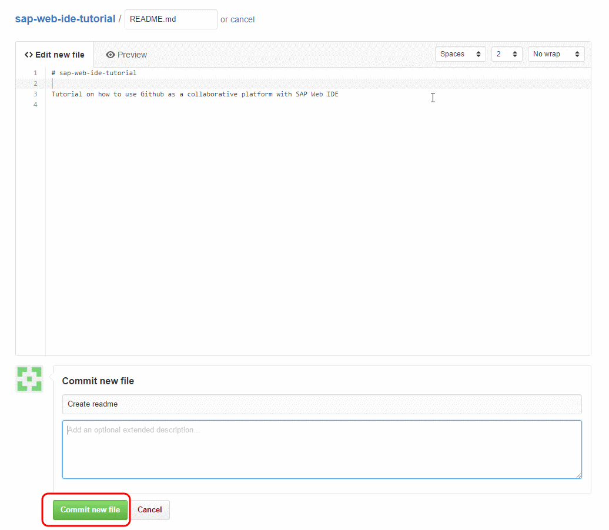

## Prerequisites  
 - **Proficiency:** Beginner
 - **Tutorials:** 
  - [Creating a Github organization and adding collaborators](http://go.sap.com/developer/tutorials/webide-github-creating-org.html)

## Next Steps
 - [Creating project in SAP Web IDE and importing it into Github](http://go.sap.com/developer/tutorials/webide-github-import-project.html)

## Details
### You will learn  
In this tutorial, you'll learn how to create a Git repository within a Github organization. 

### Time to Complete
**5 Min**.

---

1. Go to [Github.com](https://github.com) and login with your account credentials.

2. Switch to the Organization context by clicking on the **Switch dashboard context** drop-down and click on the Organization.

    

3. Click on **New repository**. Alternatively, click on the **+** icon on the top-right corner and click on **New Repository**.

    

4. Enter the repository name, description and click on **Initialize this repository with a README**. You can add in a `.gitignore` and license later on.

    

5. If you did not select the option to **Initialize this repository with a README**, create an initial commit by adding a Readme file. You can keep this readme file simple for now and add in details later

    

6. At the commit screen, enter a short description for commit reason and then click on the **Commit new file** button.

    
  
6. Your Git repository is ready!

## Next Steps
 - [Creating project in SAP Web IDE and importing it into Github](http://go.sap.com/developer/tutorials/webide-github-import-project.html)