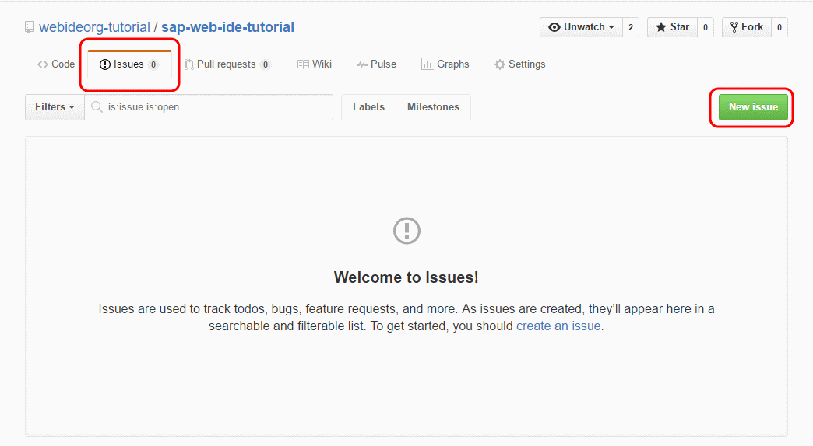
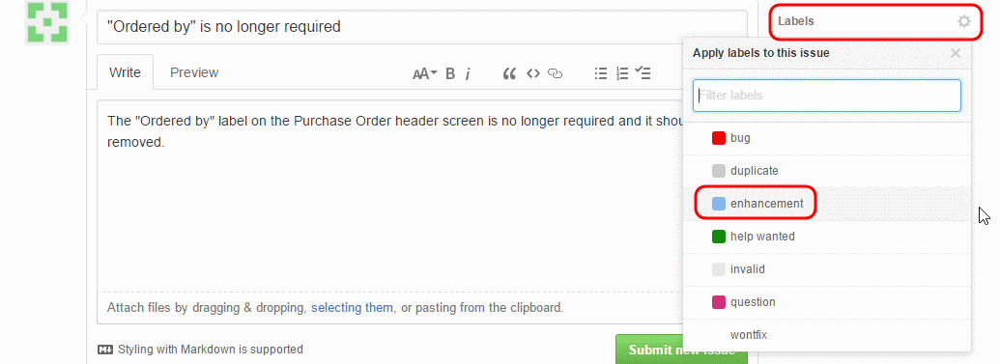
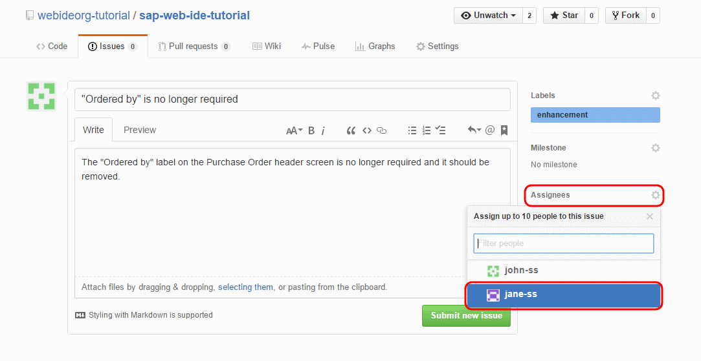
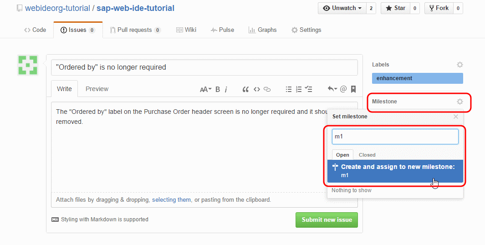
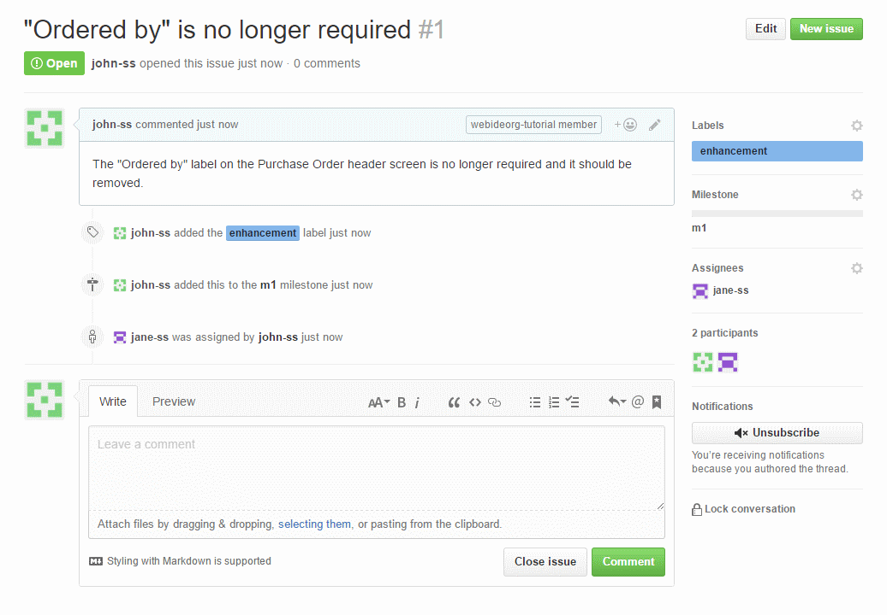
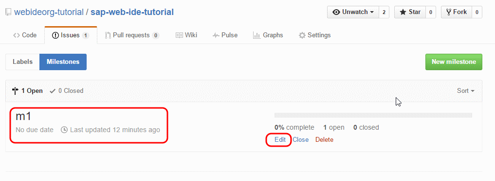
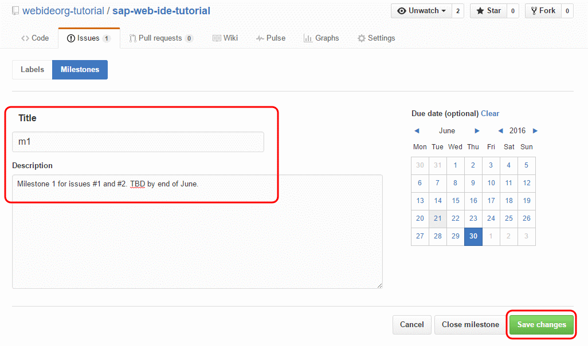

## Prerequisites  
 - **Proficiency:** Intermediate
 - **Tutorials:** 
  - [Creating project in SAP Web IDE and importing it into GitHub](http://www.sap.com/developer/tutorials/webide-github-import-project.html)

## Next Steps
 - [Creating branches in GitHub, switching branches and updating application in different branch in SAP Web IDE](http://www.sap.com/developer/tutorials/webide-github-branching.html)

## Details
### You will learn  
In this tutorial, you'll learn how to create issues, set milestones for delivery and how to assign issues and tasks to collaborators.

### Time to Complete
**10 Min**.

---

1. Go to your GitHub Organization repository.

2. Click on the **Issues** tab to open GitHub Issues. Click on the **New Issue** button to create a new issue.

    

3. Enter the details about the change required. 

    a. In this instance, you will create 2 issues, one issue to remove **Ordered by** label from the Purchase Order header and the other issue to add a **Product ID** column to the Order Details table. 

    b. Click on the **Labels** and assign it as **Enhancement**. Labels can be used to categorize issues into bug/enhancements and custom labels even. 

    

    c. You can assign a specific collaborator to work on a issue. To do this, click on **Assignees** and select the collaborator who will work on this.

    

    d. You can set milestones for specific issues. Milestones are how similar issues and deadlines can be set and categorized. To create a milestone, click on the **Milestone** and enter a name for the milestone. If it doesn't exist, you will be prompted to create them.

    

    e. Click on **Submit new issue** to create the new issue.

4.  Once the issue is created, you can add comments, discuss about and even add emoji to express your interest in the issue.

    

5. You can assign deadlines for milestones. 

    a. To do this, click on **Issues** tab of your GitHub organization repository. Then click on the **Milestones** tab.

    
    
    b. Click on **Edit** and assign a due date.

    
    
    C. Click on **Save changes** to update the milestone.

  
    
    
6. Similarly, you can create new milestones, update existing ones and check for status of current milestones from this page.

    

## Next Steps
 - [Creating branches in GitHub, switching branches and updating application in different branch in SAP Web IDE](http://www.sap.com/developer/tutorials/webide-github-branching.html)