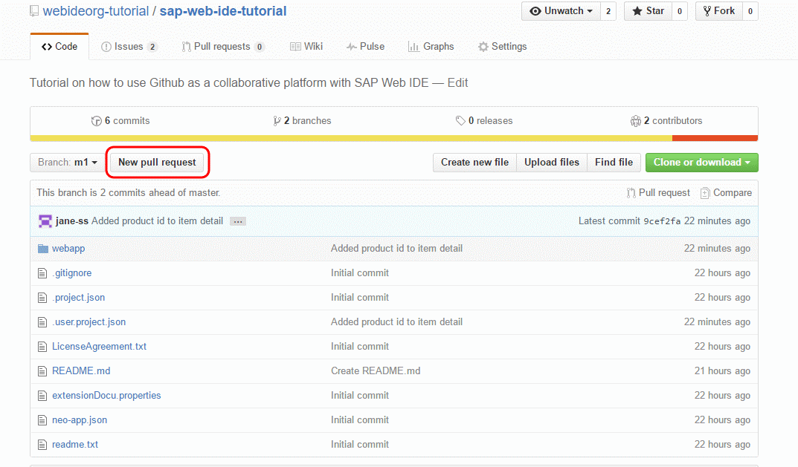
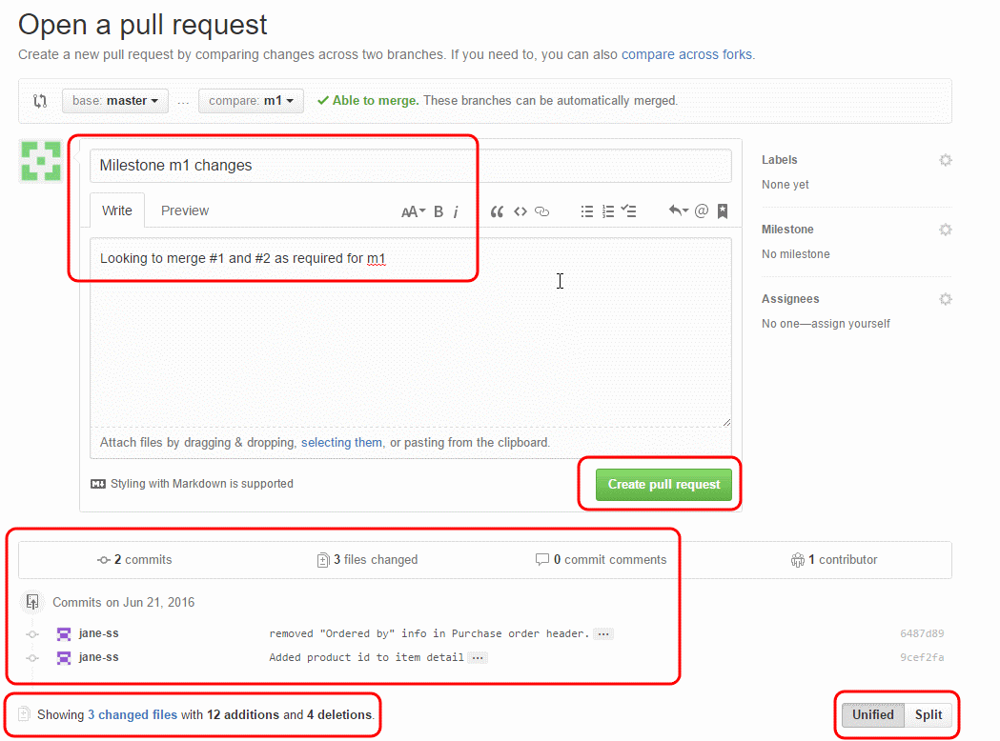
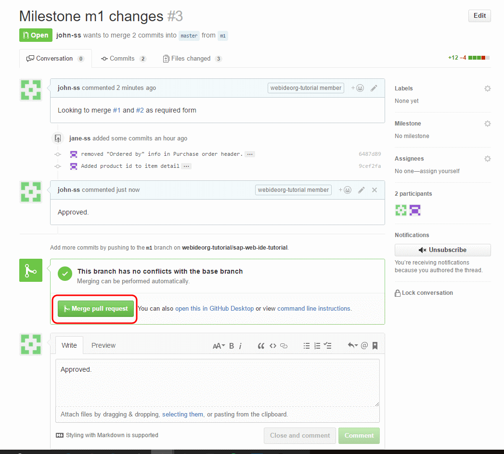
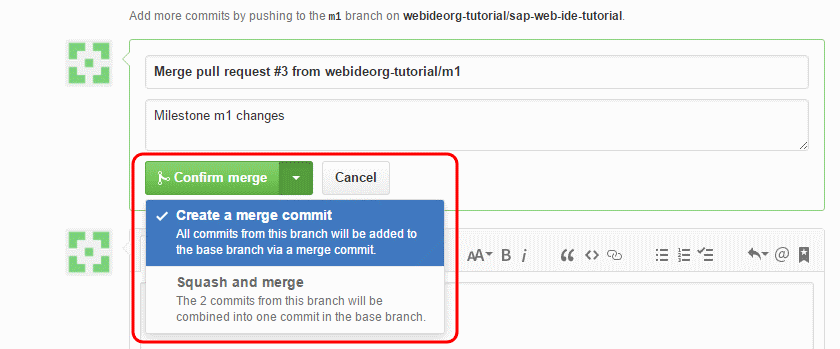
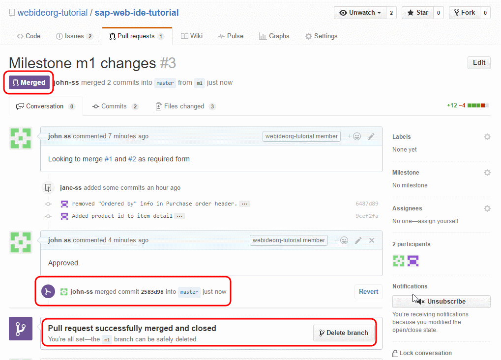
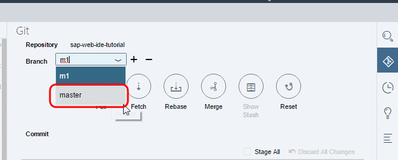
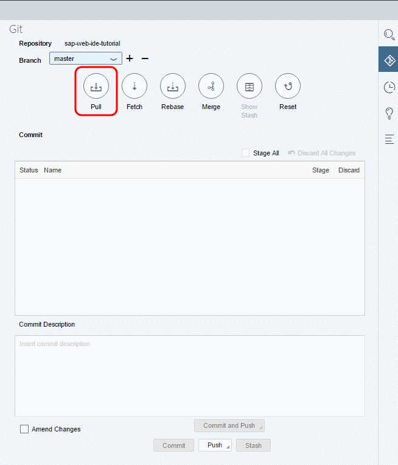
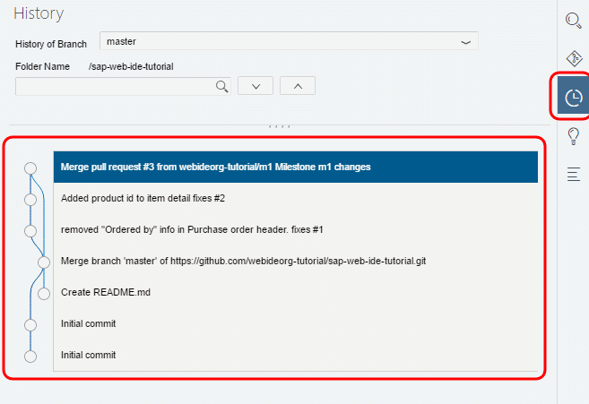

## Prerequisites  
 - **Proficiency:** Intermediate
 - **Tutorials:** 
     - [Creating branches in Github, switching branches and updating application in different branch in SAP Web IDE](http://go.sap.com/developer/tutorials/webide-github-branching.html)

## Next Steps
 - Select a tutorial from the [Tutorial Navigator](http://go.sap.com/developer/tutorial-navigator.html) or the [Tutorial Catalog](http://go.sap.com/developer/tutorials.html)

## Details
### You will learn  
In this tutorial, you'll learn how to create and send pull requests so that the changes in branches will be merged into the master branch

### Time to Complete
**10 Min**.

---

1. Open the Organization repository on Github and switch to the branch which you want to merge into master.

2. Click on the **New Pull Request** button to create a Pull Request.

      

3. Enter brief details about the Pull Request and click on **Create pull request** button to create a request. You can scroll down and see a diff of the files which were changed as well as the commits done.

      

4. To accept the pull request click on the **Pull Requests** tab to see a summary of pull requests pending. If you are happy with the changes click on the **Merge Pull request** button to accept the pull request and perform the merge. You can add in a comment if you desire so.

      

5. Once you click on **Merge Pull request**, you will see a button **Confirm merge**. Clicking on the drop-down besides the button allows you to select a merge option of your choice - select **Squash merge** if you want a single commit of all changes or  **merge commit** if you want all commits from the other branch.

    

6. If the merge was successful, you'll see a note about it and you can proceed with deleting the branch if required.

    

7. You will notice that the issues are automatically closed as well and the milestone is complete. 

    > Github will automatically close an issue if your commit message includes [certain keywords](https://help.github.com/articles/closing-issues-via-commit-messages/) once this change is merged into the master branch.

    

8. Ensure your workspace in SAP Web IDE has fetched these latest changes. To do this

    a. Click on the Git pane on the right hand side and then switch over to the master branch.

    

    b. Click on the **Pull** button to pull in the changes. Enter your Github account credentials and press **OK** button. 

    

    c. Click on the **Git history** button on the right hand side to see that the branching, changes and pull request was successful.

    

## Next Steps
 - Select a tutorial from the [Tutorial Navigator](http://go.sap.com/developer/tutorial-navigator.html) or the [Tutorial Catalog](http://go.sap.com/developer/tutorials.html) 