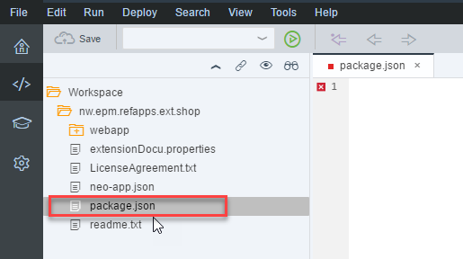
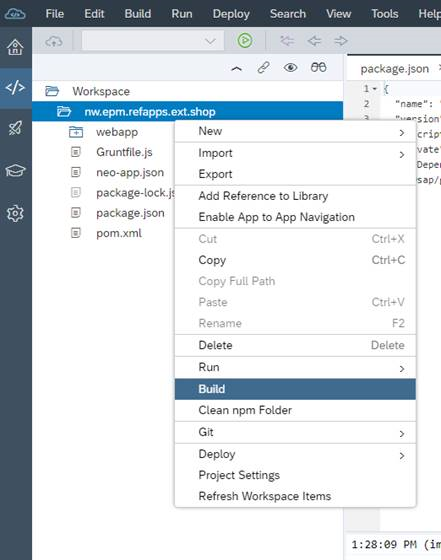
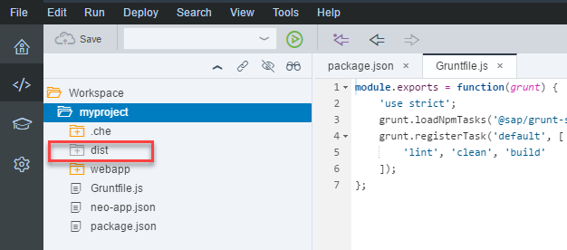
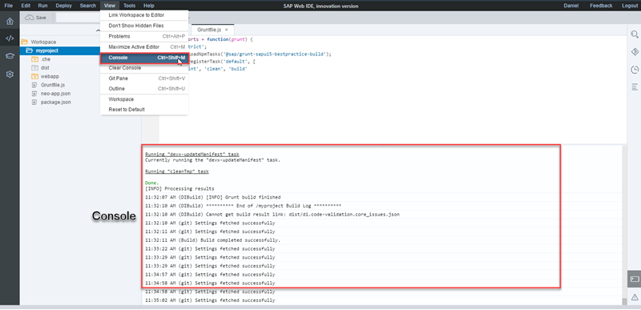

## Prerequisites  
- **Proficiency:** Beginner

## Next Steps
- **Tutorials** [Using Other Grunt Plugins in SAP Web IDE](http://www.sap.com/developer/tutorials/webide-grunt-plugins.html)


## Details
SAP Web IDE Full-stack now comes with the Grunt task runner already part of the IDE, so you can run tasks by:

- Specifying dependencies in the `package.json` file.
- Specifying/defining tasks in the `Gruntfile.js` file.  

Once you've created these files, you get a new menu option called **Build** to start the grunt tasks. You don't specify a task; SAP Web IDE always runs the `default` task that you have defined in the `Gruntfile.js`.

### Before you begin
For this tutorial, make sure:

- You are using **SAP Web IDE Full-stack**
- You have created an SAPUI5 project. You can simply create a blank or sample project from a template.
- Your project uses the Basic JavaScript validator. To change it, right-click your project and go to **Project Settings** | **Code Checking** | **JavaScript**, change the validator to **Basic JavaScript**, and click **Save**.

The `grunt-sapui5-bestpractice-build` Grunt plugin is published on the SAP npm registry. To run the Grunt build using this plugin outside of SAP Web IDE for Full-Stack Development, such as from a CLI as part of the CI process, add the following configuration option to the npm configuration file:

`@sap:registry=https://npm.sap.com/`

For more information, see https://docs.npmjs.com/files/npmrc.


### You will learn  
- How to configure your project for running a Grunt build
- How to run a Grunt build


### Time to Complete
**10 Min**

---

[ACCORDION-BEGIN [Step 1: ](Create a package.json file)]
Right-click your project and choose **New** | **File**, enter `Package.json`.


In the file enter the following code:
```
{
  "name": "grunt-build",
  "version": "0.0.1",
  "description": "Grunt build",
  "private": true,
  "devDependencies": {
      "@sap/grunt-sapui5-bestpractice-build": "^1.3.19"
   }
}
```



Later, when you select **Build** in the context menu, these settings instruct npm to install Grunt and the `gruntsapui5-bestpractice-build` Grunt plugin that contains tasks for building your SAPUI5 project.


[ACCORDION-END]

[ACCORDION-BEGIN [Step 2: ](Create a Gruntfile.js file)]
Right-click your project and choose **New** | **File**, enter `Gruntfile.js`.


In the file enter the following code:
```
module.exports = function(grunt) {
  'use strict';
  grunt.loadNpmTasks('@sap/grunt-sapui5-bestpractice-build');
  grunt.registerTask('default', [
      'lint',
      'clean',
      'build'
  ]);
};
```

The code does the following:

- Loads the tasks from the SAPUI5 best practices Grunt plugin.
- Sets the default task to execute the following tasks defined in the SAPUI plugin:

|Task&nbsp;&nbsp;            |Description       |
|---------------|-------|
| `lint`        | Validates the project code using ESLint according to the rules defined in the `.eslintrc` configuration file located in the root of your project.      |
| `clean`       | Cleans the `dist` target folder from the previous build results.      |
| `build`       | Produces a new build output in the `dist` folder of your project that is ready and optimized for better performance in the productive environment. The following tasks are executed during the build:<ul><li>Minification of `.css` files</li><li>Minification of JavaScript files (minified files)</li><li>Copying of the original files to the dist folder with `-dbg` suffix added for debugging purposes</li><li>Generation of the `Component-preload.js` and `Component-preload-dbg.js` preload files for the debug and minified files</li><li>Minification of the preload file</li></ul> |


[ACCORDION-END]


[ACCORDION-BEGIN [Step 3: ](Build your project)]
Right-click your project and choose **Build**.


When the build finishes, a new `dist` folder is created in your project and is automatically added to `.gitignore`, ensuring that the folder is not checked into the project's Git repository.


You can see any build errors in the console, which you can display by going to **View** | **Console**.



[ACCORDION-END]


## Next Steps
- **Tutorials** [Using Other Grunt Plugins in SAP Web IDE](http://www.sap.com/developer/tutorials/webide-grunt-plugins.html)
