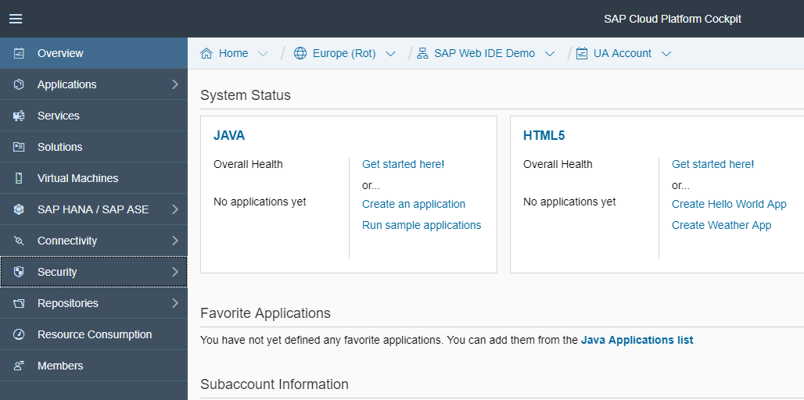
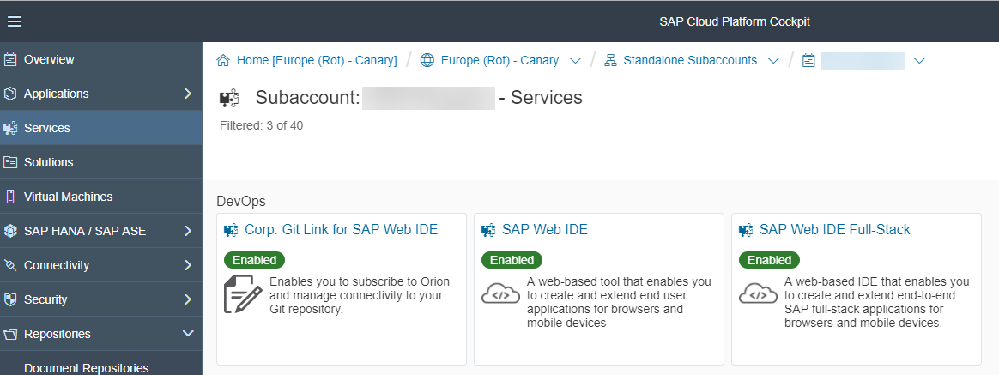
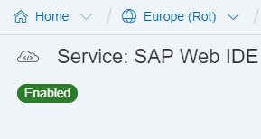
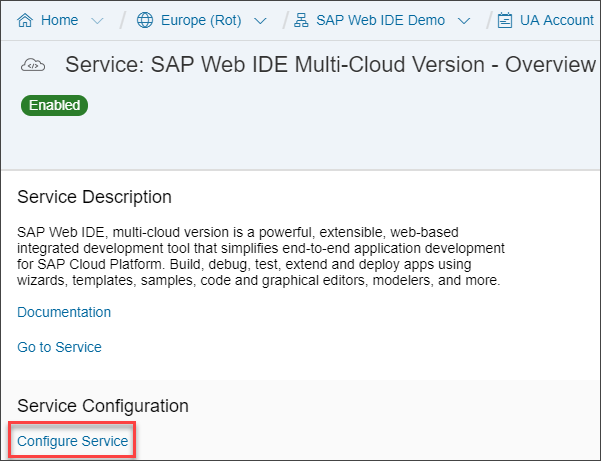
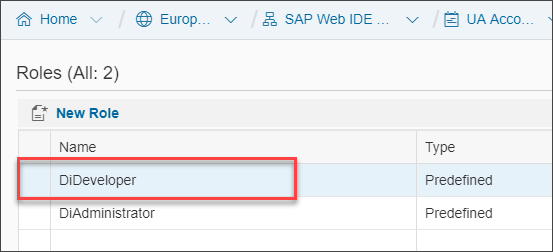
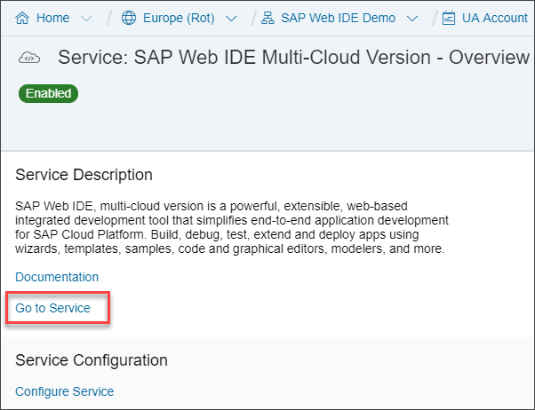

## Prerequisites  
- **Proficiency:** Beginner
You have access to an SAP Cloud Platform account, and set up a subaccount. If you don't have an account, see the  [documentation](https://help.sap.com/viewer/65de2977205c403bbc107264b8eccf4b/Cloud/en-US/dba4ae7ef36c4a93a6615c5f24ae9903.html) on how to obtain one. For information on setting up your SAP Cloud Platform, including subaccounts, see [Getting Started](https://help.sap.com/viewer/65de2977205c403bbc107264b8eccf4b/Cloud/en-US/144e1733d0d64d58a7176e817fa6aeb3.html).

## Next Steps
- Select a tutorial from the [Tutorial Navigator](https://www.sap.com/developer/tutorial-navigator.html) or the [Tutorial Catalog](https://www.sap.com/developer/tutorials.html) 

## Details
The new SAP Web IDE for Full-Stack Development supports additional scenarios, and includes additional features for improving the build process and creating full-stack applications.

This tutorial assumes you are an administrator on the SAP Cloud Platform account who is setting up a group of developers to start working with SAP Web IDE for Full-Stack Development.

### You will learn  
- How to enable your developers to start using SAP Web IDE for Full-Stack Development in a production environment

### Time to Complete
**15 Min**

---

[ACCORDION-BEGIN [Step 1: ](Log onto SAP Cloud Platform)]
Log onto your SAP Cloud Platform account.

Make sure you are in the Neo environment, not the Cloud Foundry environment. Neo is the classic, proprietary SAP Cloud Platform, and you can return to it by going **Home** | **Go to Neo Trial**.

[ACCORDION-END]

[ACCORDION-BEGIN [Step 2: ](Enable Principal Propagation)]
Go to **Security** | **Trust**, and select the **Local Service Provider** tab.

Choose **Edit**.

Change the **Principal Propagation** field to **Enabled**, and choose **Save**.

[ACCORDION-END]

[ACCORDION-BEGIN [Step 3: ](Enable the SAP Web IDE for Full-Stack Development service)]
Click **Services**.

In the search box, search for `Web`, and then click the **SAP Web IDE for Full-Stack Development** tile.

Click **Enable**. This may take a few minutes.

Wait for the status to change to the green, **Enabled** status.

[ACCORDION-END]

[ACCORDION-BEGIN [Step 4: ](Give developers permission to SAP Web IDE)]

>This step is only needed if you have configured a corporate SAML identity provider (`IdP`) for your account. For more information, see [Maintaining an `IdP` Mapping Rule for a User Group](https://help.sap.com/viewer/825270ffffe74d9f988a0f0066ad59f0/CF/en-US/315b851aea2d49e688cd3350f5fb763c.html)

On the same **Service: SAP Web IDE for Full-Stack Development** page, choose **Configure Service**.

In the **Roles** table, select the `DiDeveloper` role.

In the **Individual Users** or **Groups** area underneath, choose **Assign**, then in the pop-up window, enter the user or group you want to assign the `DiDeveloper` role, and choose **Assign**.

[ACCORDION-END]

[ACCORDION-BEGIN [Step 5: ](Publish the URL for SAP Web IDE)]
In the breadcrumb at the top, choose **SAP Web IDE for Full-Stack Development**. The URL for SAP Web IDE is shown as **Go to Service**.

Provide this URL to your developers so they can start working with SAP Web IDE for Full-Stack Development.

[ACCORDION-END]

[ACCORDION-BEGIN [Step 6: ](Set up Cloud Foundry environment - OPTIONAL)]
If your scenario includes deploying apps to the Cloud Foundry environment, then you need to also set up this environment. These will generally be for full-stack applications that include database and Java modules.

Do the following:

* [Create Cloud Foundry subaccounts, organizations, and spaces](https://help.sap.com/viewer/65de2977205c403bbc107264b8eccf4b/Cloud/en-US/76e79d62fa0149d5aa7b0698c9a33687.html).
We recommend you create separate subaccounts for development, staging/test and production purposes. We also recommend at least one space per development team per project (in the development and staging subaccounts).
* [Register your developers](https://help.sap.com/viewer/65de2977205c403bbc107264b8eccf4b/Cloud/en-US/5a91cf502b5146958977a5fb906df93a.html)
* [Assign developers to organizations and spaces](https://help.sap.com/viewer/65de2977205c403bbc107264b8eccf4b/Cloud/en-US/bbaef4ec39af493192a7a518b94e071b.html).

[ACCORDION-END]

---

## Next Steps
- Select a tutorial from the [Tutorial Navigator](https://www.sap.com/developer/tutorial-navigator.html) or the [Tutorial Catalog](https://www.sap.com/developer/tutorials.html)
