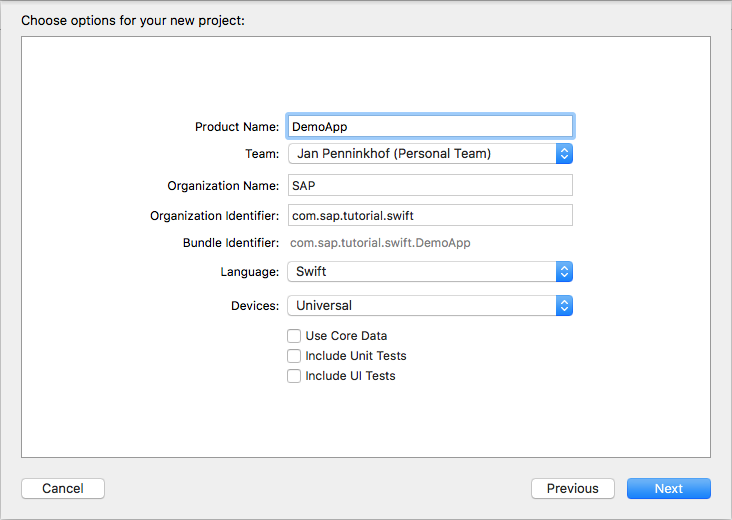
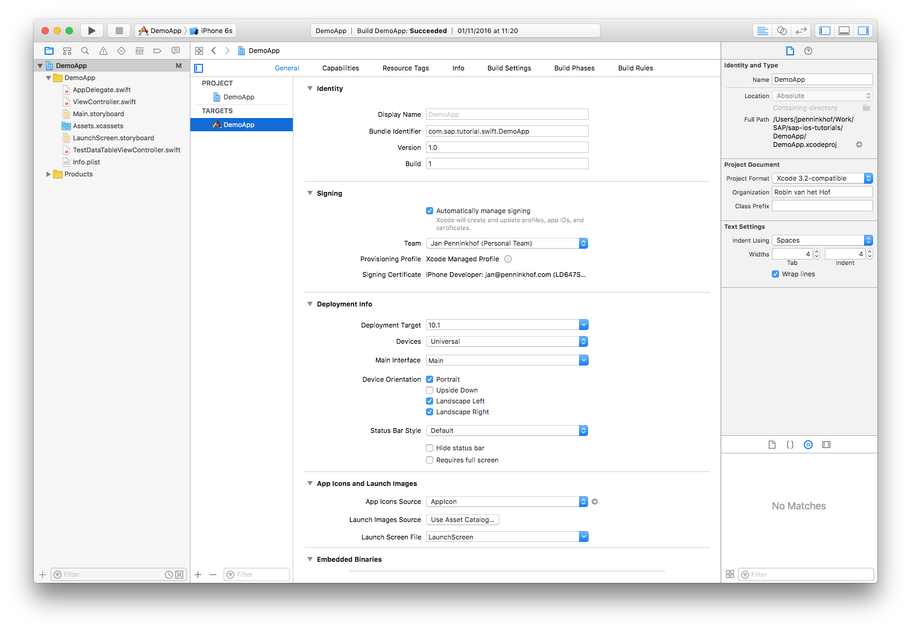
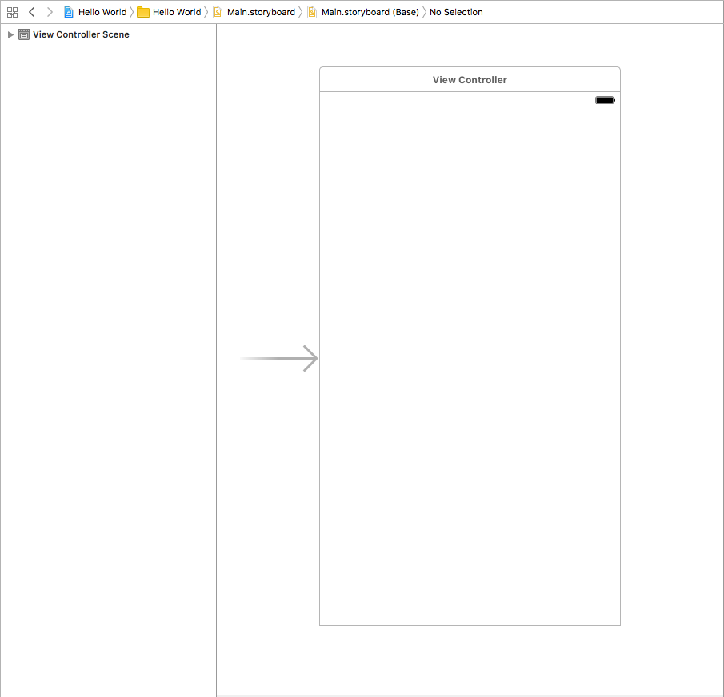
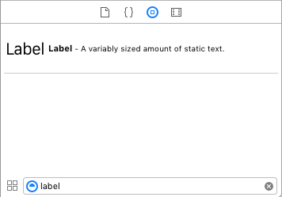
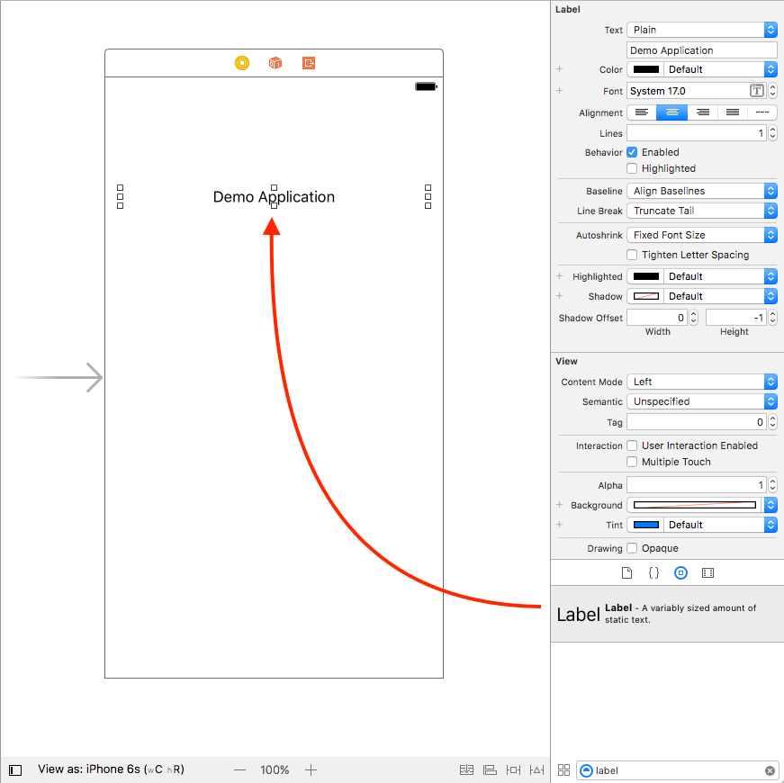
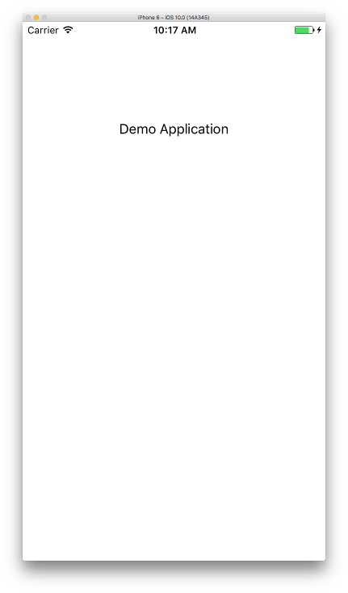

## Prerequisites  
 - **Proficiency:** Beginner
 - **Development machine:** Access to a Mac computer

## Next Steps
 - [Build your first Xcode & Swift App](http://www.sap.com/developer/tutorials/xcode-build-swift-app.html)

## Details
### You will learn  
You will learn where to find the resources to get started with Swift development using Xcode. This includes information on how to get enrolled in the Apple Developer Enterprise Program, where to get Xcode and information about the Swift programming language. This tutorial will also familiarize you with Xcode and will show how to build your first application.

### Time to Complete
**15 Min**.

---

[ACCORDION-BEGIN [Step 1: ](Introduction)]

The SAP HANA Cloud Platform SDK for iOS will enable companies and developers to quickly develop their own native apps, built with Swift, Apple’s modern programming language. These native apps for iPhone and iPad can take advantage of all the innovative iOS technologies.

To develop applications using the SAP HANA Cloud Platform SDK for iOS, you will need to use the Xcode development environment and build your applications using the Swift programing language. Apple provides all the developer tools, resources, and programs to get started. Use the resources below to learn more about Swift, iOS, and the Apple Developer Enterprise Program.

- Learn more about Swift, Apple’s modern and powerful programming language for iOS, `macOS`, tvOS, and watchOS: https://developer.apple.com/swift/

- Get started with Apple enterprise developer resources: https://developer.apple.com/enterprise

- Enroll in the Apple Developer Enterprise Program: https://developer.apple.com/programs/enterprise/

- View resources on building and designing great iOS apps: https://developer.apple.com/videos/

[DONE]
[ACCORDION-END]

[ACCORDION-BEGIN [Step 2: ](About Xcode)]

Xcode is used to build apps for iPhone and iPad, as well as apps for Mac, Apple Watch and Apple TV. These tutorials are based on Xcode 8.1, released on October 27, 2016. Xcode 8.1 is the latest version of Apple's integrated development environment (IDE) and is completely free.

> Note: Xcode has already been installed for you on the computers provided at SAP TechEd.

Select Xcode from the Dock at the bottom of the screen. Once you have started Xcode you should see the word "Xcode" in menu bar at the top left of the screen.

[DONE]
[ACCORDION-END]

[ACCORDION-BEGIN [Step 3: ](Create your first project)]

To create your first project, click on "File \> New \> Project" in the menu bar. When you do so, you will be presented with a number of application templates.

Choose "Single View Application", and click the „Next“ button.
On the next screen you can enter several options for your projects, most of which you can keep default. You can use any name as your "Product Name", but for this tutorial, use `DemoApp`. You can also pick any name as "Organization Name", but this is mostly likely the name of your company. The organization identifier is also known as a bundle prefix and is a way to uniquely identify your company. It is usually the reverse domain name of your company. The bundle identifier is then generated automatically. Keep "Swift" as your programming language, ensure devices is set to „Universal“ and to make things simple, keep "Use Core Data", "Include Unit Tests" and "Include UI Tests" unchecked.

If the "Team" drop-down shows "None", you need to select a team from the drop-down list. A team has already been setup, you don't need to create one. Once a team is set, Xcode will be able to automatically sign your applications.

> Code signing is a security technology that you use to certify that an app was created by you. Once an app is signed, the system can detect any change to the app - whether the change is introduced accidentally or by malicious code. You participate in code signing as a developer when you obtain a signing identity and apply your signature to apps that you ship. A certificate authority (often Apple) vouches for your signing identity.

Field Name              | Value
:-------------          | :-------------
Product Name            | `DemoApp`
Team                    | Pick a team from the drop-down
Organization Name       | `SAP`
Organization Identifier | `com.sap.tutorial.swift`
Language                | `Swift`
Devices                 | `Universal`

After entering the project options, all that is left is to decide where you would like to store the project. You could save your project to the desktop if you want, to be able to find it again easily.

When you save the project, Xcode will create all the files you need according to the template you selected, and will show you the development environment to start developing your app.

[DONE]
[ACCORDION-END]

[ACCORDION-BEGIN [Step 4: ](Explore the Xcode IDE)]

The Xcode window is divided into 3 sections:

- The left pane is for navigating your project and by default shows the files that make up your project.
- The center pane is the area in which you develop your application. This is the place where you edit the code, design your app layout or configure project settings.
- The right pane is the utilities pane, which changes based on what you have selected in the center pane.

At the top of the application, you will see a toolbar, which is divided into two sections:

- The left section of the toolbar contains buttons for running and stopping the application, as well as choosing which simulator or physical device you want to run your application on.
- The right section of the toolbar allows you to modify the layout of the IDE and switch panels on and off. This allows you to e.g. make more space for your code if you need to. A special button in this section is the "Assistant editor" (two circles), allowing you to show two related editors side-by-side. As you will see in a later tutorial, this is especially useful when you associate code with the UI controls of your application.

[DONE]
[ACCORDION-END]

[ACCORDION-BEGIN [Step 5: ](Building your application)]

To build your first app, you need to design the user interface of your application. In this tutorial we will just add the text "Demo application" to the main view and run it. In following tutorials, you will make the application more interactive.

To edit the user interface of the application, bring up the storyboard designer by (single) clicking on  `Main.storyboard`. This will change the main pane to the storyboard editor, which allows you to lay out your app and define navigation paths between the views of your application. In our application we currently have only have one view, which is started when the application is launched. This is indicated by the arrow coming from the left.

To add the text to the view, add a "Label". You can find the „Label“ control in the "Object Library" at the bottom of the context pane on the right. It is easiest by just entering "Label" in the filter bar at the far lower right.

To get the label on the view, drag it from the object library, and drop into the view in the storyboard editor.

> Note that while you drag the label onto the view, you will see horizontal and vertical blue lines in your interface. These lines help you to nicely align your controls to other controls or to the view.

To get the label to show "Demo Application", double-click it and  type in the new text. Once you have changed the text, you will see that the label is not big enough to fit. To make the label bigger, just pull on the little anchors (squares) around the label and realign it to the center of the view.

[DONE]
[ACCORDION-END]

[ACCORDION-BEGIN [Step 6: ](See what your app looks like on another device or orientation)]

To see what your app would look like on another device or in another orientation, you can click the "View as" text at the bottom of the screen. After clicking the "View as" button, you can select another device or orientation.

[DONE]
[ACCORDION-END]

[ACCORDION-BEGIN [Step 7: ](Run your application)]

To build and run your application, click the „Build and Run„ arrow button at the top left section of the toolbar. When you press this button Xcode will build your application and start a simulator based on the device indicated on the right of the „Build and Run„ button. You could also specify a physical device as target device. This would get your app to run on a real device.

When the „Build and Run„ button in the image above is pressed, a simulator is started. Once the simulator is running, the application is launched in the simulator.

To stop the application, press the stop button in the toolbar controls:

Congratulations! You have just created, built and run your first application for iOS using Xcode!

[DONE]
[ACCORDION-END]

### Next Steps
 - [Build your first Xcode & Swift App](http://www.sap.com/developer/tutorials/xcode-build-swift-app.html)
