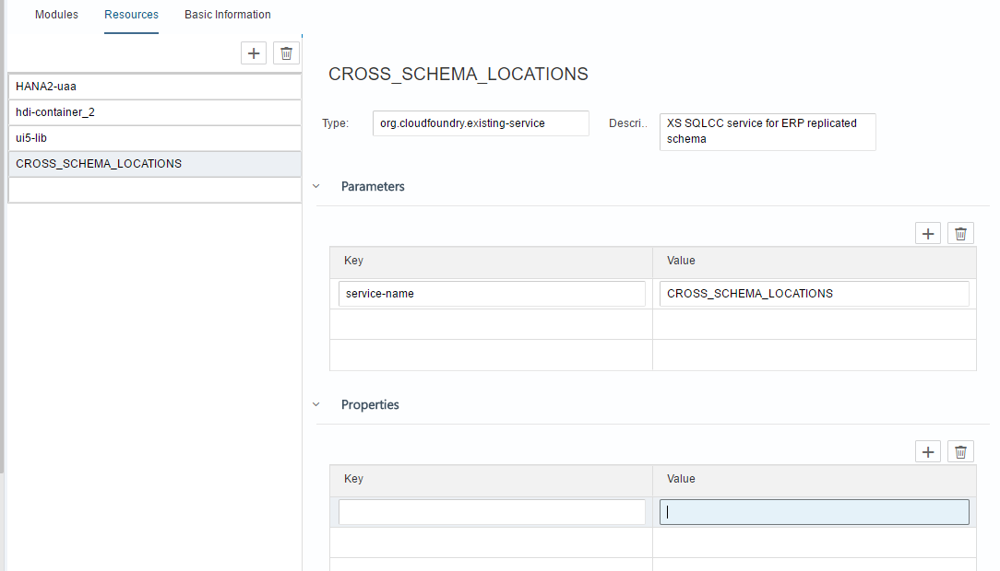
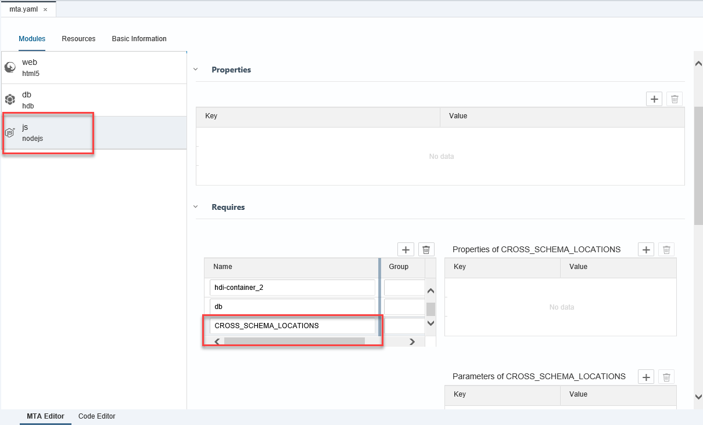
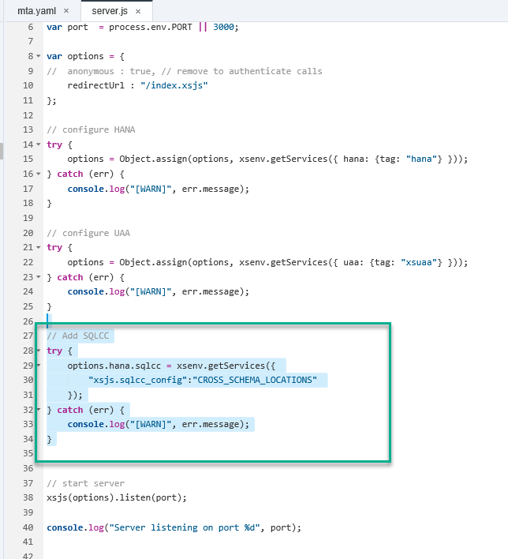
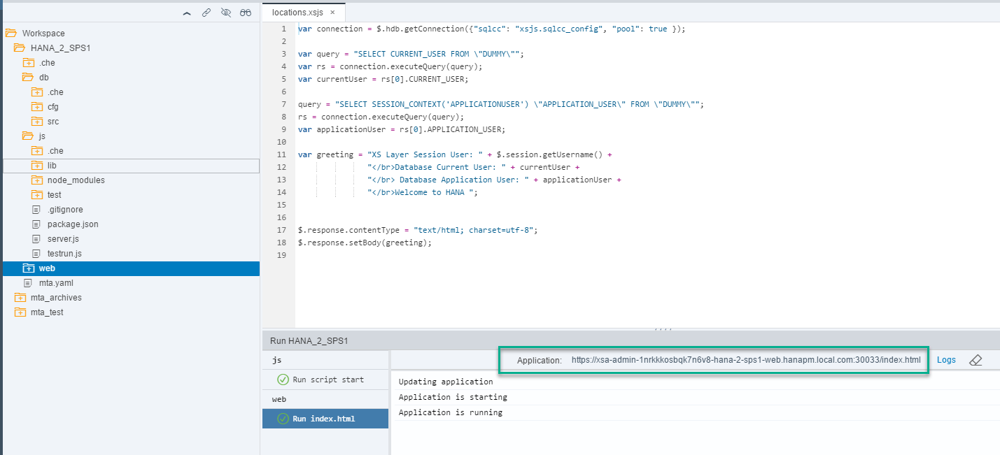
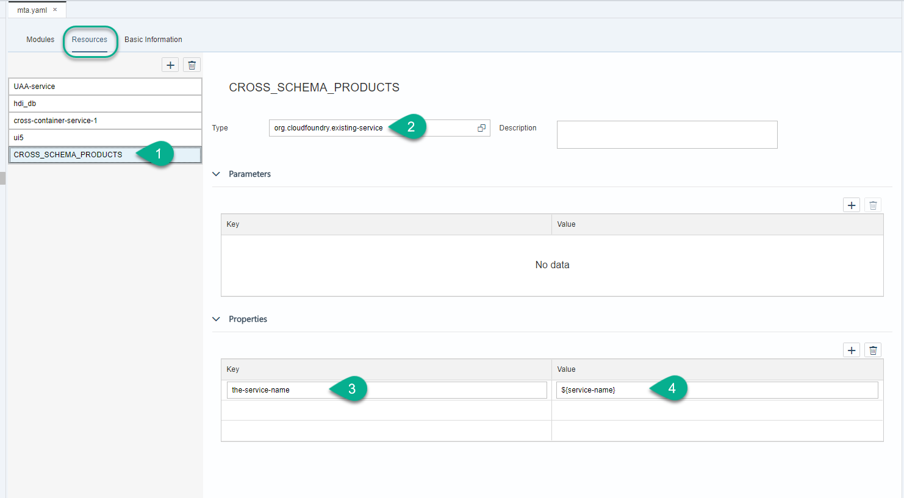
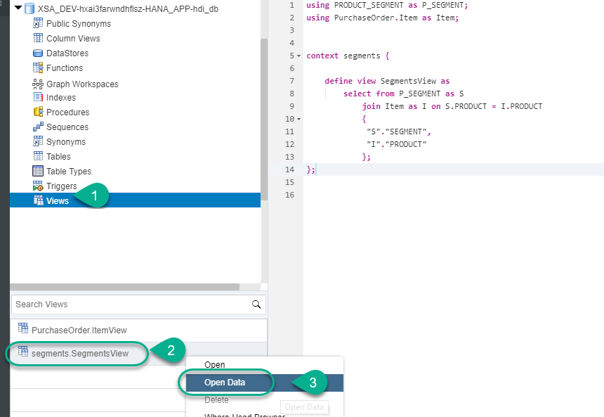

## Prerequisites  
 - **Proficiency:** Beginner | Intermediate | Advanced
 - **Tutorials:** [Creating an OData Service with Create Operation and XSJS Exit](https://www.sap.com/developer/tutorials/xsa-xsodata-create.html)


## Next Steps
 - Select a tutorial group from the [Tutorial Navigator](https://www.sap.com/developer/tutorial-navigator.html) or the [Tutorial Catalog](https://www.sap.com/developer/tutorial-navigator.tutorials.html)

## Details
### You will learn  
This tutorial will walk you through the integration of a non `HDI-managed` database, such as a replicated database, into an HDI container and how to access it using a SQL anonymous connection.

### Time to Complete
**15 Min**

---

[ACCORDION-BEGIN [Step 1: ](Load data into a database schema in SystemDB)]

This tutorial needs a replicated database or a schema that is not managed by an HDI container. An example of such schema is an ABAP or ERP database, which you may need to integrate to your XS Advanced development. You will simulate this by creating a schema and importing data into it.

>Note: This tutorial will use the default System database in an SAP HANA, express edition instance. Use a tenant database if you have a different system or one available.

</br>

Begin by connecting to your SAP HANA `SystemDB` using the **+** sign in the Database Explorer and choose **SAP HANA Database (Multitenant)**:


Set the connection parameters to your System database, or the database of your choice. Make sure the selected user has access to the database schema.


You can now see the schemas in your database and open the SQL console:


[ACCORDION-END]

[ACCORDION-BEGIN [Step 2: ](Create a Schema and table and Import data)]

Paste the following code into a SQL console to create a custom schema and a table in it:

```
create schema "LOCATION_TEST";
set schema "LOCATION_TEST";
create column table "LOCATIONS"(
	POSTAL_CODE NVARCHAR(10) primary key,
	CODE_CITY NVARCHAR(200),
	STREET NVARCHAR(200),
	COORDINATES ST_GEOMETRY (4326)
)

```

**Execute** and check the results:


Insert data into the newly-created table with the following commands in a SQL console:

```
INSERT INTO "LOCATION_TEST"."LOCATIONS" VALUES('B1001DII','Buenos Aires','Av. L.N. Alem 855', new ST_POINT('POINT(-34.597681 -58.370822)',4326));
INSERT INTO "LOCATION_TEST"."LOCATIONS" VALUES('B1605DII','Buenos Aires','Sargento Cabral St.3770', new ST_POINT('POINT(-34.515592 -58.525522)',4326));
INSERT INTO "LOCATION_TEST"."LOCATIONS" VALUES('70714-900','Brasilia','Quadra 04, Bloco B, numero 100', new ST_POINT('POINT(-15.786525 -47.887175)',4326));
INSERT INTO "LOCATION_TEST"."LOCATIONS" VALUES('20040-002','Rio de Janeiro','Av. Rio Branco n 138  8 andar', new ST_POINT('POINT(-22.90571 -43.177655)',4326));
INSERT INTO "LOCATION_TEST"."LOCATIONS" VALUES('20091-906','Rio de Janeiro','Rua Candelária 65-15°andar-Centro', new ST_POINT('POINT(-22.899742 -43.177849)',4326));
INSERT INTO "LOCATION_TEST"."LOCATIONS" VALUES('04795-000','Sao Paulo','Av das Nacoes Unidas 14171', new ST_POINT('POINT(-23.622742 -46.700376)',4326));
INSERT INTO "LOCATION_TEST"."LOCATIONS" VALUES('04707-910','Sao Paulo','Av. Roque Petroni Jrl, 999-13 andar', new ST_POINT('POINT(-23.623616 -46.696824)',4326));
INSERT INTO "LOCATION_TEST"."LOCATIONS" VALUES('93022-718','Cristo Rei','Avenida SAP 188', new ST_POINT('POINT(-29.796534 -51.148405)',4326));
INSERT INTO "LOCATION_TEST"."LOCATIONS" VALUES('T2P 4J8','Calgary Alberta','855-2nd Street SW -Suite 3900 ', new ST_POINT('POINT(51.045414 -114.069242)',4326));
INSERT INTO "LOCATION_TEST"."LOCATIONS" VALUES('H3C 2M1','Montreal','111 rueDukeStreet', new ST_POINT('POINT(45.496778  -73.556336)',4326));
INSERT INTO "LOCATION_TEST"."LOCATIONS" VALUES('H3A 3L4','Montreal','999 de Maisonneuve Blvd. West', new ST_POINT('POINT(45.501961  -73.574231)',4326));
INSERT INTO "LOCATION_TEST"."LOCATIONS" VALUES('K1R 7X7','Ottawa','360 Albert Street', new ST_POINT('POINT(45.418012 -75.703812)',4326));
INSERT INTO "LOCATION_TEST"."LOCATIONS" VALUES('M2P 2B8','Toronto','4120 Yonge Street', new ST_POINT('POINT(43.746845 -79.409373)',4326));
INSERT INTO "LOCATION_TEST"."LOCATIONS" VALUES('M1H 3E3','Toronto','100 Consilium Place', new ST_POINT('POINT(43.776974 -79.252282)',4326));
INSERT INTO "LOCATION_TEST"."LOCATIONS" VALUES('V6B 1A9','Vancouver','910 Mainland Street', new ST_POINT('POINT(49.276935 -123.117691)',4326));
INSERT INTO "LOCATION_TEST"."LOCATIONS" VALUES('V6B 2W7','Vancouver','990 Homer Street', new ST_POINT('POINT(49.2774741 -12.311972)',4326));
INSERT INTO "LOCATION_TEST"."LOCATIONS" VALUES('N2L6R2','Waterloo','445 Wes Graham Way', new ST_POINT('POINT(43.480208 -80.550943)',4326));
INSERT INTO "LOCATION_TEST"."LOCATIONS" VALUES('1240000','Antofagasta','934 General Borgona', new ST_POINT('POINT(-23.666681 -70.403138)',4326));
INSERT INTO "LOCATION_TEST"."LOCATIONS" VALUES('7550001','Santiago','Rosario Norte 100', new ST_POINT('POINT(-33.40775 -70.570901)',4326));
INSERT INTO "LOCATION_TEST"."LOCATIONS" VALUES('7550000','Santiago','San Crescente 81 Piso 6', new ST_POINT('POINT(-33.416953 -70.595376)',4326));
INSERT INTO "LOCATION_TEST"."LOCATIONS" VALUES('22,115-30','Bogota','Avenida Carrera 9 No. 115-06',new ST_POINT('POINT(4.693179 -74.034550)',4326));
```


[ACCORDION-END]


[ACCORDION-BEGIN [Step 3: ](Create a User-Provided service)]
Open a command line to execute a command with the XS client. You will now create a user-provided service called `CROSS_SCHEMA_LOCATIONS` to allow other modules to access the new schema.

Replace the hostname, instance number and port (ending in 13 or 15), user and password in the below command:

```
xs cups CROSS_SCHEMA_LOCATIONS -p "{\"host\":\"<hostname>\",\"port\":\"3<Instance Number><15|13>\",\"user\":\"<user>\",\"password\":\"<Password>\",\"driver\":\"com.sap.db.jdbc.Driver\",\"tags\":[\"hana\"] , \"schema\" : \"LOCATION_TEST\" }"
```

>Note: You can find out what the right port is (i.e., 30013 or 30015 for instance number 00) by running `xs apps` or `netstat`  in the OS console.

</br>

And execute it in a console:


[ACCORDION-END]

[ACCORDION-BEGIN [Step 4: ](Add the service as a resource for the nodejs module)]

Back in the `Development` tool in the SAP Web IDE for SAP HANA, open the `mta.yaml` editor and add a resource called `CROSS_SCHEMA_LOCATIONS`, with type `org.cloudfoundry.existing-service` and the following parameter:
- Key: `service-name`
- Value: `CROSS_SCHEMA_LOCATIONS`



Add the newly-declared resource as a dependency for the `node.js` module:



**Save** the `mta.yaml` file.


[ACCORDION-END]

[ACCORDION-BEGIN [Step 5: ](Extend the server.js file)]

Open the file `server.js` file in the `js` folder and add the following code:

```
// Add SQLCC
try {
	options.hana.sqlcc = xsenv.getServices({
		"xsjs.sqlcc_config":"CROSS_SCHEMA_LOCATIONS"
	});
} catch (err) {
	console.log("[WARN]", err.message);
}
```
As in this example:




[ACCORDION-END]

[ACCORDION-BEGIN [Step 6: ](Test the xsjs service)]

Add a file in the `js/lib/xsjs` folder called `locations.xsjs` with the following code:

```
var connection = $.hdb.getConnection({"sqlcc": "xsjs.sqlcc_config", "pool": true });

var query = "SELECT CURRENT_USER FROM \"DUMMY\"";  
var rs = connection.executeQuery(query);
var currentUser = rs[0].CURRENT_USER;

query = "SELECT SESSION_CONTEXT('APPLICATIONUSER') \"APPLICATION_USER\" FROM \"DUMMY\"";  
rs = connection.executeQuery(query);
var applicationUser = rs[0].APPLICATION_USER;

var greeting = "XS Layer Session User: " + $.session.getUsername() +
               "</br>Database Current User: " + currentUser +
               "</br> Database Application User: " + applicationUser +
               "</br>Welcome to HANA ";


$.response.contentType = "text/html; charset=utf-8";
$.response.setBody(greeting);
```

**Save** and **Run** the `js` module. Then **Run** the web module.




Replace `index.html` with `/xsjs/locations.xsjs`. You should now see that the database user is the schema owner and the XS layer session user is the user you are logged in with.


[ACCORDION-END]

[ACCORDION-BEGIN [Step 7: ](Add the service as a resource to the HDI container)]

You will now edit the `mta.yaml` file so you can use it in your XS Advanced development in, for example, CDS artifacts. Open the `MTA` editor and add the following a new resource that will be very similar to the resource required by the `js` module, but with some additional properties. Add a resource called `CrossSchemaServices`, type `org.cloudfoundry.existing-service`, with `service-name` and `CROSS_SCHEMA_LOCATIONS` as the key-value pair in **Parameters** and `locations-service-name` and `${service-name}` in **Properties**.




Now add the new resource as a requirement for the `db` module. Add `CrossSchemaService` in Group `SERVICE_REPLACEMENTS`.  Add the property key with value `hdi-locations-service` and property service with value `~{locations-service-name}`.


After all additions and assuming you have been following the tutorials series in a sequence, your `mta.yaml` file in the code editor should look similar to this:

```
ID: HANA_2_SPS1
_schema-version: '2.0'
version: 0.0.1
modules:
  - name: web
    type: html5
    path: web
    requires:
      - name: HANA2-uaa
      - name: js-api
        group: destinations
        properties:
          name: core-backend
          url: '~{url}'
          forwardAuthToken: true
  - name: db
    type: hdb
    path: db
    requires:
      - name: hdi-container
        properties:
          TARGET_CONTAINER: '~{hdi-container-name}'
      - name: CrossSchemaServices
        group: SERVICE_REPLACEMENTS
        properties:
          key: hdi-locations-service
          service: '~{locations-service-name}'
  - name: js
    type: nodejs
    path: js
    provides:
      - name: js-api
        properties:
          url: '${default-url}'
    requires:
      - name: HANA2-uaa
      - name: hdi-container
      - name: db
      - name: CROSS_SCHEMA_LOCATIONS
resources:
  - name: HANA2-uaa
    type: com.sap.xs.uaa-space
    parameters:
      config-path: ./xs-security.json
  - name: hdi-container
    parameters:
      config:
        schema: HANA2
    properties:
      hdi-container-name: '${service-name}'
    type: com.sap.xs.hdi-container
  - name: CROSS_SCHEMA_LOCATIONS
    type: org.cloudfoundry.existing-service
    description: XS SQLCC service for ERP replicated schema
    parameters:
      service-name: CROSS_SCHEMA_LOCATIONS
  - name: CrossSchemaServices
    type: org.cloudfoundry.existing-service
    parameters:
      service-name: CROSS_SCHEMA_LOCATIONS
    properties:
      locations-service-name: '${service-name}'

```

[ACCORDION-END]

[ACCORDION-BEGIN [Step 8: ](Grant privileges to the schema)]

Create a folder called `cfg` in the `db` folder and a file called `LOCATION_TEST.hdbgrants`.

Add the following code:

```
{
  "hdi-locations-service": {
    "object_owner" : {
      "schema_privileges":[
        {
          "reference":"LOCATION_TEST",
          "privileges_with_grant_option":["SELECT", "SELECT METADATA"]
        }
      ]
    },
    "application_user" : {
      "schema_privileges":[
        {
          "reference":"LOCATION_TEST",
          "privileges_with_grant_option":["SELECT", "SELECT METADATA"]
        }
      ]
    }
  }
}
```


In `src/data`, add a file called `locations.hdbsynonym` and add the entry `LOCATIONS` for the synonym and object name and `LOCATION_TEST` as the schema name.


Proceed to **Build** the `db` module.


[ACCORDION-END]

[ACCORDION-BEGIN [Step 9: ](Create a CDS file)]

Create a file called `loc.hdbcds` under `db/src/data`, with the following code:

```
using LOCATIONS as LOC_TABLE;

context loc {
    define view LOC_VIEW as
        select from LOC_TABLE
        {
            "POSTAL_CODE",
            "CODE_CITY"
        };
};

```

You could merge this file with the existing data on, for example, Business Partners, and their cities. For now, **Build** and go into the database explorer.



See how the view in the HDI container can get data from the System database.


[ACCORDION-END]

## Next Steps
- Select a tutorial from the [Tutorial Navigator](https://www.sap.com/developer/tutorial-navigator.html) or the [Tutorial Catalog](https://www.sap.com/developer/tutorial-navigator.tutorials.html)
