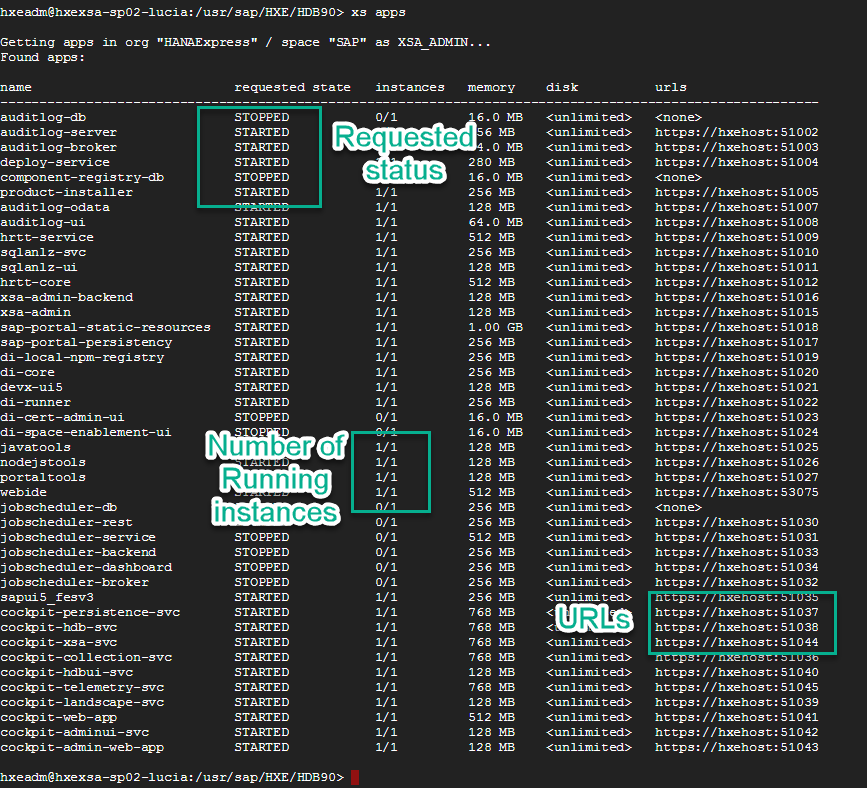
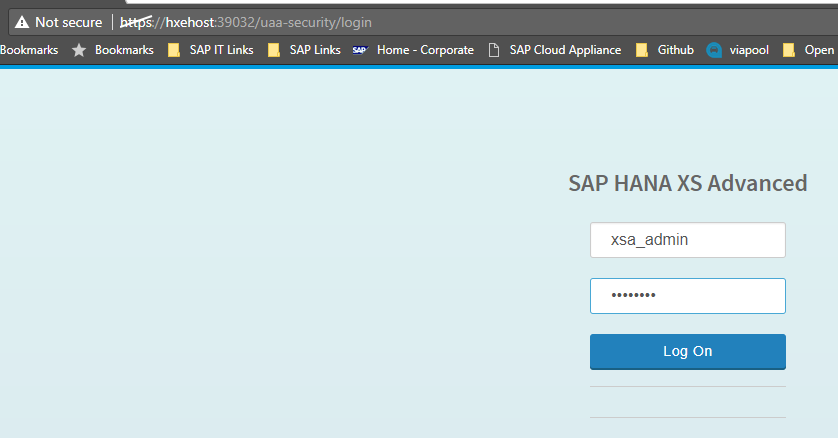
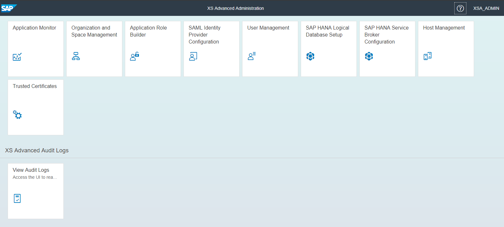

## Prerequisites  
 - **Proficiency:** Beginner | Intermediate | Advanced
 - **Tutorials:** [Get an SAP HANA, express edition, instance with XS Advanced applications](https://www.sap.com/developer/topics/sap-hana-express.html)


## Next Steps
 - [Get started with SAP HANA, XS Advanced development](https://www.sap.com/developer/groups/hana-xsa-get-started.html)


## Details
### You will learn  
You will explore the Administration Cockpit and XS Command Line Interface (XS CLI) for XS Advanced.

### Time to Complete
**15 Min**

---

[ACCORDION-BEGIN [Step 1: ](Log in to the XS Command Line Interface)]

The XS CLI enables you to maintain not only the applications that are deployed to the XS advanced run-time environment, but also the run-time environment itself, and the users who access and use it. You can get it from the download manager for SAP HANA, express edition, or from the [SAP Service Marketplace](https://launchpad.support.sap.com/#/softwarecenter). Make sure you have the latest version in order to avoid issues.

The XS CLI is also available by default in the SAP HANA, express edition, instance with XS Advanced applications. From a console connected to the operating system, switch to user `hxeadm` and log in as follows:

```bash

sudo su - hxeadm
xs login

```


Enter the master password to log in with `XSA_ADMIN`. You are now logged in to the default organization and space. You can  later log in to a different organization or space by adding `-s` for space or `-o` for organization.

>Note: If you get an `SSL error` because you are using the default self-signed certificate from SAP HANA, express edition, add `--skip-ssl-validation` to your login command.


[ACCORDION-END]

[ACCORDION-BEGIN [Step 2: ](Check running applications)]

You can check on the status of the running applications with command `xs apps`. This will also tell you the URL for the important applications you will need for administration and the SAP Web IDE for SAP HANA.



Take note of the URL for `xsa-admin`.


Note that the running instances need to show `1/1`. If you see `0/1` and `STARTED` is the requested status, the application is probably still starting.


[ACCORDION-END]


[ACCORDION-BEGIN [Step 3: ](Check the Administration Cockpit)]

By default, SAP HANA, express edition, creates a developer user called `XSA_DEV`.
If, for example, you want to create additional users and enable them in the development space, you will need to access the Administration Cockpit. You can also disable running applications you will not use to save up resources.

Open an **incognito window** in your browser. Use the URL for `xsa-admin`:


You will see you get redirected to the User Authentication and Authorization service. Log in with the user `XSA_ADMIN` and its password (which will be the master password you provided during setup for SAP HANA, express edition):

>Note: The hostname must be mapped in your hosts file. Also make sure the URL is using `https`



You are now logged in to the administration cockpit:




Go into the application monitor to see the running applications. **Copy** the URL for the Web IDE


You can explore other tasks available from the cockpit, such as changing passwords, assigning role collections and users to spaces.


[ACCORDION-END]

[ACCORDION-BEGIN [Step 4: ](Log in to the Web IDE)]

Open a new browser window and copy the URL for the SAP Web IDE for SAP HANA. You will be redirected to the UAA service. Use the user `XSA_DEV` and its password. For SAP HANA, express edition, this is the same password as the master password.


[ACCORDION-END]

## Next Steps
- [Get started with SAP HANA, XS Advanced development](https://www.sap.com/developer/groups/hana-xsa-get-started.html)
