## Prerequisites  
 - **Proficiency:** Beginner
 - Create a Node.js module to expose an OData service (https://www.sap.com/developer/tutorials/xsa-xsodata.html)

## Details
### You will learn  
How to perform a very simple addition to the default HTML5 module to consume the OData service by binding a model. This is a very simple example that will be later expanded to incorporate better practices and is only intended to demonstrate a basic test consumption of a data model and the basic troubleshooting tools.

### Time to Complete  
**15 Min**

---

[ACCORDION-BEGIN [Step 1: ](Remove the default scripts)]

Open the file `index.html` under resources. You will find the default code creates a button that fades away when pressed

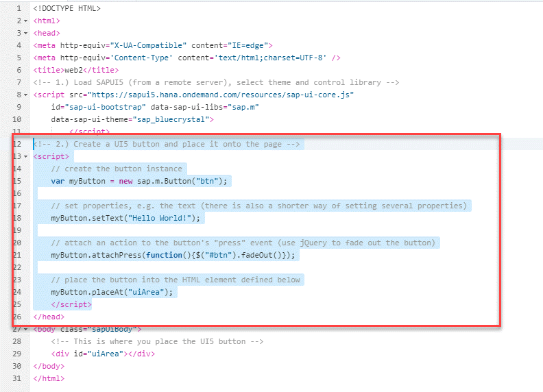

Remove the logics for the button

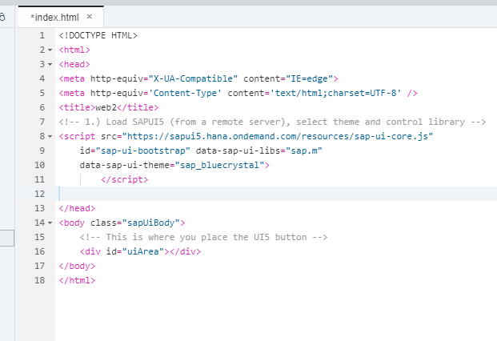

[DONE]

[ACCORDION-END]

[ACCORDION-BEGIN [Step 2: ](Bind the OData model to a table)]

In [this previous tutorial](https://www.sap.com/developer/tutorials/xsa-xsjs-xsodata.html), you created an XSJS compatible Node.js module to expose an OData V2 service that provides data from your database module. Consuming that model using SAP UI5 is simplified thanks to the concept of binding.

Take a look at the output of the OData service in JSON format


Add the following script to your `index.html` file, where the logics for the button used to be.

```javascript

<script>

	var oModel = new sap.ui.model.odata.ODataModel("/xsodata/purchaseOrder.xsodata", true);
	var oTable = new sap.ui.table.Table({ title: "My first table" });
	oTable.addColumn(new sap.ui.table.Column({ label: "PO ID", template: "PURCHASEORDERID" }));
	oTable.setModel(oModel);
  oTable.bindRows("/POHeader");
	oTable.placeAt("uiArea");

	</script>
```

> ### More about binding
> You are using an OData model that will load data as required by the client and delegate the sorting and filtering operations to the server-side. This model will provide the data from the service you defined before. You are then creating a table and binding the model to the table, so that all changes in the data are reflected also in the table.  Check the Help for [more information about SAPUI5 and binding](https://help.sap.com/viewer/40826922922346f890185c8ff02d30da/1.19/en-US/91f0ca956f4d1014b6dd926db0e91070.html)

Save and run the HTML5 module. You should get an error. Press `F12` in your browser and look at the errors in the console.


[VALIDATE_1]
[ACCORDION-END]

[ACCORDION-BEGIN [Step 4: ](Add missing libraries)]

You can see the available libraries in the `Sources` tab in the panel. Notice the resources that are loaded:

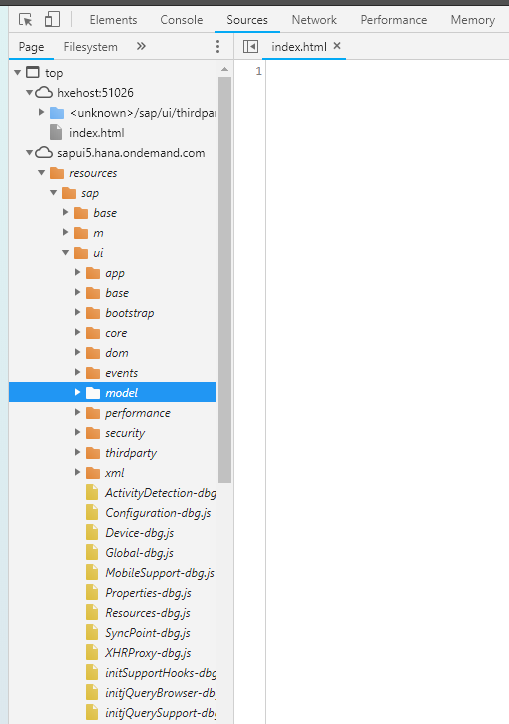

Go back and look at the code in `index.html` .

You are using `sap.ui.table` and `sap.ui.model` to display the table. If you compare the libraries you are using to the libraries that are loaded, you will see `sap.ui.table` is not present as a resource. This is why you are getting the error in the console.

> ### More about these libraries
> You will see there is a reference to `sap-ui-core.js`, a control library (`sap.m`) and a theme, `sap_bluecrystal`.
>`sap-ui-core.js` is the bootstrap file for SAPUI5, it contains the minimum required parts of the core library.  This will load and initialize the SAPUI5 library as soon as the script is executed by the browser. After its initialization, and because it has been added by default in the `index.html`, the library `sap.m` is loaded, together with its dependencies.

Add `sap.ui.table` to the `index.html` file as a required library.

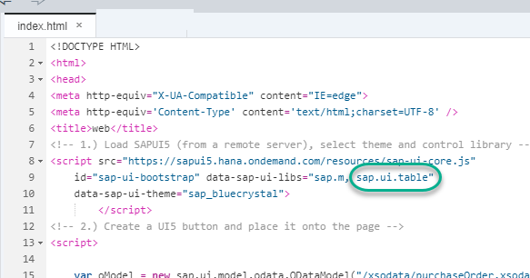

**Save** and **run** the web module again. You should see the table with results. Additionally, if you refresh while in the `Network` tab, you will see the requests, the sequence in which they are called and how long it takes them to load.


[DONE]

[ACCORDION-END]

[ACCORDION-BEGIN [Step 4: ](Create an instance of SAPUI5)]

You will see that the source of the SAP UI5 library is a public, remote resource.


In a productive scenario, there are many reasons to use a local version of the library. As of SAP HANA 2.0, SPS01, SAP UI5 was incorporated to XS Advanced as a micro-service for local consumption. You need to create an instance of the service to use on your Multi-Target Application just like you did with the UAA service.

Alternate between normal and incognito mode or use another browser to log in to the XSA Cockpit with the user `XSA_ADMIN`. In an SAP HANA, express edition instance this application has been incorporated in SPS03 and is found on port 51036 (i.e., https://hxehost:51036 ).

Navigate to the service marketplace for the space where your application is deployed and click on the `sapui5` service

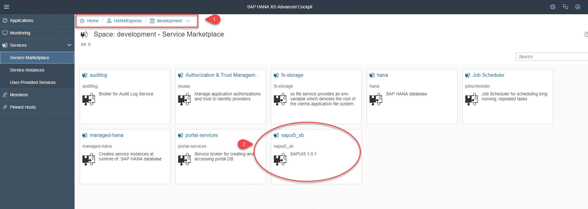

Click **instances** and create a **New instance**


Choose plan `sapui5-1.52` and click **Next**

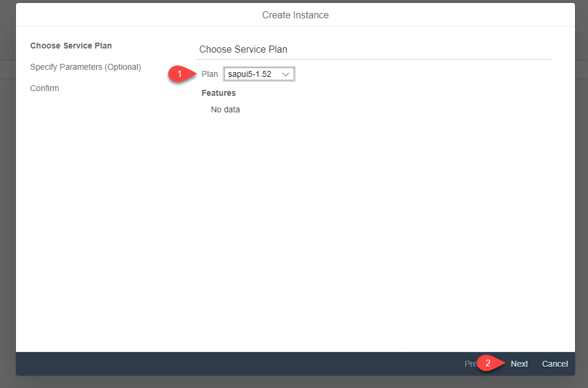

Call it `ui5`. When asked to specify parameters, you can click **Next**.

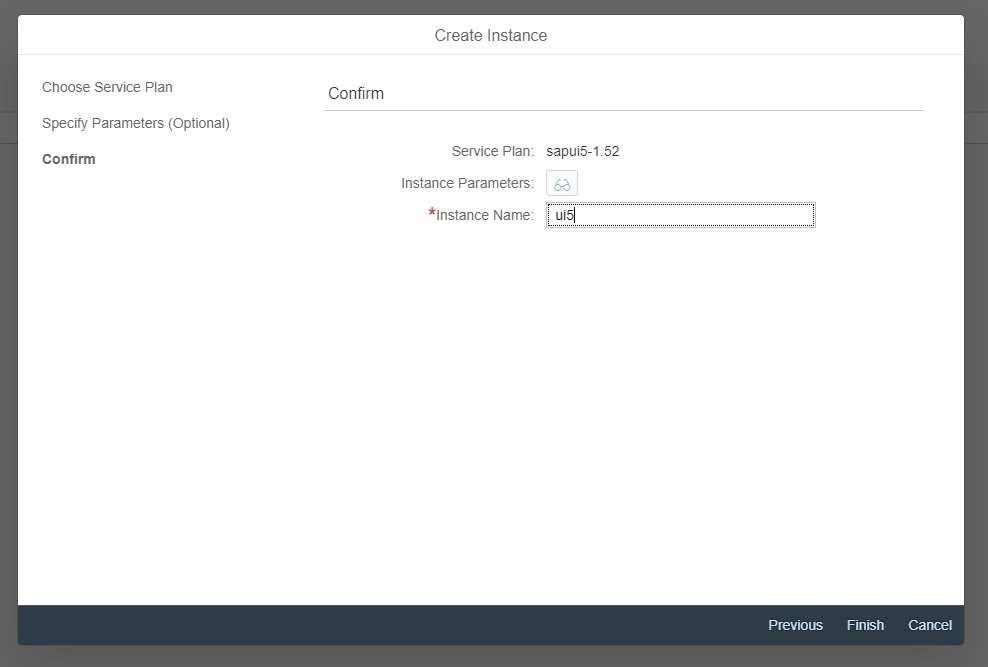

> Note: If you do not have SPS03 yet, add the following resource to your `mta.yaml` file, adjusting the UI5 version accordingly instead of running the previous wizard, which is not available. The following example works for SPS02

> ```txt
- name: ui5
    type: configuration
    parameters:
      provider-id: 'com.sap.ui5.dist.sapui5-dist-xsa.XSAC_UI5_FESV3:sapui5_fesv3'
      version: '>=1.44.0'

> ```

[DONE]
[ACCORDION-END]

[ACCORDION-BEGIN [Step 5: ](Add the SAPUI5 service as a dependency)]

Just like with the UAA service, you want to bind the instance you have created to your Multi-Target Application. Open the `MTA.yaml` file and click **add a new resource** called `ui5`.

Use `org.cloudfoundry.managed-service` as the type and the following key-value pairs under parameters:

- service : `sapui5_sb`
- `service-plan` : `sapui5-1.52`

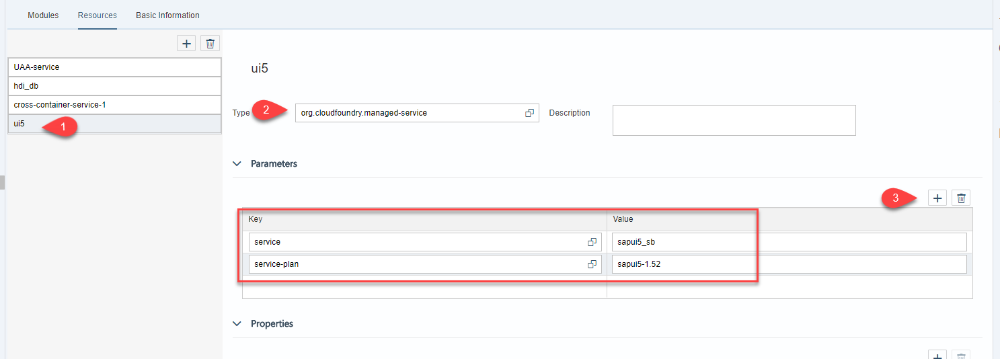

> ### Where are the values coming from?
> The name of the service instance, the type of service and service plan are use to bind the instance of the UI5 service to the web module. You can see these values under `Service Instances` in the XS Advanced cockpit or by listing them using the XS CLI with command `xs services`

**Save** the `yaml` file and navigate to the `resources` tab. Use the drop-down menu to choose the newly created resource.

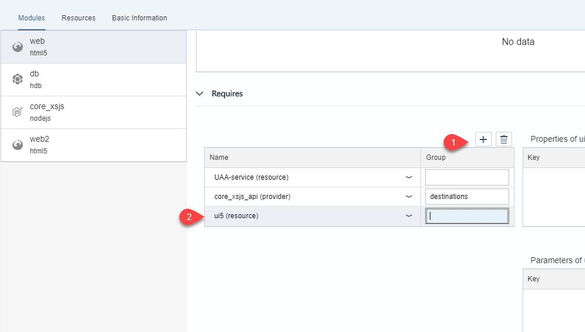

> Note: If you do not have SPS03 yet, skip the previous configuration and add the following dependency to the web module in the `yaml` file instead
>
> ```txt
- name: ui5
  properties:
    url: ~{url}

> ```

[DONE]
[ACCORDION-END]

[ACCORDION-BEGIN [Step 6: ](Adjust the AppRouter replacement)]

Open the file `xs-app.json` and add the following code at the end of the route declarations

```text
{
		"source": "/(.*)",
		"localDir": "resources",
		"authenticationType": "xsuaa",
		"replace": {
			"pathSuffixes": ["index.html", "odataTest.html"],
			"services": {
				"sapui5_sb": {
					"tag": "ui5"
					}
				}		
				}
			}
```
You will need to add a comma before adding the new route with the replacement values, the full file looks as follows:

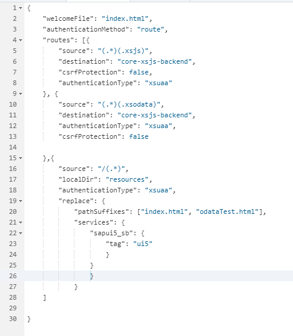

**Save the file**

> ### What does this mean?
> Take a look at the `package.json` file. You will notice a node module,`approuter.js`, is called. This module will read the file `xs-app.json`, use the `welcomeFile` value to redirect to `index.html` by default, and interpret the routes requests should take according to the regular expressions in the `source` key.
> It can also replace placeholders in static text resources, such as a placeholder for the URL to the UI5 service in `index.html`. In this case, the `AppRouter` finds the service with tag `ui5` like  you created in step 4, bound to the web application. If you use command `xs env APP`, where APP is the name of your web application, you will see the configuration details for the UI5 service.
>  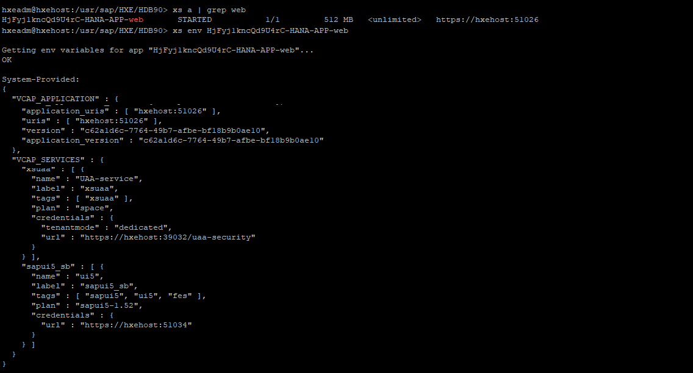
> You can find more information about the AppRouter in the [SAP Help portal](https://help.sap.com/viewer/4505d0bdaf4948449b7f7379d24d0f0d/2.0.03/en-US/6ba89596e3a64a5480c3977d4ea7fdba.html)

[DONE]
[ACCORDION-END]

[ACCORDION-BEGIN [Step 7: ](Call the micro-service in your HTML file)]

Open the `index.html` file and replace the remote URL with the variable `{{{sapui5_sb.url}}}`.

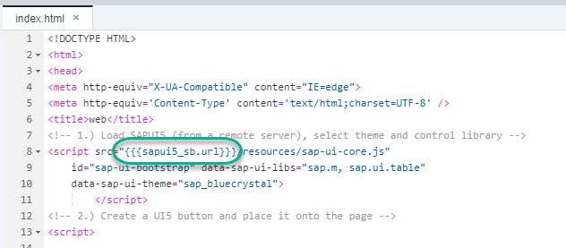

**Save and Run** the `index.html` file.

Right-click on the site and use the `view source` option to see the replacement:

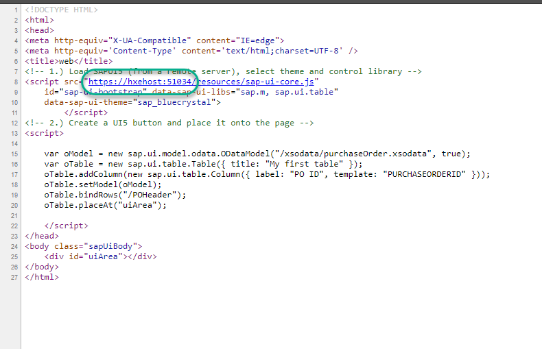

Press `CTRL + SHIT + ALT + S` and wait for the diagnostics window.

[VALIDATE_3]
[ACCORDION-END]


---
