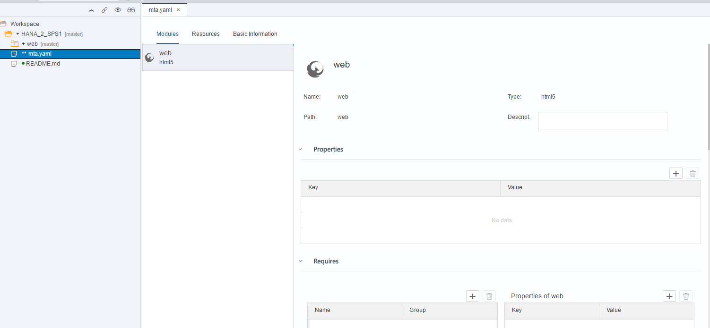
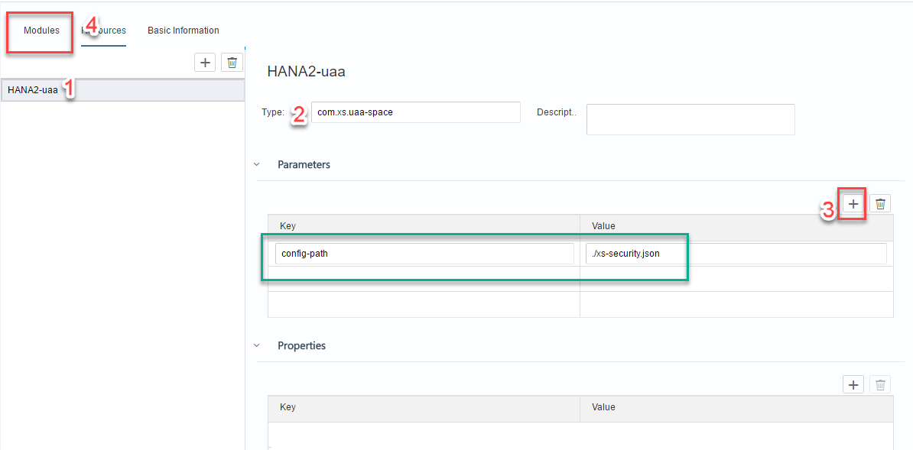
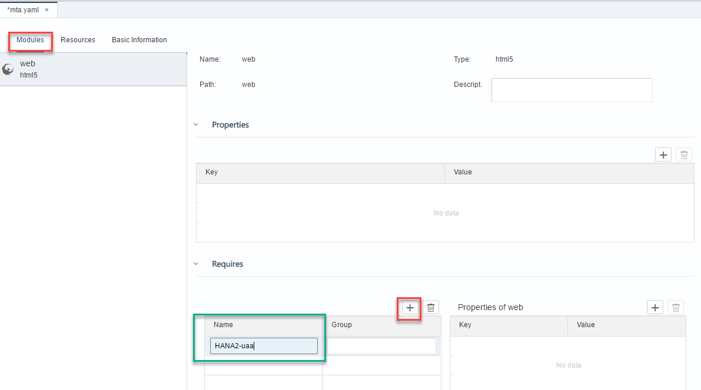
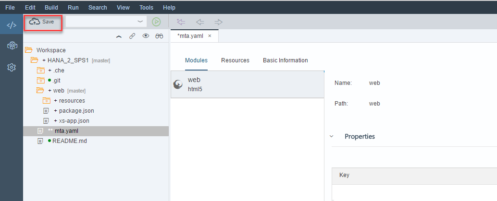
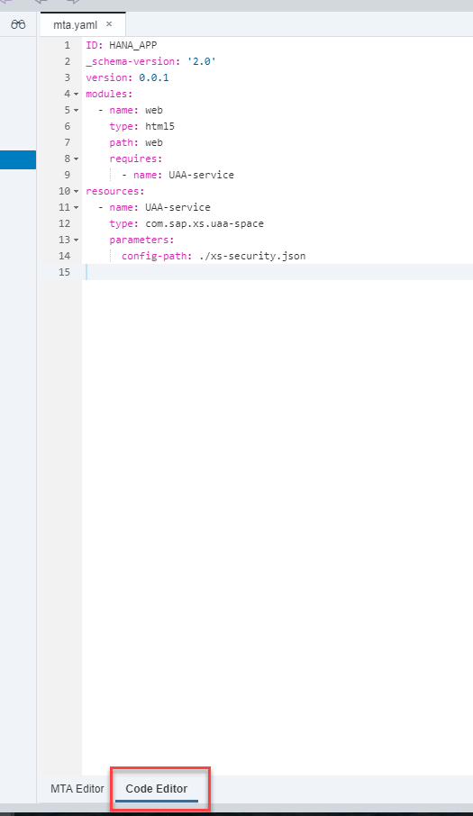
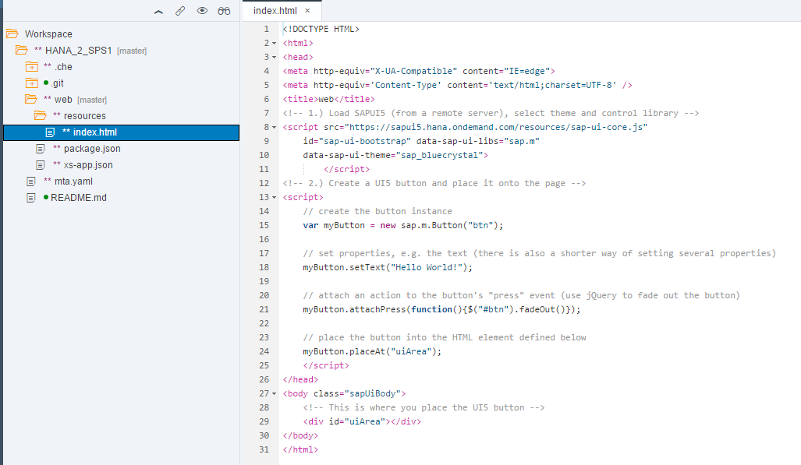
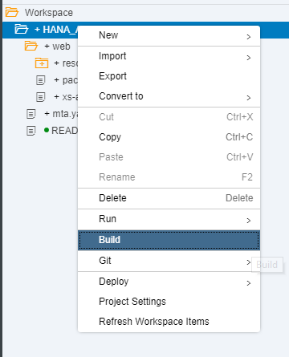
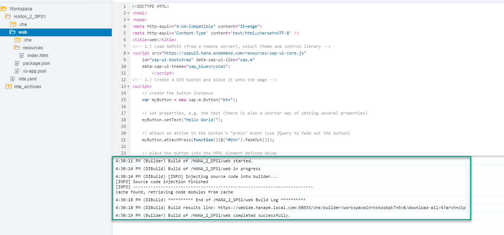
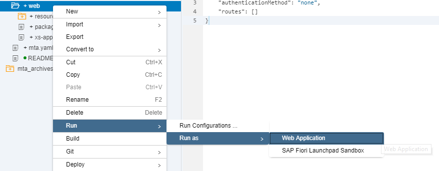
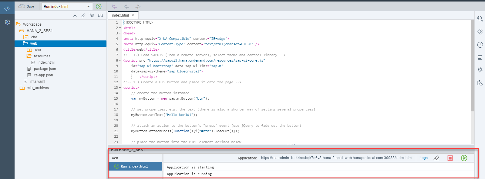

## Prerequisites  
 - **Proficiency:** Beginner
 - **Tutorials:** [SAP HANA XS Advanced Connect to Web IDE and clone Git Repository](http://www.sap.com/developer/tutorials/xsa-connecting-webide.html)

## Next Steps
 - [SAP HANA XS Advanced Creating an HDI Module](http://www.sap.com/developer/tutorials/xsa-hdi-module.html)


## Details
### You will learn  
You will now create the HTML5 module to add basic web based content to your XSA application.


### Time to Complete
**15 Min**.

---


[ACCORDION-BEGIN [Step 1: ](Launch the SAP Web IDE for HANA)]

Launch the SAP Web IDE for SAP HANA at the following URL in your web browser. The `hostname` of course is the hostname of the SAP HANA Developer Edition that you created in the previous tutorial.

Remember for XSA you will need to use the hostname and not the IP address of the server, instructions are found on the server landing page itself.

`https://<hostname>:53075/`

User: `XSA_DEV`
Password: The password provided when you set up HANA Express

or you can use

User: `WORKSHOP_01`
Password: `HanaRocks2017` or what you changed it to


[ACCORDION-END]


[ACCORDION-BEGIN [Step 2: ](Add the HTML5 Module in your existing MTA project)]

Select the Git repository  Now create the HTML5 module to host and serve out the front end content. Begin by right-clicking on your project and then choosing `New -> HTML5 Module`


Name the module `web`. Press Next to see the confirmation. Then press **Finish**.


This not only adds the necessary metadata to the web folder but also maintains the module entry in the project's `mta.yaml` file within the project root.



[ACCORDION-END]

[ACCORDION-BEGIN [Step 3: ](Add the UAA service as a dependent resource)]

You need to add `HANA2-uaa` as a dependent service/resource to the `mta.yaml` file. This is because you have user authentication required to access your application.

Go into the `Resources` tab and click on the **+** sign:


>What is this `mta.yaml` file for? We have so far created a Multi Target Application, that is, an application that will contain different modules, such as an HTML5 module and some database artifacts within a HANA Database Module. This file is a design-time descriptor, that will be used by the platform to create a deployment descriptor. This file contains information related to the application (ID, version, description) as well as resources, modules and parameters that will be deployed and required at runtime.


</br>

Fill in the name,  type ( `com.sap.xs.uaa-space` ), key-value parameters (`config-path` and `./xs-security.json` ) and then click on **Modules**:



Back in the `Modules` tab, add the resource as a requirement:



And click on **Save**



You can check on the `Code Editor` tab to see the actual contents of the  `mta.yaml` file.




[ACCORDION-END]

[ACCORDION-BEGIN [Step 4: ](Create the UAA service for your application)]
In future, adding the resource declaration to the MTA descriptor will allow the tools to automatically provision these resources at runtime. But this functionality is not yet provided for UAA services.  Therefore you have to use the XS command line client tool to perform this step. From a command line type the following to connect to remote XSA server.

>REMEMBER: You must also install the LATEST version of XSA command line tools!! These can be downloaded from the SAP HANA Developer Edition directly, using the Download Manager and choosing "Clients" from the [SAP HANA, Express Edition, getting started](https://www.sap.com/developer/topics/sap-hana-express.html) or via the [SAP Service Marketplace](https://websmp208.sap-ag.de/~SAPIDP/002006825000000234912001E)

```
xs login -a http://<hostname>:3XX30 -o HANAExpress -s development -u XSA_DEV
```

If you are not using HANA Express, change the organization (`HANAExpress`), space (`development`) and user (`XSA_DEV`) accordingly. `XX` will be the instance number.

The space has to match the space that was setup in the Project Settings. You can check it by right-clicking on the repository folder and opening "Project Settings"


>Note: You can also check the organization name and available spaces in the "Organization and Space management" tile in XS Advanced Administration and Monitoring tools menu or using command

To create the UAA service issue the following command:

```
xs create-service xsuaa space HANA2-uaa

```


[ACCORDION-END]

[ACCORDION-BEGIN [Step 5: ](Change Authentication Method)]

The web folder in your project contains the resources that will be served out by this HTML5 module. This HTML5 module manages all HTML/client side UI resources (in the resources folder) and performs the task of reverse proxy for all other internal services. This way you have a single HTTP endpoint and avoid any CORS issues. The Add Module wizard already placed a simple `index.html` with `Hello World` in the resources folder.



The HTML5 module is configured via the file `xs-app.json`. In this file we can map the routes to destinations we defined in the `mta.yaml`. We can also set authentication and other options. Go ahead and change the `authenticationMethod` to route in the `xs-app.json` file.

```
{
	"welcomeFile": "index.html",
	"authenticationMethod": "route",
	"routes": [ ]
}
```
[ACCORDION-END]

[ACCORDION-BEGIN [Step 6: ](Build and Run!)]

Your initial development is done and you are ready to deploy your application onto the XS Advanced server. Right-click on the project and press **Build**.


And check the results in the log.



Click on the web folder and click on **Run**. This  will open a new browser tab to the default page of this web service.



The console will be updated with the status of the service as the Application in a separate tab requests for your credentials:



Switch your browser tab and you should see the authentication prompt for your application. Login with the same user credentials you used to log into the SAP Web IDE for SAP HANA. Provided you are not extremely quick in which case your browser may still hold your session and you may not need to log in again. Authentication at the XS level is now done by referencing a user stored. This can be configured to be the HANA database or it can be an external user directory.


After successful authentication, you should see your `index.html` with the Hello World button.


[ACCORDION-END]

## Next Steps
 - [SAP HANA XS Advanced Creating an HDI Module](http://www.sap.com/developer/tutorials/xsa-hdi-module.html)
