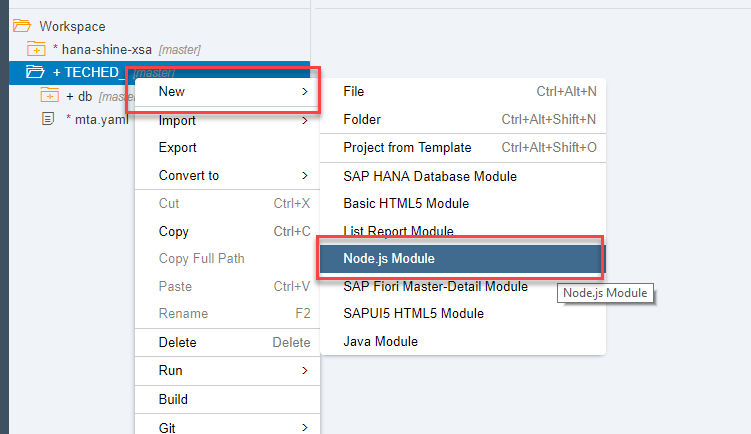
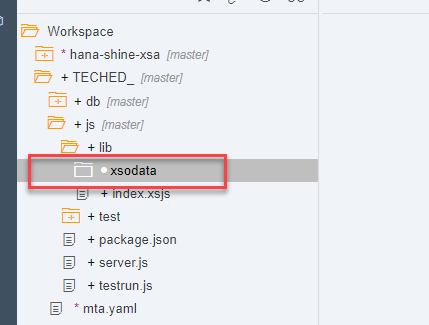
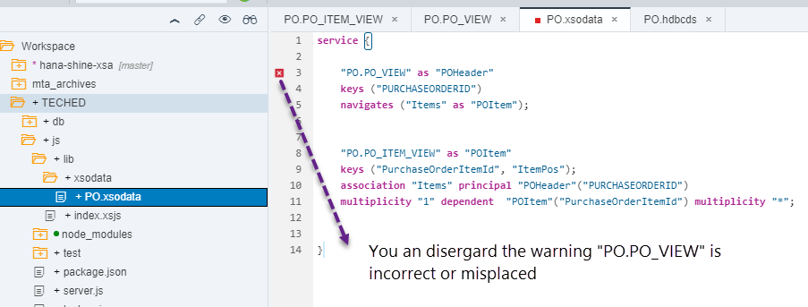

## Prerequisites
 - **Proficiency:** Beginner

## Details
### You will learn  
Create a Node.js module to expose data in an OData service.

### Time to Complete
**10 Min**

---

[ACCORDION-BEGIN [Step 1: ](Create a Node.js module)]

Create a Node.js module. Right-click on your project and select `New->Node.js Module`:



Call it `js`:


Add a description, check the `XSJS support` box and click on **Finish**


[DONE]
[ACCORDION-END]

[ACCORDION-BEGIN [Step 2: ](Create an OData file)]

You will now create an OData file to expose the contents of the artifacts you defined in your CDS module. This is not really Node.js development but the utilization of the runtime environment to expose OData. You can see real examples of Node.js development in the SHINE model later.

Create a folder called `xsodata` under `js->lib`



Create a file called `PO.xsodata` with the following content:

```sql
service {

	"PO.PO_VIEW" as "POHeader"
	keys ("PURCHASEORDERID")
	navigates ("Items" as "POItem");


	"PO.PO_ITEM_VIEW" as "POItem"
	keys ("PurchaseOrderItemId", "ItemPos");
	association "Items" principal "POHeader"("PURCHASEORDERID")
	multiplicity "1" dependent  "POItem"("PurchaseOrderItemId") multiplicity "*";


}
```

>Note: You can disregard the warning in the OData definition



**Save and Build** the `js` module.

[DONE]
[ACCORDION-END]

[ACCORDION-BEGIN [Step 3: ](Add the dependency between the modules)]

You have a database module and now you also have a Node.js module. These modules could technically be executed separately, even deployed separately. However, the Node.js module needs data from the database module. You need to add this dependency in the file that keeps them all together, the `mta.yaml`:


Add both the HDI container and database modules to the `Requires` section of the `js` modules.

**Save** the file.

[DONE]
[ACCORDION-END]


[ACCORDION-BEGIN [Step 4: ](Test the service)]

**Run** the `js` module. Click on the URL to open a new tab:


Edit the URL to access the OData service, replace `index.xsjs` with `/xsodata/PO.xsodata`:


Add `?$format=json` to the end of the URL. Copy the results and click on **Validate**

[VALIDATE_1]
[ACCORDION-END]
