## Prerequisites  
 - **Proficiency:** Intermediate
 - **Tutorials:** [HANA Database Access from Node.js](http://go.sap.com/developer/tutorials/xsa-node-dbaccess.html)

## Next Steps
 - [Text Bundles](http://go.sap.com/developer/tutorials/xsa-node-text.html)

## Details
### You will learn  
you will learn about the fundaments of the asynchronous nature of Node.js You will so see how this asynchronous capability allows for non-blocking input and output. This technique is one of the basic things that makes Node.js development different from other JavaScript development and also creates one of the reasons for its growing popularity. We will see how these techniques are applied to common operations like HTTP web service calls or even SAP HANA database access.

### Time to Complete
**15 Min**.

---

1. Return to the Node.js module and the `server.js` source file. Add a second module require statement for `./exerciseAsync`

	```
	"use strict";

	var xsjs  = require("sap-xsjs");
	var xsenv = require("sap-xsenv");
	var port  = process.env.PORT || 3000;
	var server = require('http').createServer();
	var express = require("express");
	var node = require("./myNode"); 
	var exerciseAsync = require("./exerciseAsync");
	```

2. Add an express route handler for this `exerciseAsync` module and pass the server variable in as well. 

	```
	app.use("/node", node());
	app.use("/node/excAsync", exerciseAsync(server));
	```

3. Create a new file in your `js` folder called `exerciseAsync.js`. 

	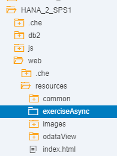

4. Add the following code to your `exerciseAsync.js` file. You can look at this code if you want, but isn’t what we want you to focus on for this exercise. Instead this is really just a test framework. You will instead write the important parts of this exercise in a series of additional Node.js modules – each focusing on a different Node.js asynchronous aspect.

	```
	“use strict";
	var express = require("express");
	var app = express(); 
	var WebSocketServer = require("ws").Server;
	var asyncLib = require("./async/async.js");
	var dbAsync = require("./async/databaseAsync.js");
	var dbAsync2 = require("./async/databaseAsync2.js");
	var fileSync = require("./async/fileSync.js");
	var fileAsync = require("./async/fileAsync.js");
	var httpClient = require("./async/httpClient.js");
	
	module.exports = function(server){
	
	
		app.use(function(req, res){
	    	res.send({ msg: "hello" });
		});
		var wss = new WebSocketServer({ 
			server: server, 
			path: "/node/excAsync"
		});
	
		wss.broadcast = function (data) {
			var message = JSON.stringify({text: data});
	    	for (var i in this.clients)
	        	this.clients[i].send(message);
	    	console.log("sent: %s", message);
		};
	
		wss.on("connection", function (ws) {
	    	console.log("Connected");	
			
			ws.on('message', function (message) {
	        	console.log('received: %s', message);
	        	var data = JSON.parse(message);
	        	switch(data.action){
	        		case "async":
	        			asyncLib.asyncDemo(wss);
	        			break;
	        		case "fileSync":
	        	    	fileSync.fileDemo(wss);
	        	    	break;
	        		case "fileAsync":
	        	    	fileAsync.fileDemo(wss);
	        	    	break;  
	        		case "httpClient":
	        	    	httpClient.callService(wss);
	        	    	break;    
	        		case "dbAsync":
	        	    	dbAsync.dbCall(wss);
	        	    	break;  
	        		case "dbAsync2":
	        	    	dbAsync2.dbCall(wss);
	        	    	break;         	           	        	          	    
	        		default:
						wss.broadcast('Error: Undefined Action: '+ data.action);
						break;
	        }
	    });    	
	    	ws.send(JSON.stringify({
	        	text: "Connected to Exercise 3"
	    	}));	
		});
		
		return app;
	};
	```

5. Look at the `package.json` file in the editor. You will see the dependencies section which lists all required libraries and their versions. Add the `ws` module to this dependencies section.

	```
	"sap-xsenv": "1.2.1",
	"sap-xsjs": "1.4.0",
	"express": "4.12.3",
	"sap-hdbext": "1.1.2",
    	"sap-xssec": "0.5.3",
    	"passport": "0.2.1",
    	"async": "latest",
    	"ws": "latest"
	},
	```

6. You will also need a test user interface for this exercise.  Go to the `web/resources` folder and right mouse click.  Choose `Import->From` File System.

	

7. Press browse and file the file `exerciseAsync.zip` in the Git repo. Keep all other selections at their defaults and press **OK**

	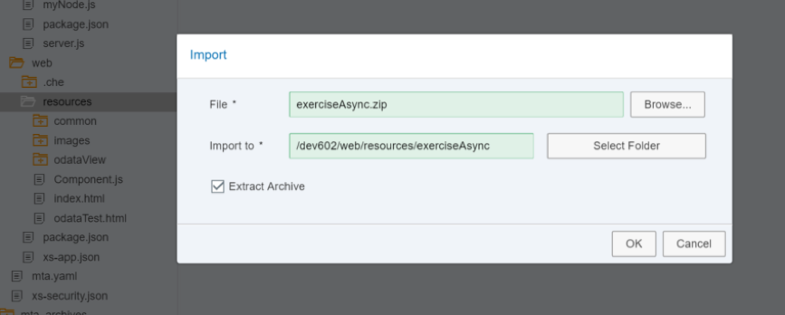

8. This should import the complete UI for you.

	

9. Create a folder under `js` called `async`. This is where you will create the rest of the files in this section. 

	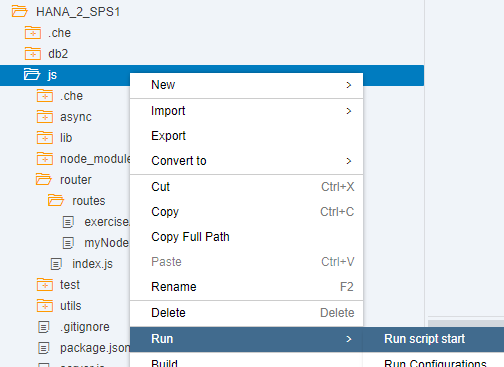

10. The rest of the files can be imported from the file system. Right mouse click on `/js/async` and choose `Import -> From File System`. Choose the file `async.zip` from the Git repo. Keep all other settings the same and press **OK**. 

	

11. You can now run the `js` module

	

12. You should see that the build and deploy was successful. 

	

13. However if you go to the tab where the service run was started, you will see an Unauthorized message just as in previous sections. This is as intended.

	

14. So now run the `web` module. 

	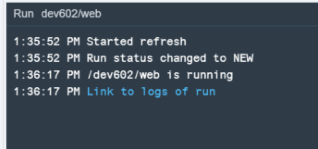

15. In the running tab, you should see the `index.html` from earlier.  

	

16. Now change the path in the browser to `/exerciseAsync`. You should see the test framework for this exercise.  

	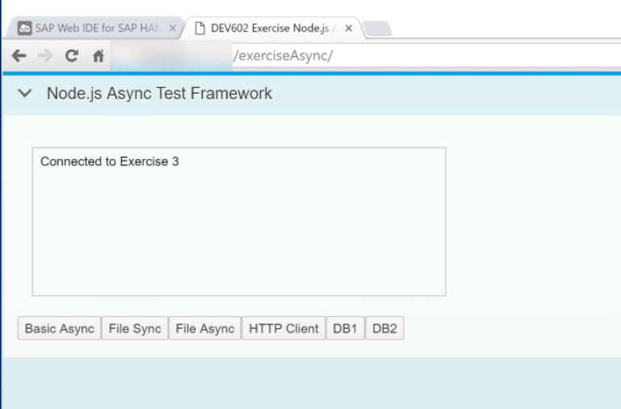

17. Basic `Async` runs the `async.js` code. In this code you will output a start message, then set a timer which will issue a message after 3 seconds. Finally you will issue an ending message.

	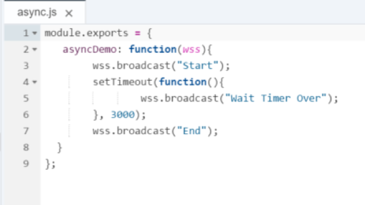

18. What do you expect this code will output? From many other programming languages you would expect sequential processing and therefore the End output wouldn’t come until after the timer expired. However part of the power of Node.js is asynchronous non-blocking execution of many core elements. In test UI, press the Basic `Async` button.

	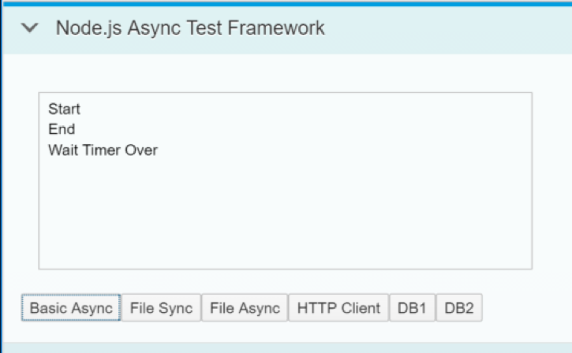

19. Perhaps a timer seemed like an obvious asynchronous operation. However this asynchronous nature of Node.js is often used when programs must wait on input or output. When asynchronous processing is applied to these operations, you can keep from blocking execution of other logic while you wait on things like file access, HTTP requests or even database query execution. Now look at the difference between synchronous and asynchronous file operations. 


20. The `fileSync.js` is using the `fs` library and the function `readFileSync` to read each of the two text files. After each read operation output there is a message.

	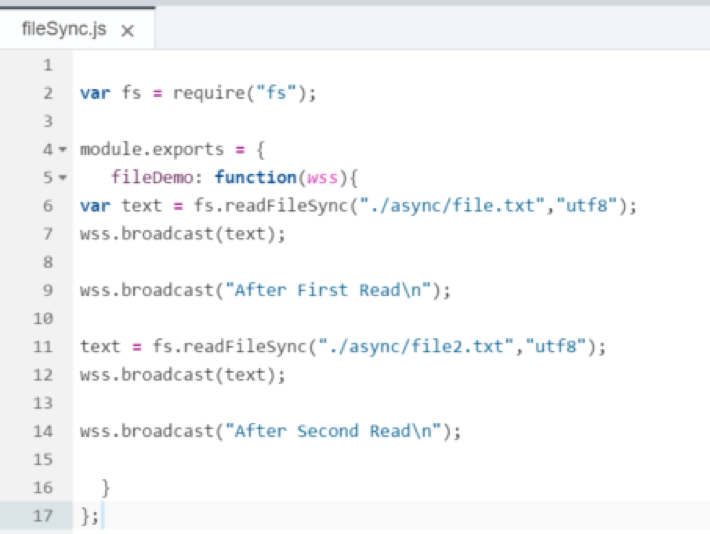

21. Test your `fileSync.js` from the UI test tool. As you might expect, everything is output in exactly the same order as the lines of code were listed in the application because all operations were synchronous. Program execution didn’t continue until each read operation had completely finished.

	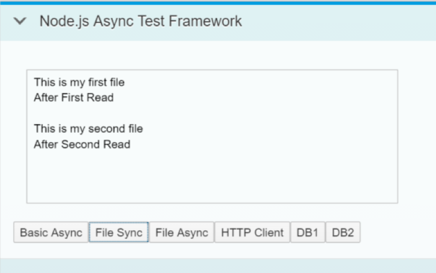

22. Now to look at `fileAsync.js`. Notice that the message output now is embedded as an in-line callback function. It doesn’t get executed until the read operation is complete, but the rest of the program flow continues and isn’t blocked by the file operation.

	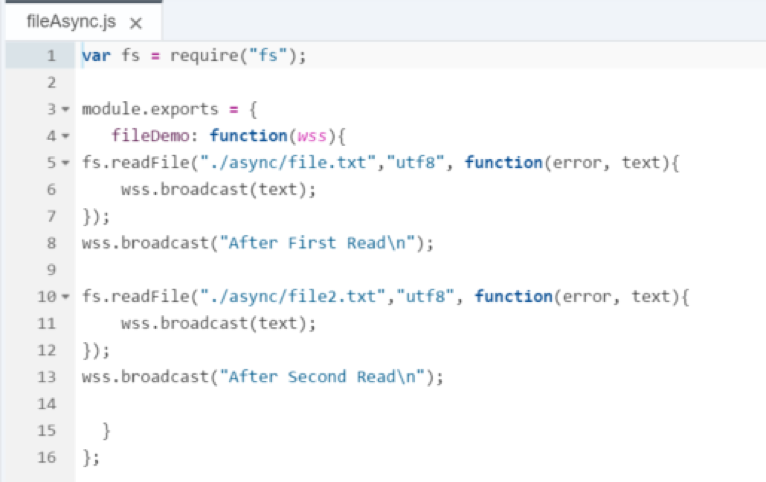

23. Now run `fileAsync.js` from the test UI. The output of this exercise gives us very different results. Both after comments are outputted before either of the file contents.  Also if the first file had been significantly larger than the second, it’s possible that the second might have finished and output first. This has powerful implications to how you code applications.

	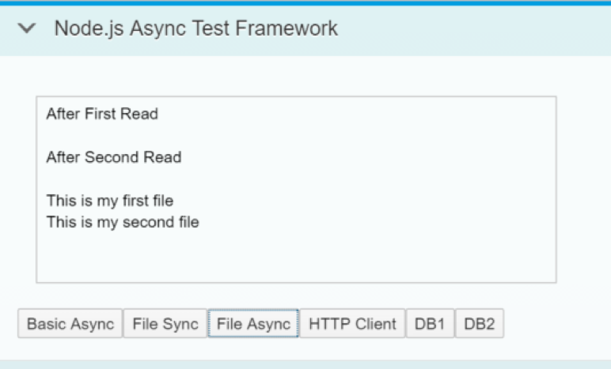

24. Similar to file operations, HTTP requests are another area where your programs must often wait on an external response. In this section you can see how Node.js also makes calling external HTTP services non-blocking. The HTTP library you used in earlier sections can also be used to make HTTP requests. Use the get function of the HTTP library to call to `http://www.loc.gov/pictures/search/?fo=json&q=SAP`. This will call the US Library of Congress Image Search (a REST API which requires no authentication or API Key to keep the exercise simple). Issue a message before and after the HTTP request.

	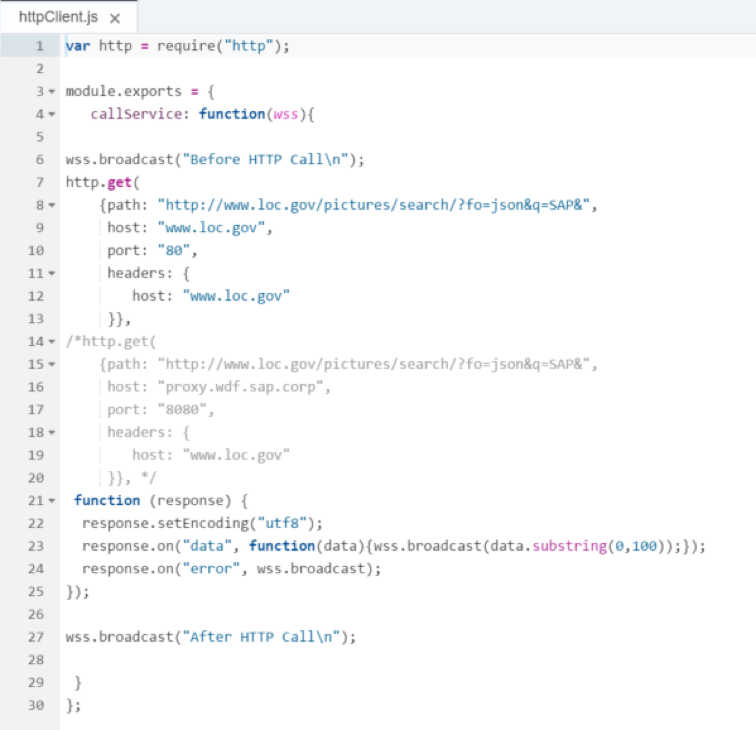

25. Test your `httpClient.js` from the test UI. Similar to the earlier file exercise, the after HTTP call console message is output before the response from the HTTP request.

	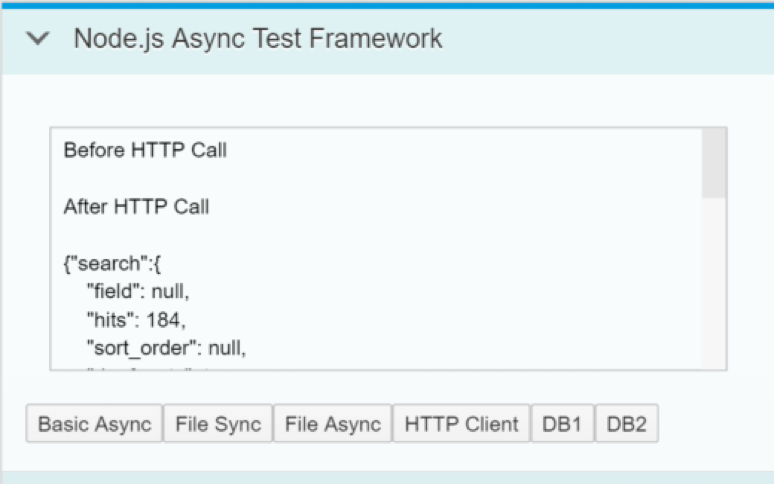

26. Perhaps most interesting is that this non-blocking concept can also be extended to database access. This allows you to issue multiple requests to the underlying HANA database in parallel and without stopping the processing flow of the JavaScript application logic. Earlier in this section, you learned about making database access to HANA. For this section you’ve already coded the database requests in a reusable module, so you can concentrate on the asynchronous flow. First you have `databaseAsync.js`. This Issues a message, then calls two functions (`callHANA1` and `callHANA2`), then issues another message. This will execute two different queries in the HANA database.

	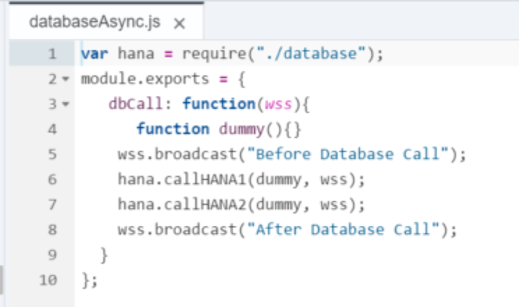

27. Test your `databaseAsync.js` from test UI. As you are hopefully learning to expect, the messages you issued after the database requests are actually output first. Only then are the database query results returned. There is also no guarantee that query 1 will finish before query 2. 

	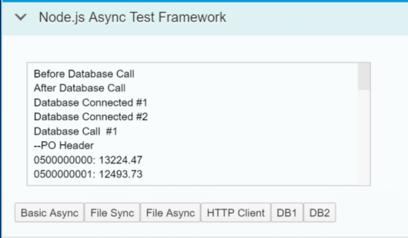

28. But what if you want more control over the flow of program execution. Maybe you want several database operations to happen in parallel, but then some logic to execute only after all queries are complete. This is one of things the `async` library in Node.js can make easier. In `databaseAsync2.js` you adjust the logic to use the `async.parallel` function. This allows some of the commands to execute in parallel as before, but then have a sync point once all operations are complete to allow further processing.  You will output one final message after everything is done.

	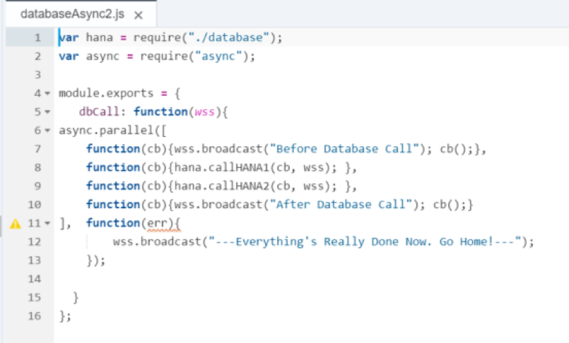

29. Test your `databaseAsync2.js` from the test UI. The execution is similar to before, but now we have the final message after all queries are complete. Because we have a sync point after all parallel execution is complete, we can output this final message after both queries are complete. 

	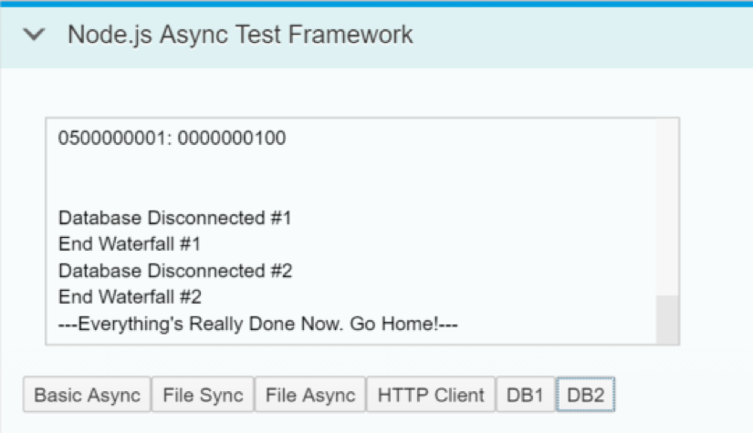

## Next Steps
 - [Text Bundles](http://go.sap.com/developer/tutorials/xsa-node-text.html)
