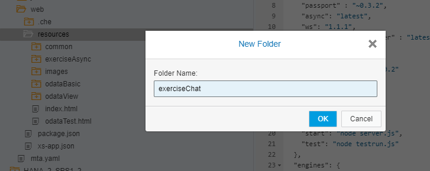
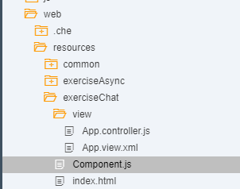
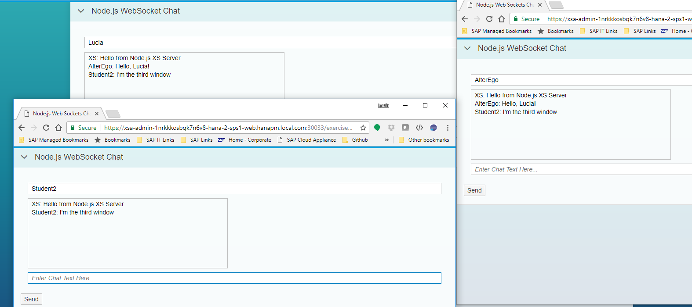
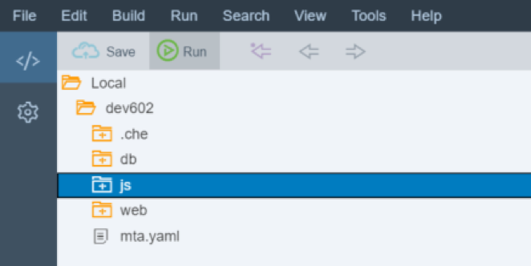
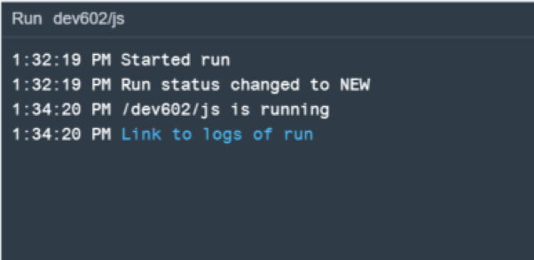
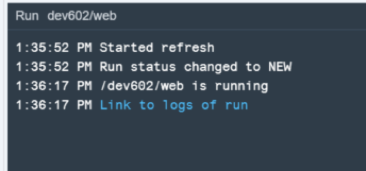
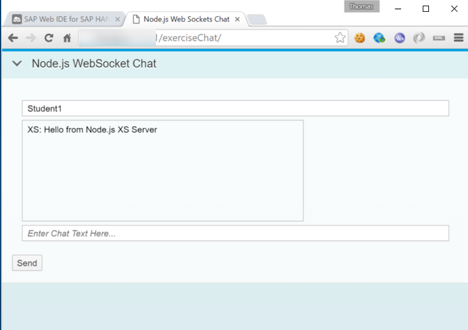
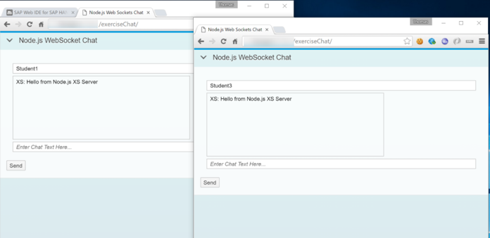
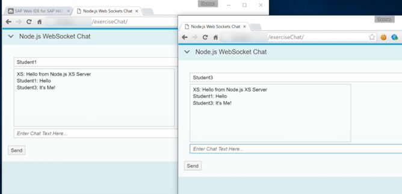

## Prerequisites  
 - **Proficiency:** Intermediate
 - **Tutorials:** [Text Bundles](http://go.sap.com/developer/tutorials/xsa-node-text.html)

## Next Steps
 - Select a tutorial from the [Tutorial Navigator](http://go.sap.com/developer/tutorial-navigator.html) or the [Tutorial Catalog](http://go.sap.com/developer/tutorials.html)

## Details
### You will learn  
This section will demonstrate the ease at which you can tap into the powerful web sockets capabilities of Node.js You will use web sockets to build a simple chat application. Any message sent from the SAPUI5 client side application will be propagated by the server to all listening clients. 

### Time to Complete
**15 Min**.

---

1. Return to the Node.js module and the `server.js` source file. Add a module require statement for `./chatServer`

	```
	/*eslint no-console: 0, no-unused-vars: 0*/
	"use strict";
	
	var xsjs  = require("sap-xsjs");
	var xsenv = require("sap-xsenv");
	var port  = process.env.PORT || 3000;
	var server = require('http').createServer();
	var express = require("express");
	var node = require("./myNode"); 
	var exerciseAsync = require("./exerciseAsync");
	var textBundle = require("./textBundle");
	var chatServer = require("./chatServer");
	```

2. Add an express route handler for this `chatServer` module and pass the server variable in as well.  

	```
	var app = express(); 
	app.use("/node", node());
	app.use("/node/excAsync", exerciseAsync(server));
	app.use("/node/textBundle", textBundle());
	app.use("/node/chat", chatServer(server));
	
	var options = xsjs.extend({
	```

3. Create a new file in your `js` folder called `chatServer.js`

	

4. Add the following code to your `chatServer.js` file. The Node.js module for Web Sockets which we are going to use is `ws`. Require it and create a new instance of the `WebSocketServer`. This is then a recommended implementation for the remainder of the Web Sockets functionality to both receive and send messages.

	```
	"use strict";
	var express = require("express");
	var app = express(); 
	var WebSocketServer = require("ws").Server;
	
	module.exports = function(server){
		app.use(function(req, res){
	    	res.send({ msg: "hello" });
		});
		var wss = new WebSocketServer({ 
			server: server, 
			path: "/node/chatServer"
		});
	
		wss.broadcast = function (data) {
	    	for (var i in this.clients)
	        	this.clients[i].send(data);
	    	console.log("sent: %s", data);
		};
	
		wss.on("connection", function (ws) {
	    	ws.on("message", function (message) {
	        	console.log("received: %s", message);
	        	wss.broadcast(message);
			});
	    	ws.send(JSON.stringify({
	        	user: "XS",
	        	text: "Hello from Node.js XS Server"
	    	}));
		});
		
		return app;
	};
	```

5. You will also need a nice user interface for this exercise.  Go to the `web/resources` folder and right mouse click. Choose `Import->From` File System

	

6. Press browse and file the file `exerciseChat.zip` in the Git Repo. Keep all other selections at their defaults and press **OK**.

	

7. This should import the complete UI for you.

	

8. We can now run the `js` module. 

	

9. You should see that the build and deploy was successful. 

	

10. However if you go to the tab where the service run was started, you will see an Unauthorized message just as in previous sections. This is as intended.

	

11. So now run the `web` module.

	

12. In the running tab, you should see the `index.html` from earlier.  

	

13. Now change the path in the browser to `/exerciseChat`. You should see the simple chat user interface.  

	

14. Open a second browser window and cut and paste the chat application URL into it. 

	

15. Anything you type into either window is sent to the server and then pushed out to all listeners. If you want to test further open more than two browser windows.  
 
	


## Next Steps
 - Select a tutorial from the [Tutorial Navigator](http://go.sap.com/developer/tutorial-navigator.html) or the [Tutorial Catalog](http://go.sap.com/developer/tutorials.html)
