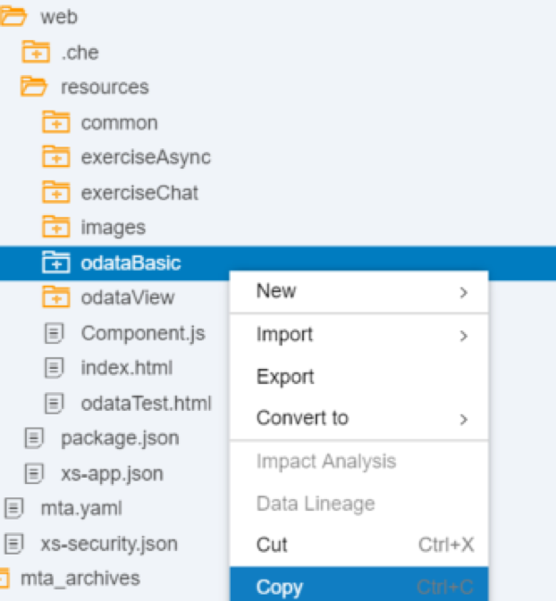
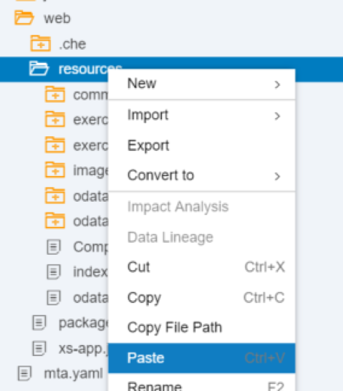
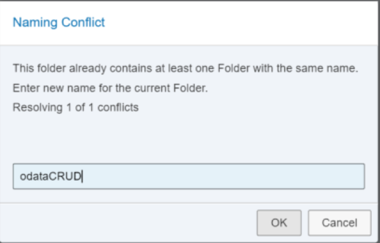
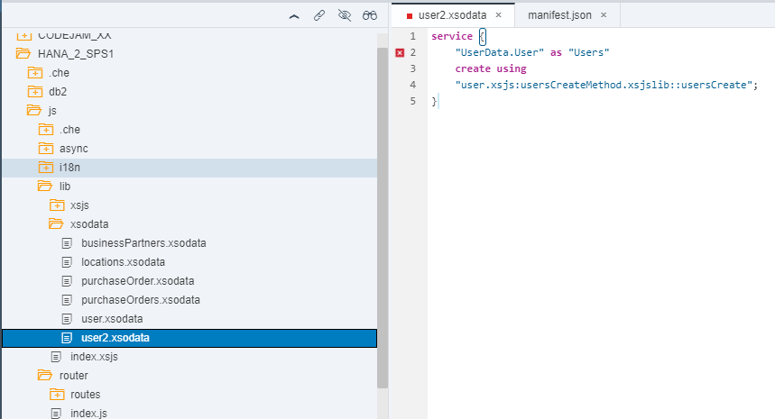
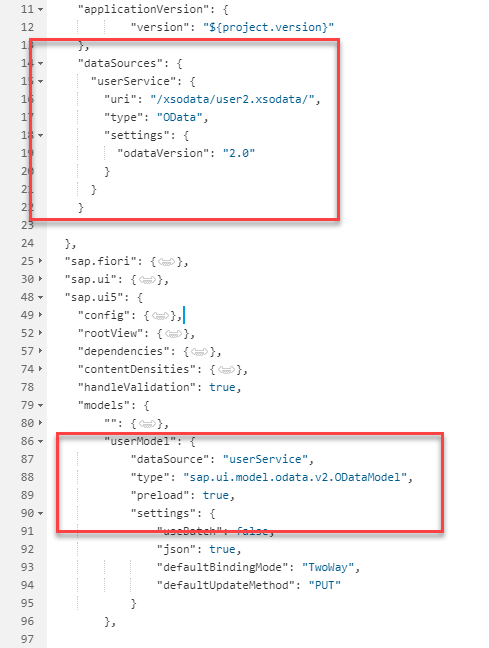
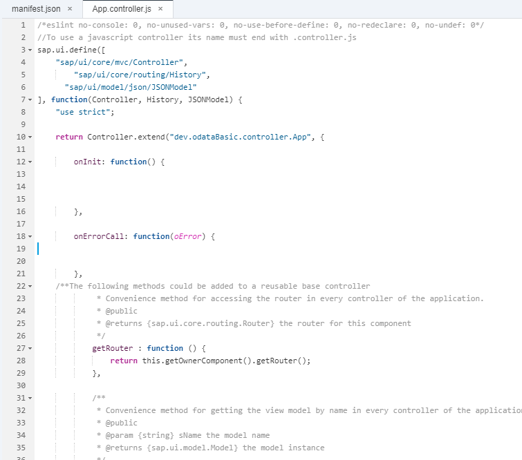
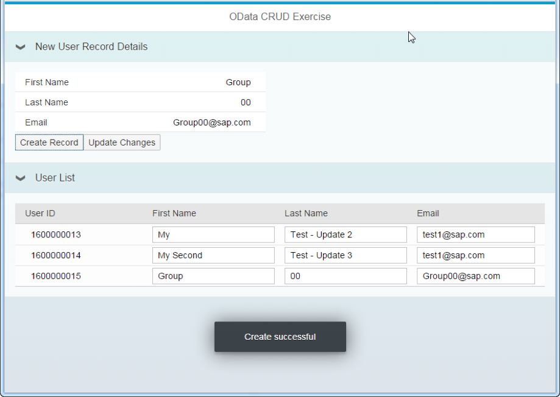
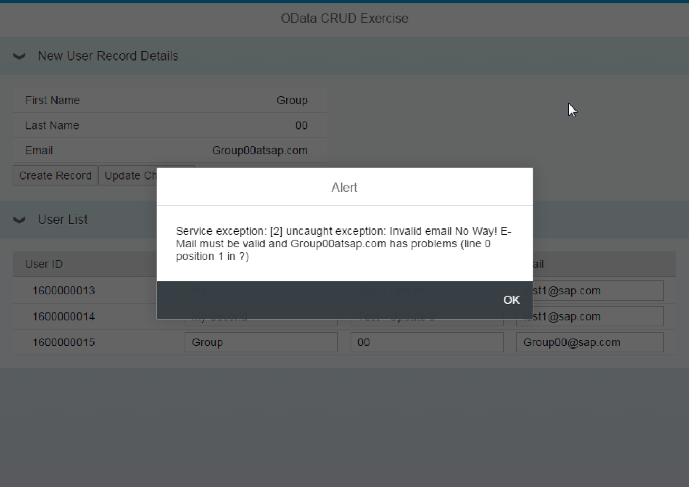

## Prerequisites  
- **Proficiency:** Intermediate
- **Tutorials:** [Use OData Metadata to dynamically create the columns](http://www.sap.com/developer/tutorials/xsa-sapui5-metadata.html)

## Next Steps
- Select a tutorial from the [Tutorial Navigator](http://www.sap.com/developer/tutorial-navigator.html) or the [Tutorial Catalog](http://www.sap.com/developer/tutorials.html)

## Details
### You will learn  
Consume an OData Service with Create Option


### Time to Complete
**15 Min**.

---

[ACCORDION-BEGIN [Step 1: ](Copy previous code)]

You will begin by making a copy of the previous exercise.



 Right-click on the `resources` folder . Choose Paste.



In the copy folder dialog, give the new Name as `odataCRUD`.



[DONE]
[ACCORDION-END]

[ACCORDION-BEGIN [Step 2: ](Copy the OData create service)]

In the `js->lib->xsodata` folder, copy the file `user.xsodata` into `user2.xsodata`. Replace the code with the following:

```
service {
	"UserData.User" as "Users"
	create using
	"user.xsjs:usersCreateMethod.xsjslib::usersCreate";
}
```

You should have something like:



[DONE]
[ACCORDION-END]


[ACCORDION-BEGIN [Step 3: ](Edit `manifest,json`)]

Go into the `manifest.json` file and switch the service to the existing `user.xsodata` service. Also adjust the name of the `datasource` in the model configuration:



[DONE]
[ACCORDION-END]

[ACCORDION-BEGIN [Step 4: ](Adjust the XML view)]

Use the following code to replace the existing code for your XML view:

```XML

<core:View xmlns="sap.m" xmlns:mvc="sap.ui.core.mvc" xmlns:u="sap.ui.unified" xmlns:core="sap.ui.core" xmlns:smartTable="sap.ui.comp.smarttable"
	controllerName="dev.odataBasic.controller.App">
	<u:Shell id="myShell" icon="/images/sap_18.png">
		<u:user>
			<u:ShellHeadUserItem image="sap-icon://person-placeholder" username="{config>/UserName}"/>
		</u:user>
		<u:content>
			<ScrollContainer height="100%" width="100%" horizontal="true" vertical="true">
				<Panel headerText="New User Record Details" expandable="true" expanded="true">
					<List width="400px">
						<InputListItem label="First Name">
							<Input id="fName" value="{/FirstName}"/>
						</InputListItem>
						<InputListItem label="Last Name">
							<Input id="lName" value="{/LastName}"/>
						</InputListItem>
						<InputListItem label="Email">
							<Input id="email" value="{/Email}"/>
						</InputListItem>
					</List>
					<Button text="Create Record" press="callUserService"/>
					<Button text="Update Changes" press="callUserUpdate"/>
				</Panel>				
				<VBox fitContainer="true">
					<smartTable:SmartTable id="userTable" header="User List" editable="false" entitySet="Users" showRowCount="true" enableAutoBinding="true"
						showFullScreenButton="true" tableType="Table">
						<Table>
							<columns>
								<Column id="UserId">
									<customData>
										<core:CustomData key="p13nData" value='\{"columnKey": "UserId", "leadingProperty": "UserId", "sortProperty": "UserId", "columnIndex":"1"}'/>
									</customData>
									<Text text="User ID"/>
								</Column>
								<Column id="FirstName">
									<customData>
										<core:CustomData key="p13nData" value='\{"columnKey": "FirstName", "leadingProperty": "FirstName", "maxLength": "40","columnIndex":"2"}'/>
									</customData>
									<Text text="First Name"/>
								</Column>
								<Column id="LastName">
									<customData>
										<core:CustomData key="p13nData" value='\{"columnKey": "LastName", "leadingProperty": "LastName", "maxLength": "40","columnIndex":"3"}'/>
									</customData>
									<Text text="Last Name"/>
								</Column>
								<Column id="Email">
									<customData>
										<core:CustomData key="p13nData" value='\{"columnKey": "Email", "leadingProperty": "Email", "maxLength": "40","columnIndex":"4"}'/>
									</customData>
									<Text text="Email"/>
								</Column>
							</columns>
							<items>
								<ColumnListItem>
									<cells>
										<Input value="{UserId}" name="PERS_NO" />
										<Input value="{FirstName}" name="FIRSTNAME"/>
										<Input value="{LastName}" name="LASTNAME"/>
										<Input value="{Email}" name="E_MAIL"/>
									</cells>
								</ColumnListItem>
							</items>
						</Table>
					</smartTable:SmartTable>
				</VBox>
			</ScrollContainer>
		</u:content>
	</u:Shell>
</core:View>
```

[DONE]
[ACCORDION-END]

[ACCORDION-BEGIN [Step 5: ](Add controller logics)]

Event handlers are within the controller file for your view. You can delete the implementation of the functions `onInit` and `onErrorCall`, as you will implement new logics:



Add the following code to the `onInit` function:

```javascript
this.getView().addStyleClass("sapUiSizeCompact"); // make everything inside this View appear in Compact mode
			var oConfig = this.getOwnerComponent().getModel("config");
			var userName = oConfig.getProperty("/UserName");
			var userModel = this.getOwnerComponent().getModel("userModel");
			var oTable = this.getView().byId("userTable");
			oTable.setModel(userModel);

```

Add a function called `callUserService`:

```javascript
callUserService: function() {
			var oModel = this.getOwnerComponent().getModel("userModel");
			var result = this.getView().getModel().getData();
			var oEntry = {};
			oEntry.UserId = "0000000000";
			oEntry.FirstName = result.FirstName;
			oEntry.LastName = result.LastName;
			oEntry.Email = result.Email;

			oModel.setHeaders({
				"content-type": "application/json;charset=utf-8"
			});
			var mParams = {};
			mParams.success = function() {
				sap.m.MessageToast.show("Create successful");
			};
			mParams.error = this.onErrorCall;
			oModel.create("/Users", oEntry, mParams);
		},


```

Take a look at the code you have just added. You can see it is creating a JSON object with the service fields. Add a new function called `callUserUpdate`

```javascript

callUserUpdate: function() {
  var oModel = this.getOwnerComponent().getModel("userModel");
  oModel.setHeaders({
    "content-type": "application/json;charset=utf-8"
  });

  var mParams = {};
  mParams.error = function() {
    sap.m.MessageToast.show("Update failed");
  };
  mParams.success = function() {
    sap.m.MessageToast.show("Update successful");
  };

  oModel.submitChanges(mParams);
},

```

Finally, here is the code for the error handling function:

```javascript

onErrorCall: function(oError) {
			if (oError.statusCode === 500 || oError.statusCode === 400 || oError.statusCode === "500" || oError.statusCode === "400") {
				var errorRes = JSON.parse(oError.responseText);
				if (!errorRes.error.innererror) {
					sap.m.MessageBox.alert(errorRes.error.message.value);
				} else {
					if (!errorRes.error.innererror.message) {
						sap.m.MessageBox.alert(errorRes.error.innererror.toString());
					} else {
						sap.m.MessageBox.alert(errorRes.error.innererror.message);
					}
				}
				return;
			} else {
				sap.m.MessageBox.alert(oError.response.statusText);
				return;
			}
		},

```

Keep the reusable methods from the original script.


[DONE]
[ACCORDION-END]

[ACCORDION-BEGIN [Step 6: ](Save and test)]

Run the `js` module and then the `web` module. When the new tab opens, adjust the URL to include the `odataCRUD` path:


Try creating a new record:

Try both creating a new record and editing existing records. Also try creating a record with an invalid email address.






[DONE]
[ACCORDION-END]


## Next Steps
- Select a tutorial from the [Tutorial Navigator](http://www.sap.com/developer/tutorial-navigator.html) or the [Tutorial Catalog](http://www.sap.com/developer/tutorials.html)
