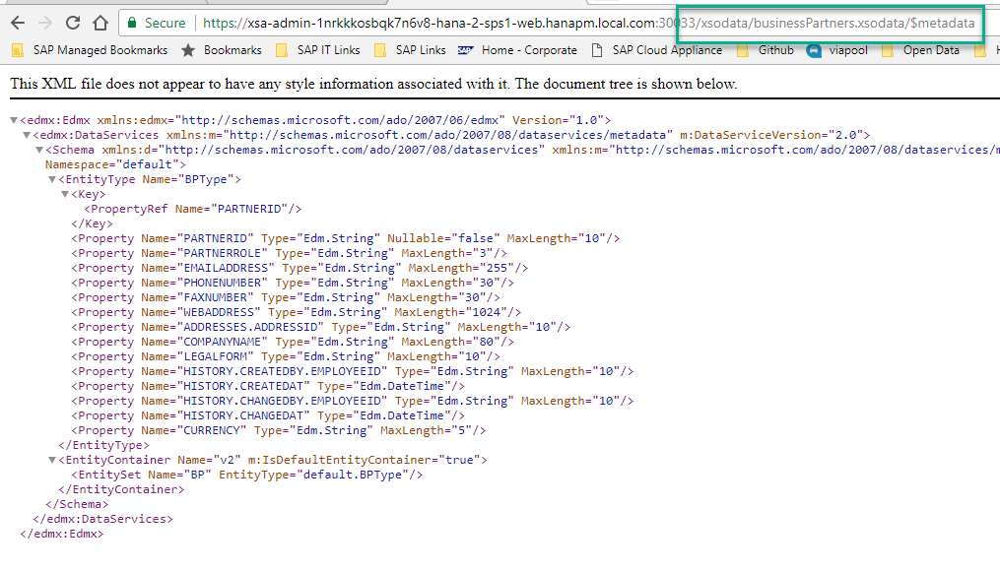
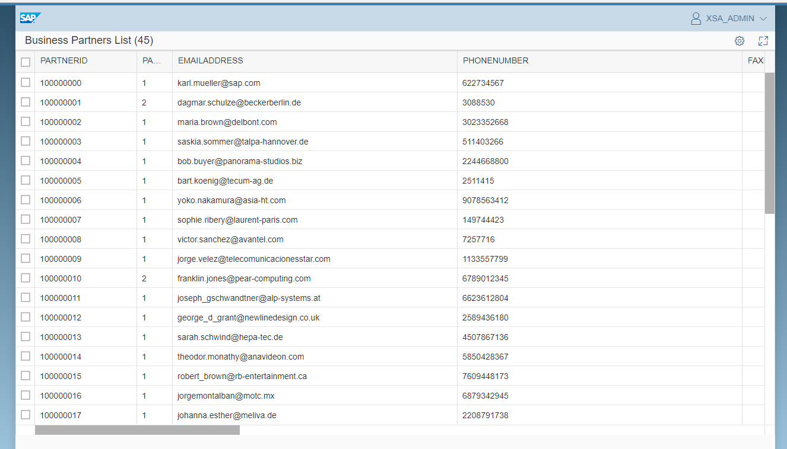

## Prerequisites  
- **Proficiency:** Intermediate
- **Tutorials:** [Consume a Basic OData Service](http://www.sap.com/developer/tutorials/xsa-sapui5-odata.html)

## Next Steps
- [Consume an OData Service with Create Option](http://www.sap.com/developer/tutorials/xsa-sapui5-consume.html)

## Details
### You will learn  
Use the Metadata to dynamically create columns in your table.
**Please note - This tutorial is based on SPS11**

### Time to Complete
**10 Min**.

---


[ACCORDION-BEGIN [Step 1: ](Edit table column definitions)]

In the previous part of this exercise we hard coded all the table column definitions in the template.  However, OData services expose all their meta data and we can use this feature to build the columns dynamically. Return to your view file. Delete the complete block of lines after the Table Column Definitions comment and before the var `displayPanel` line.



[DONE]
[ACCORDION-END]

[ACCORDION-BEGIN [Step 2: ](Create columns dynamically)]

You can create a connection to the metadata object via the function `getServiceMetadata` of your model object. Inside this meta data you will find the columns of the service at `dataServices.schema[0].entityType[0].property`. Loop over this collection and create a column for each `property.name` in the service dynamically. If you need help writing this code please refer to the solution at: `http://<hostname>:51013/workshop/admin/ui/exerciseMaster/?workshop=dev602&sub=ex4_13` Save and Activate your project.

```
//Table Column Definitions
var oMeta = sap.ui.getCore().getModel("bpModel").getServiceMetadata();
          for ( var i = 0; i < oMeta.dataServices.schema[0].entityType[0].property.length; i++) {
	var property = oMeta.dataServices.schema[0].entityType[0].property[i];
              oTable.addColumn(new sap.m.Column({
                  header: new sap.m.Label({
                      text: property.name
                  }),
                  width: "125px"
              }));
              columnList.addCell(new sap.m.Text({
                  text: {
                      path: "bpModel>"+property.name
                  },
                  name: property.name
              }));
}
```

[DONE]
[ACCORDION-END]

[ACCORDION-BEGIN [Step 3: ](Test your app)]

3. Test your application in a web browser using the Run option. The URL would be `/odataBasic`. Notice that you now have all the columns of the service; not just the few you had before.



[DONE]
[ACCORDION-END]


## Next Steps
- [Consume an OData Service with Create Option](http://www.sap.com/developer/tutorials/xsa-sapui5-consume.html)
