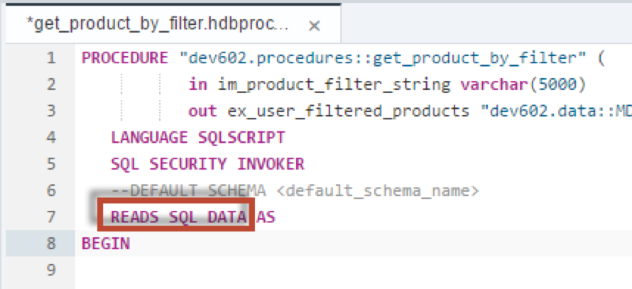
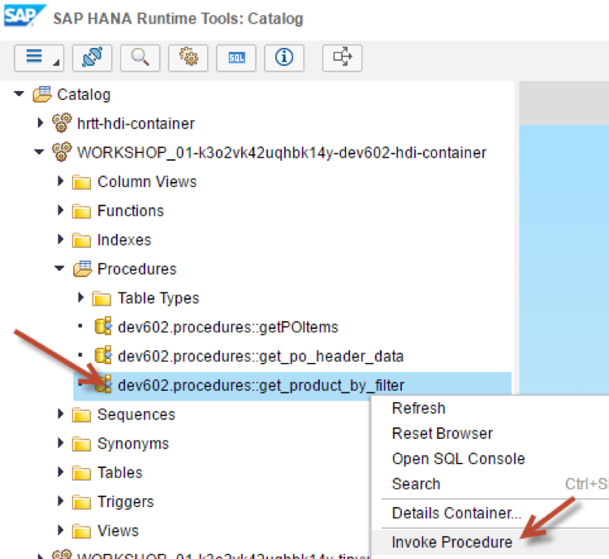
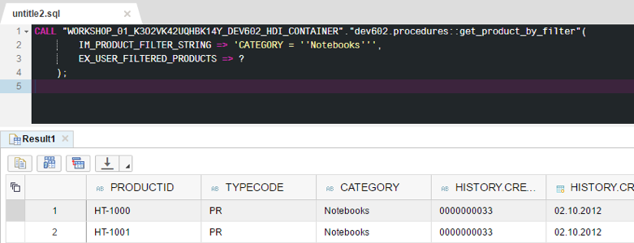
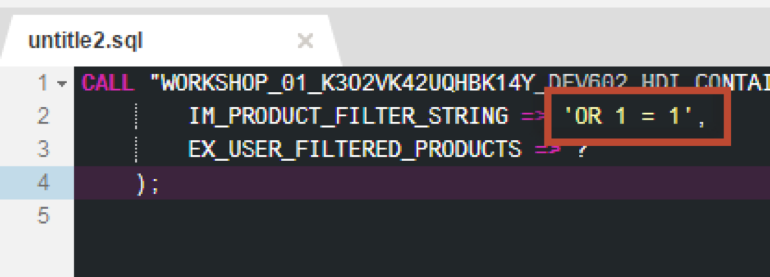

## Prerequisites  
- **Proficiency:** Intermediate
- **Tutorials:** [Using Execute Immediate](http://www.sap.com/developer/tutorials/xsa-sqlscript-execute.html)

## Next Steps
- [SQL vs Cursors vs Arrays vs Index-based Cell Access](http://www.sap.com/developer/tutorials/xsa-sqlscript-sql-cursor.html)

## Details
### You will learn  
In contrast to EXEC and EXECUTE IMMEDIATE, `APPLY_FILTER` is SQL injection save. Furthermore the result of the `APPLY_FILTER` will be assigned to a table variable. This allows further processing of the result by referring to the table variable. As `APPLY_FILTER` does not allow executing dynamic `DML/DDL` statements the procedure can be flagged read only which allows further optimization.

**Please note - This tutorial is based on SPS11**

### Time to Complete
**15 Min**.

---


[ACCORDION-BEGIN [Step 1: ](Add output parameter)]

Return to the procedure editor. Add an output parameter called `ex_user_filtered_products` and reference the `dev602.data::MD.Products` table as the type.


[DONE]
[ACCORDION-END]

[ACCORDION-BEGIN [Step 2: ](Edit the procedure)]

Now that we are not using the dynamic SQL keywords, we no longer need a `read/write` procedure, so add the READS SQL DATA before AS.



Remove the EXECUTE IMMEDIATE statement and instead insert the following SELECT statement and `APPLY_FILTER` statement using table variable assignments. The `APPLY_FILTER` needs two input parameters: table variable which will used for filtering and a scalar variable which contains the string.


[DONE]
[ACCORDION-END]

[ACCORDION-BEGIN [Step 3: ](Check complete code)]

The completed code should be very similar to this. If you do not wish to type this code, you can reference the solution web page at `http://<hostname>:51013/workshop/admin/ui/exerciseMaster/?workshop=dev602&sub=ex2_18`

```
PROCEDURE "dev602.procedures::get_product_by_filter" (
      IN im_product_filter_string varchar(5000),
      OUT ex_user_filtered_products "dev602.data::MD.Products" )
LANGUAGE SQLSCRIPT
SQL SECURITY INVOKER
--DEFAULT SCHEMA <default_schema_name>
READS SQL DATA  AS
BEGIN

pre_filtered_products =
     SELECT * FROM "dev602.data::MD.Products" WHERE CATEGORY NOT IN ('Laser printers');

ex_user_filtered_products = APPLY_FILTER(:pre_filtered_products, :im_product_filter_string ) ;

END
```

[DONE]
[ACCORDION-END]

[ACCORDION-BEGIN [Step 4: ](Save and build)]

5. Click **Save**.


Use what you have learned already and perform a build on your `hdb` module. Then return to the HRTT page and invoke the procedure again.



[DONE]
[ACCORDION-END]

[ACCORDION-BEGIN [Step 5: ](Run and check results)]

Click **Format Code**.


Enter the filter string for the input parameter as

```
'CATEGORY = ''Notebooks'''
```
and click **Run**.


Once again, the results are displayed, but this time they are passed through a parameter which you are able to access for further processing.



[DONE]
[ACCORDION-END]

[ACCORDION-BEGIN [Step 6: ](Test different input)]

Change the input parameter value to 'OR 1 = 1' and click "Run" again.



You will notice you now get an error message when passing 'OR 1 = 1' to the procedure. This happens as the provided string will no longer be concatenated to the predefined filter conditions. Instead the provided string will be treated as a stand-alone filter condition, in this case having an invalid syntax.


[DONE]
[ACCORDION-END]


## Next Steps
- [SQL vs Cursors vs Arrays vs Index-based Cell Access](http://www.sap.com/developer/tutorials/xsa-sqlscript-sql-cursor.html)
