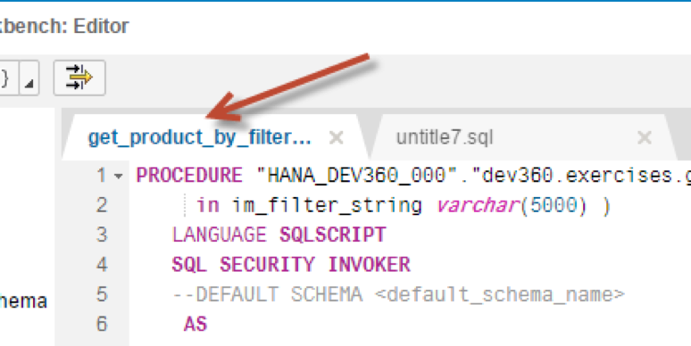
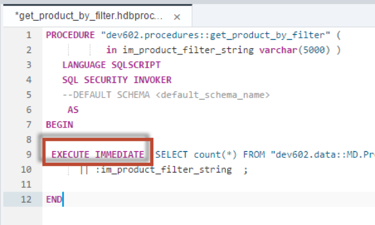
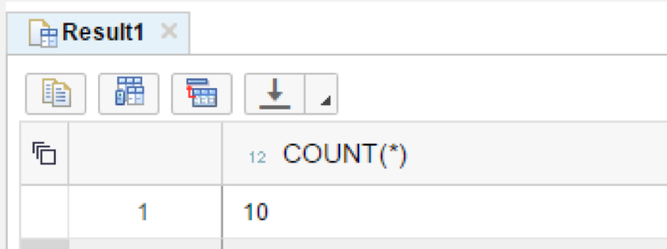
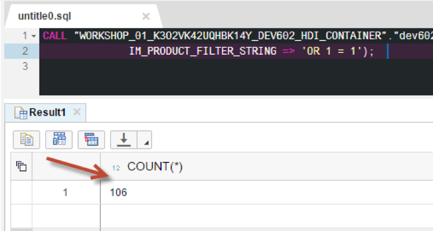

## Prerequisites  
 - **Proficiency:** Intermediate
 - **Tutorials:** [Using Dynamic SQL vs Dynamic Filtering](http://www.sap.com/developer/tutorials/xsa-sqlscript-dynamic.html)

## Next Steps
 - [Using APPLY FILTER](http://www.sap.com/developer/tutorials/xsa-sqlscript-applyfilter.html)

## Details
### You will learn  
In contrast to executing a string using EXEC, executing the string using EXECUTE IMMEDIATE returns a result set.

### Time to Complete
**10 Min**.

---

1. Switch back to the procedure editor.

    

2. Switch back to the procedure editor. Replace the EXEC keyword with EXECUTE IMMEDIATE

    

3. Click "Save".

    

4. Use what you have learned already and perform a build on your `hdb` module. Then return to the HRTT page run the call statement again.

    

5. You will notice the implicit result set is now returned to the console.  But you still cannot work further on this result set.

    

6. Now change the CALL statement again, this time insert the value for the input parameter as ' ' as shown here. Run the CALL statement again

    

7. You will notice the count is 10, which refers to all products except for `Laser printers`.

    

8. Now change the CALL statement. This time insert the value for the input parameter as 'OR 1 = 1' as shown here. Run the CALL statement again.

    

9. You will notice the count is now much higher, 106.  This illustrates the possibility of SQL injection. The always true `OR-condition` (1=1) will enforce that the complete `where-condition` will be evaluated to true for each record.

    

## Next Steps
 - [Using APPLY FILTER](http://www.sap.com/developer/tutorials/xsa-sqlscript-applyfilter.html)
