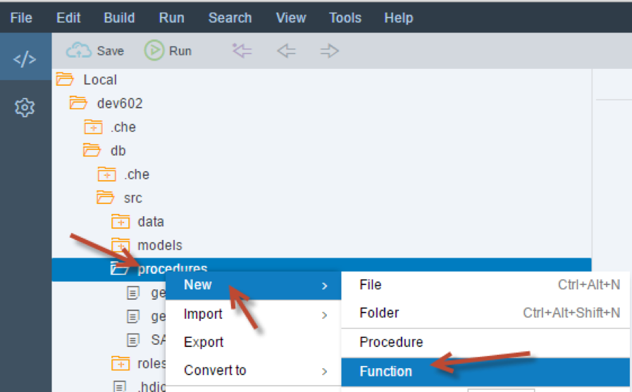
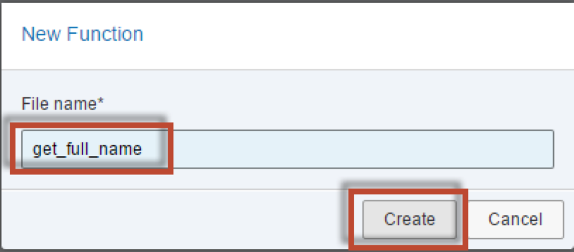
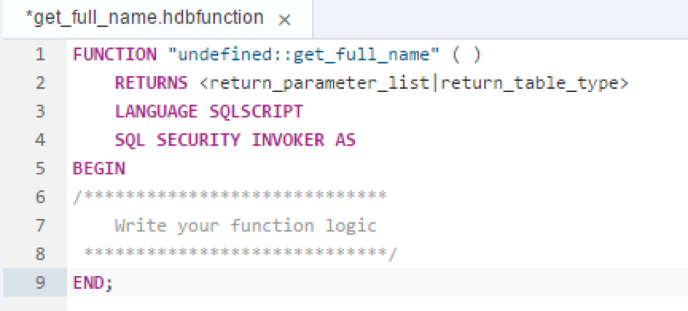
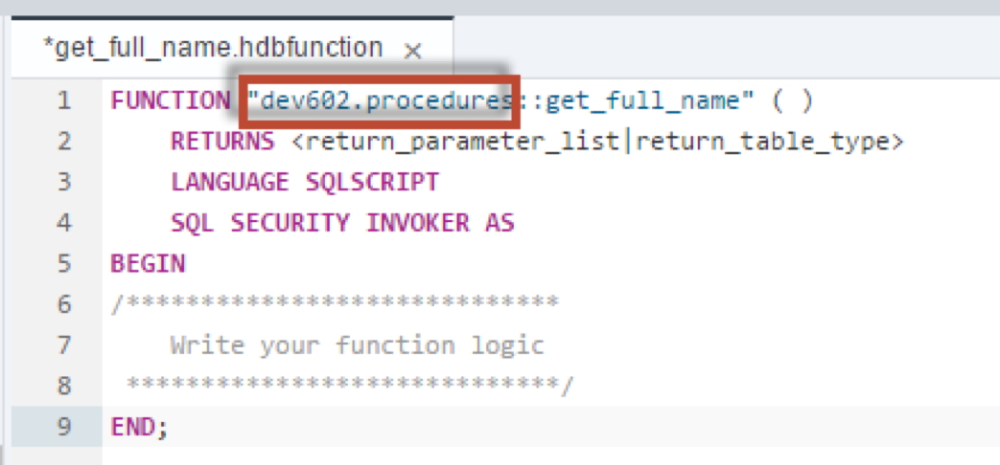
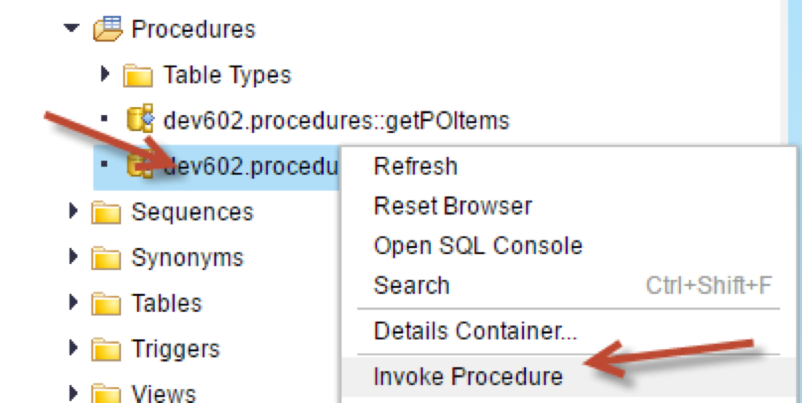

## Prerequisites  
 - **Proficiency:** Intermediate
 - **Tutorials:**  [Intermediate Table Variables](http://go.sap.com/developer/tutorials/xsa-sqlscript-table-var.html)

## Next Steps
 - [Creating Table User Defined Functions](http://go.sap.com/developer/tutorials/xsa-sqlscript-table-user.html)

## Details
### You will learn  
In this exercise we are creating a scalar UDF for generating a full name from the last, first and middle name of the employee.

### Time to Complete
**15 Min**.

---

1. Right click on the "procedures" folder and choose "New", then "Function".

	
	
2. Enter the name of the file as `get_full_name` and click "Create".

	

3. The editor will open with a small code snippet inserted

	

4. Rename the namespace from `Undefined` to `dev602.procedures`

	

5. Enter the code into the editor as shown here.  Please note the default for parameter `im_employeeid` which makes assigning a value to the parameter optional. If you do not wish to type this code, you can reference the solution web page at `http://<hostname>:51013/workshop/admin/ui/exerciseMaster/?workshop=dev602&sub=ex2_13`

	```
	FUNCTION "dev602.procedures::get_full_name" (
            IN im_firstname NVARCHAR(40) , 
            IN im_middlename NVARCHAR(40), 
            IN im_lastname NVARCHAR(40), 
            IN im_employeeid NVARCHAR(10) DEFAULT '' )
 			RETURNS ex_fullname NVARCHAR(256) AS
		BEGIN

			if :im_middlename IS NULL THEN
   				ex_fullname = :im_lastname || ', ' || :im_firstname;
			ELSE 
   				ex_fullname = :im_lastname || ', ' ||
                 :im_firstname || ' ' || :im_middlename;
 			END IF;
       
			IF :im_employeeid <> '' then 
   				ex_fullname = :ex_fullname || '(' || :im_employeeid || ')';
 			END IF;
	END;
	```

6. Click "Save"

	

7. Return to your procedure called `get_po_header_data` and modify it. Start by renaming the `LOGINNAME` column of the output table to `FULLNAME`. Also change the output length to 256. This is needed to match later on which the anticipated output structure.

	

8. Change the last SELECT statement.  Remove the `LOGINNAME` column from the field list and replace it with a call to the scalar function that you created earlier.  Make sure to pass the `NAME.FIRST`, `NAME.MIDDLE` and `NAME.LAST` name columns to the scalar function call.

	

9. The completed code should look very similar to this. If you do not wish to type this code, you can reference the solution web page at `http://<hostname>:51013/workshop/admin/ui/exerciseMaster/?workshop=dev602&sub=ex2_14`

	```
	PROCEDURE "dev602.procedures::get_po_header_data" (
             OUT EX_TOP_3_EMP_PO_COMBINED_CNT TABLE(
                        FULLNAME NVARCHAR(256), 
			  CREATE_CNT INTEGER, 
			  CHANGE_CNT INTEGER,
			  COMBINED_CNT INTEGER )  )
   	LANGUAGE SQLSCRIPT
   	SQL SECURITY INVOKER
   		--DEFAULT SCHEMA <default_schema_name>
   	READS SQL DATA AS 
	BEGIN

	po_create_cnt =  SELECT COUNT(*) AS CREATE_CNT, "HISTORY.CREATEDBY.EMPLOYEEID"  AS EID
         FROM "dev602.data::PO.Header" WHERE PURCHASEORDERID IN (
               SELECT PURCHASEORDERID 
                    FROM "dev602.data::PO.Item" 
            WHERE "PRODUCT.PRODUCTID" IS NOT NULL)
   GROUP BY  "HISTORY.CREATEDBY.EMPLOYEEID";
    
	po_change_cnt =  SELECT COUNT(*) AS CHANGE_CNT, "HISTORY.CHANGEDBY.EMPLOYEEID" AS EID
         FROM "dev602.data::PO.Header"  WHERE PURCHASEORDERID IN (
            SELECT PURCHASEORDERID 
                 FROM "dev602.data::PO.Item"
       WHERE "PRODUCT.PRODUCTID" IS NOT NULL)
 	GROUP BY  "HISTORY.CHANGEDBY.EMPLOYEEID";


	EX_TOP_3_EMP_PO_COMBINED_CNT = 
          SELECT "dev602.procedures::get_full_name"( "NAME.FIRST", "NAME.MIDDLE", "NAME.LAST") 	as FULLNAME, crcnt.CREATE_CNT, chcnt.CHANGE_CNT, crcnt.CREATE_CNT + chcnt.CHANGE_CNT AS 	COMBINED_CNT
   	FROM "dev602.data::MD.Employees" as emp
       LEFT OUTER JOIN :PO_CREATE_CNT AS crcnt
             ON emp.EMPLOYEEID = crcnt.EID
       LEFT OUTER JOIN :PO_CHANGE_CNT AS chcnt
             ON emp.EMPLOYEEID = chcnt.EID
                ORDER BY COMBINED_CNT DESC LIMIT 3;

	END
	```

10. Click "Save".

	

11. Use what you have learned already and perform a build on your `hdb` module. Then return to the HRTT page and invoke the procedure.

	

12. A new SQL tab will be opened, click "Run".

	

13. Notice the `FULLNAME` column, it shows the results of the scalar `UDF` logic.

	


## Next Steps
 - [Creating Table User Defined Functions](http://go.sap.com/developer/tutorials/xsa-sqlscript-table-user.html)
