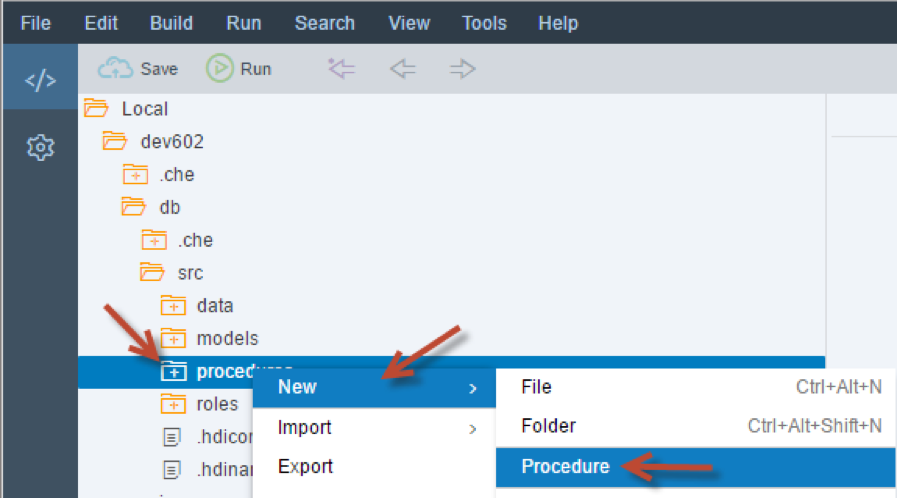
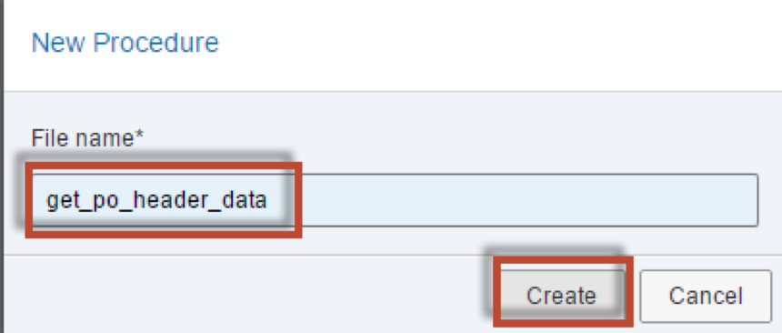
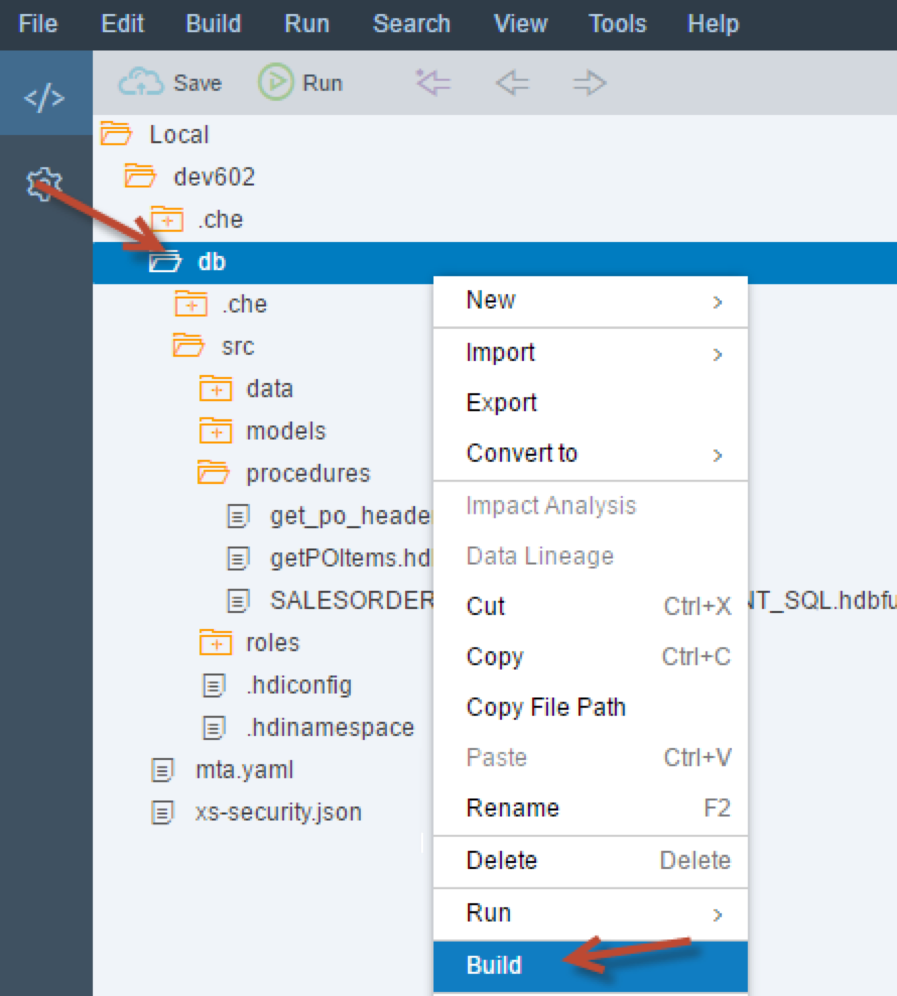
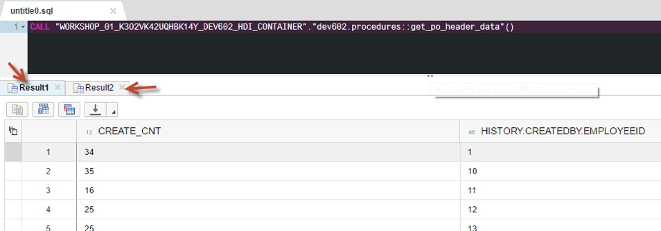

## Prerequisites  
- **Proficiency:** Intermediate
- **Tutorials:** [Creating a Calculation View with a Cube data type and Star Join](https://www.sap.com/developer/tutorials/xsa-sqlscript-cube.html)

## Next Steps
- [Parallel Processing and Parameters](https://www.sap.com/developer/tutorials/xsa-sqlscript-parallel.html)

## Details
### You will learn  
In this exercise you will create a small procedure `get_po_header_data` with two implicit SELECT queries.
**Please note - This tutorial is based on SPS11**

### Time to Complete
**15 Min**.

---


[ACCORDION-BEGIN [Step 1: ](Create new procedure)]

Right click on the **procedures** package and choose **New**, then **HDB Procedure**.



Enter the name of the procedure as `get_po_header_data`.  Click **Create**



The editor will then be shown.


[ACCORDION-END]

[ACCORDION-BEGIN [Step 2: ](Change namespace name)]

Change the namespace from "Undefined" to `dev602.procedures`


[ACCORDION-END]

[ACCORDION-BEGIN [Step 3: ](Add SELECTs)]

Between the BEGIN and END statements, insert the SELECT statements as shown.  These are implicit select statements whose results sets are passed to the caller.  


[ACCORDION-END]

[ACCORDION-BEGIN [Step 4: ](Review complete code)]

The completed code should look similar to this. If you do not wish to type this code, you can reference the solution web page at `http://<hostname>:51013/workshop/admin/ui/exerciseMaster/?workshop=dev602&sub=ex2_10`

```
PROCEDURE "dev602.procedures::get_po_header_data" ( )
LANGUAGE SQLSCRIPT
SQL SECURITY INVOKER
--DEFAULT SCHEMA <default_schema_name>
READS SQL DATA AS
BEGIN

SELECT COUNT(*) AS CREATE_CNT, "HISTORY.CREATEDBY.EMPLOYEEID"
     FROM "dev602.data::PO.Header" WHERE PURCHASEORDERID IN (
                     SELECT PURCHASEORDERID
                          FROM "dev602.data::PO.Item"
          WHERE "PRODUCT.PRODUCTID" IS NOT NULL)
GROUP BY  "HISTORY.CREATEDBY.EMPLOYEEID";

SELECT COUNT(*) AS CHANGE_CNT, "HISTORY.CHANGEDBY.EMPLOYEEID"
     FROM "dev602.data::PO.Header"  WHERE PURCHASEORDERID IN (
                     SELECT PURCHASEORDERID
                          FROM "dev602.data::PO.Item"
          WHERE "PRODUCT.PRODUCTID" IS NOT NULL)
GROUP BY  "HISTORY.CHANGEDBY.EMPLOYEEID";
END
```


[ACCORDION-END]

[ACCORDION-BEGIN [Step 5: ](Save and build)]

Save the procedure.


Perform a build on your `hdb` module.




[ACCORDION-END]

[ACCORDION-BEGIN [Step 6: ](Invoke procedure)]

Switch over to the HRTT page and look for your procedure


Right-click on the procedure and choose **Invoke Procedure**.


A new SQL tab will be opened with the CALL statement inserted.  


Click the **Run** button.


[ACCORDION-END]

[ACCORDION-BEGIN [Step 7: ](Check results)]

The two results are then shown in another tab.  



Note the execution time.


[ACCORDION-END]


## Next Steps
- [Parallel Processing and Parameters](https://www.sap.com/developer/tutorials/xsa-sqlscript-parallel.html)
