## Prerequisites  
 - **Proficiency:** beginner
 - **Tutorials:** [SAP HANA XS Advanced, Creating an HDI Module](https://www.sap.com/developer/tutorials/xsa-hdi-module.html)

## Next Steps
 - [Create a simple OData service](https://www.sap.com/developer/tutorials/xsa-xsodata.html)

## Details
### You will learn  
You will learn how to build the XSJS and XSODATA services used to expose your data model to the user interface. Although XS Advanced runs on Node.js, SAP has added modules to Node.js to provide XSJS and XSODATA backward compatibility. Therefore you can use the same programming model and much of the same APIs from the Extended Application Services, classic model even within this new environment.

### Time to Complete
**15 Min**.

---

[ACCORDION-BEGIN [Step 1: ](Create a Node.js module)]
Like the previous exercises, you will start by creating a new module.  `New->Node.js Module`

 

Name the module `core_xsjs` and press Next.

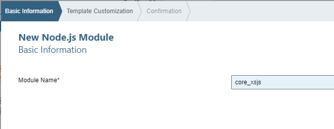

Be sure to check the box Enable XSJS support. Then press Next. Then press Finish.

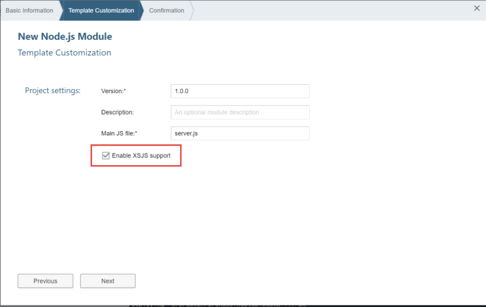

Once again the `mta.yaml` file has been extended to add the `core_xsjs` module.


This XSJS module will also need the UAA service for authentication. Additionally, it will need data from the database module and the HDI container behind it. Add those dependencies to the node module

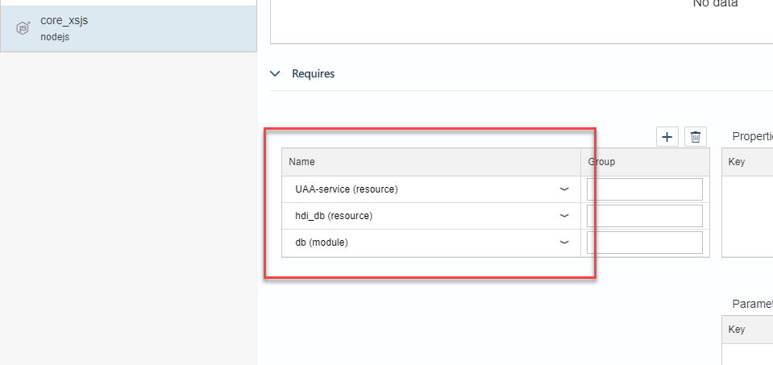

Now you need to add the dependency from the web module to this new Node.js module and a destination route to it as well.

In the `Requires` section of the web module, add `core_xsjs-api`

> If you are editing this manually, this should match the name of the value under `Provides` in the new node module

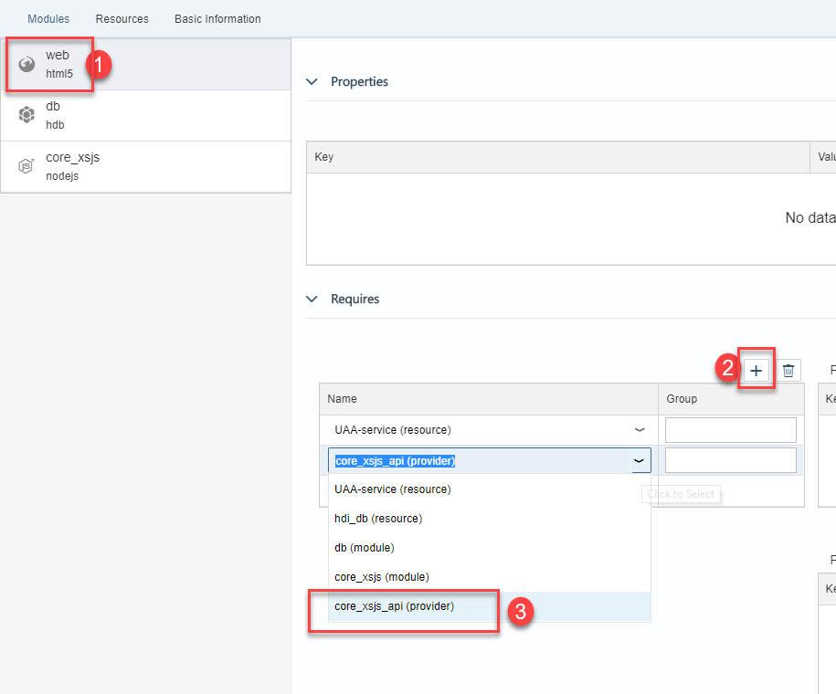

Add `destinations` in the field group and the following key-value pairs as the properties for the `core_xsjs-api` module:

```
name: core-backend
url: ~{url}
forwardAuthToken: true
```

The complete section for the web module should now look like this:


> ### What is this configuration for?
> The `approuter` is a module that serves as a single point of entry to a Multi-Target Application. In this case, the [web module](https://www.sap.com/developer/tutorials/xsa-html5-module.html) contains the call to this module in the `package.json` file. The `approuter ` will use routes to determine the destination for a request coming from, for example, a web browser. The configuration you have just entered is naming the Node.js destination as `core-backend`, URL is picking up the value from the `provides` URL, which is in turn taking it from the reserved environment variable, `default-url`.
>
> Later at deploy, the destination routing builds a dependency and navigation ability between the two services without ever having to hard code the URLs or ports. They are assigned at deploy time and all references are automatically updated.

**Save** the `yaml` file and go into the code editor. Copy the definition of the node module in the validation below:

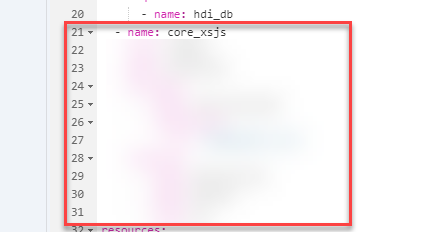

[VALIDATE_1]

[ACCORDION-END]  

[ACCORDION-BEGIN [Step 2: ](Configure Routes)]

You can now add rules for redirecting certain requests to the web module into other modules in this project.

Open the file `xs-app.json` in the web module and fill in the routes with the following configuration

```json
"routes": [{
  "source": "(.*)(.xsjs)",
  "destination": "core-xsjs-backend",
  "csrfProtection": false,
  "authenticationType": "xsuaa"
}, {
  "source": "(.*)(.xsodata)",
  "destination": "core-xsjs-backend",
  "authenticationType": "xsuaa"

}]

```

This is where you are configuring that any file request with the extension `.xsjs` or `.xsodata` should be rerouted internally to the Node.js destination that you defined in the `mta.yaml` file.

This is what the section should like:

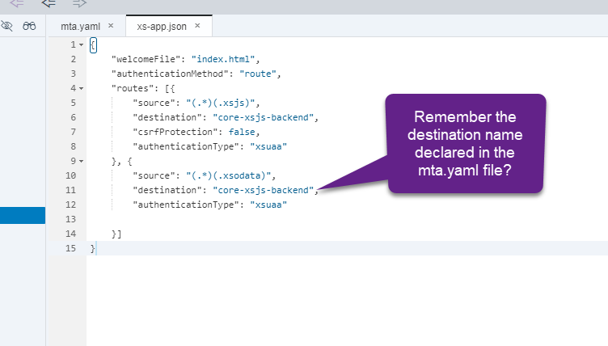

[DONE]

[ACCORDION-END]  

[ACCORDION-BEGIN [Step 3: ](Enable authentication in your service)]

Return to the `js` folder that you created in this exercise. Like the other applications, this one also starts with a `package.json` file. Different this time is the fact that the startup script is not an SAP provided central node application, but one that you have created via the module creation wizard.

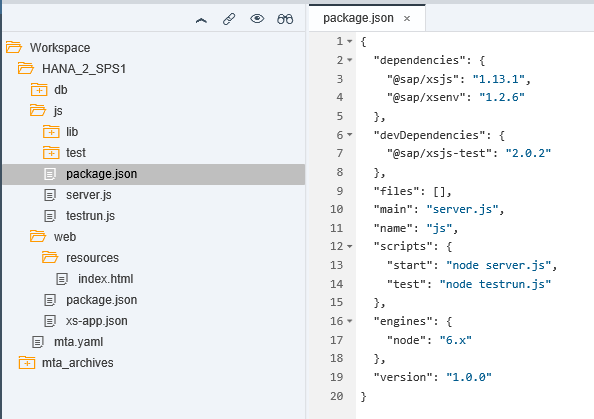

This `server.js` is the Node.js `bootstrap` for XSJS compatibility mode. It uses the SAP provided `xsjs` module and starts it with a few basic parameters. However, remember all the HANA database connectivity options come from the HDI container which you bound to this service via the `mta.yaml` file.  You want to make a few changes to what the wizard has generated. You want authentication on your service, so comment out the `anonymous: true` line

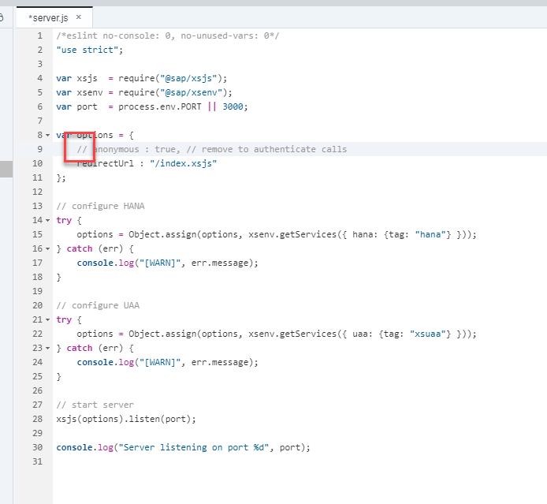


Remember to **Save.**

[DONE]
[ACCORDION-END]

[ACCORDION-BEGIN [Step 4: ](Create an OData service)]

In the lib folder, create a sub-folder called `xsodata`. Create a file named `purchaseOrder.xsodata`. In the latest versions of Web IDE, you can create both objects at the same time using `New->File` as follows:

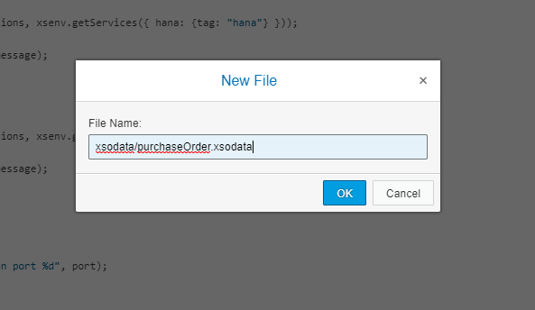


Here you expose both the Header and Item tables from your HDI container as separate entities and build a navigation association between the two.

```sql
service {
    "PurchaseOrder.Header"
	  as "POHeader" navigates ("Items" as "POItem");

	"PurchaseOrder.Item"
	  as "POItem";

	association "Items" principal  "POHeader"("PURCHASEORDERID")
	multiplicity "1" dependent "POItem"("POHeader.PURCHASEORDERID") multiplicity "*";
}
```
> You can ignore the warning from `XSODataValidator` this time


[DONE]
[ACCORDION-END]

[ACCORDION-BEGIN [Step 5: ](Create an XSJS service)]
In the lib folder, create a sub-folder called `xsjs` and a file named `hdb.xsjs`.  Here is the source code for this file.

```sql
/*eslint no-console: 0, no-unused-vars: 0, dot-notation: 0*/
/*eslint-env node, es6 */
"use strict";

var conn = $.hdb.getConnection();
var query = "SELECT FROM PurchaseOrder.Item { " +
	        " POHeader.PURCHASEORDERID as \"PurchaseOrderItemId\", " +
            " PRODUCT as \"ProductID\", " +
            " GROSSAMOUNT as \"Amount\" " +
            " } ";
var rs = conn.executeQuery(query);

var body = "";
for(var item of rs){
   if(item.Amount >= 500){
	body += item.PurchaseOrderItemId + "\t" +
			item.ProductID + "\t" + item.Amount + "\n";
   }
}

$.response.setBody(body);
$.response.contentType = "application/vnd.ms-excel; charset=utf-16le";
$.response.headers.set("Content-Disposition",
		"attachment; filename=Excel.xls");
$.response.status = $.net.http.OK;

```

Create a second file named `csrf.xsjs`.  This is an empty file which you can use to request a `CSRF` token for update/insert/delete operations.

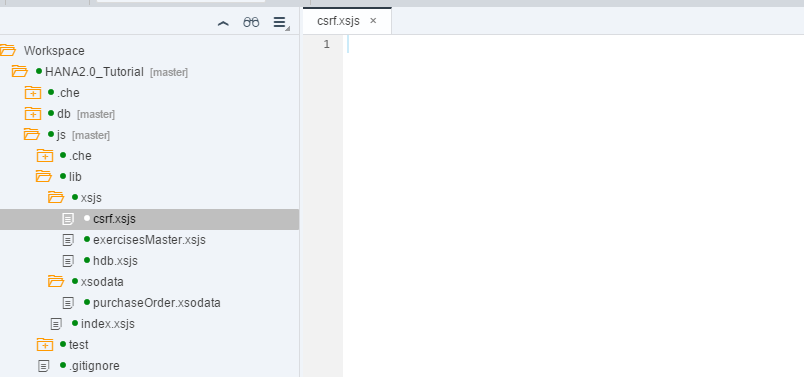

[DONE]

[ACCORDION-END]  

[ACCORDION-BEGIN [Step 5: ](Execute the js module)]

**Run** the `js` module. It will first build the module so it will take a little longer than usual.

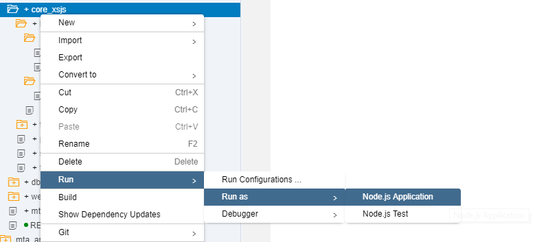

You should see that the build and deploy were successful and the JS module is running.


So now run the `web` module. It will need to rebuild and redeploy due to the added dependency to the `js` module.


In the running tab, you should see the `index.html` from earlier. You can add the URL to your `xsjs` service `/index.xsjs` in the browser. You will see that your `xsjs` service is accessible via the HTML5 module runtime. The HTML5 module functions as a proxy and performs the routing to the other service internally.

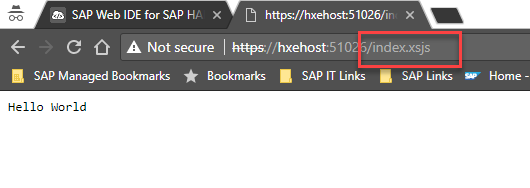

`/xsjs/hdb.xsjs` reads data from our new Purchase Order table you created in HANA in the previous exercise and exports it as an Excel text file. Feel free to test the other example `xsjs` files you created in this exercise as well.


`/xsodata/purchaseOrder.xsodata/?$format=json` shows you the definition for your OData service


Go back into SAP Web IDE for SAP HANA and click the URL for the Node.js service


Paste the result into the validation below. If you get an error, you might want to review step 3.

[VALIDATE_2]

[ACCORDION-END]  

## Next Steps
 - [Create a simple OData service](https://www.sap.com/developer/tutorials/xsa-xsodata.html)
